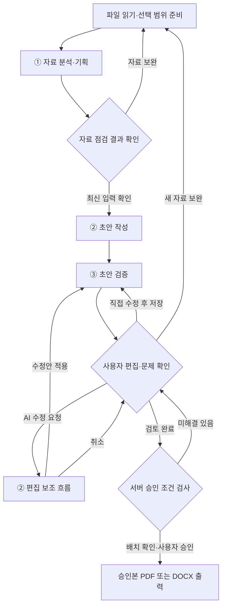
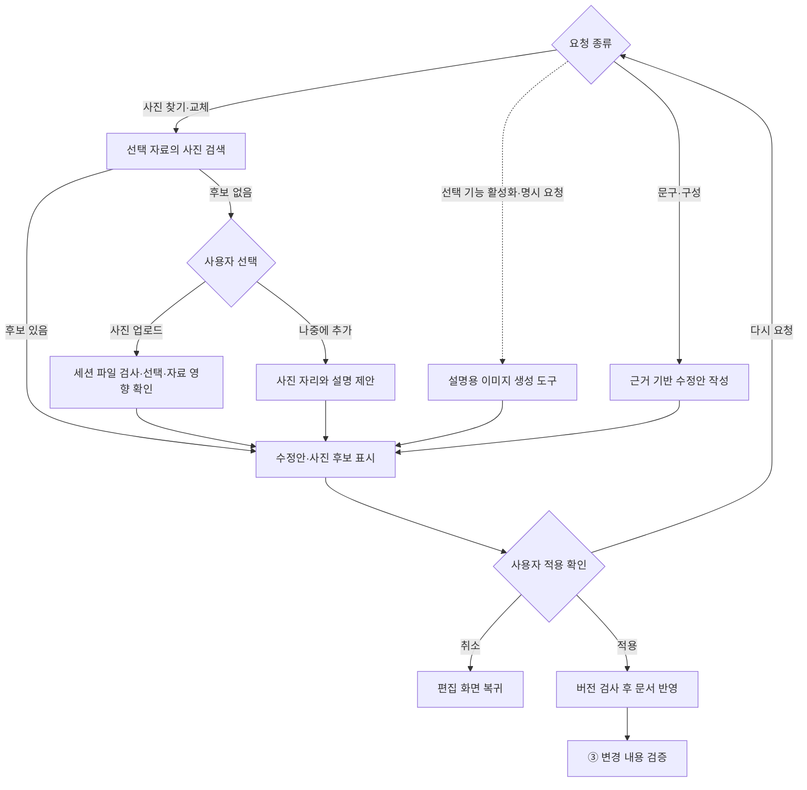

# 핵심 에이전트와 LangGraph 설계

기준일: 2026-09-23 · v1.2 · 적용: 백엔드 레포의 Agent 담당 · 구현 대상 설계; 실행 코드가 아님

Agent 담당은 이 문서의 AI/그래프 역할을 구현한다. 파일·세션·API·저장·승인·출력은 같은 레포의 백엔드 담당과 연결한다. 실제 작업은 [task_agent.md](task_agent.md)의 AG-*를 따르며 프론트 화면을 이 레포에서 만들지 않는다.

## 1. 핵심 역할은 3개

| 역할 | 질문 | 책임 결과 |
|---|---|---|
| ① 자료 분석·기획 | 무엇을 쓸 수 있고 무엇이 부족한가? | 근거가 연결된 사실, 충돌·누락, 페이지·사진·인증 활용 추천 |
| ② 구성·초안 작성·편집 보조 | 확인한 자료를 어떻게 전달할까? | 페이지·블록 초안, 선택 영역 수정안, 사진 후보 |
| ③ 초안 검증 | 작성·수정하면서 사실이 달라지거나 빠지지 않았나? | 문제 위치·이유·근거·수정 제안 |

①은 작성 전 자료의 충분성을, ③은 작성 후 표현의 정확성과 누락을 점검한다. 모델은 공유할 수 있지만 프롬프트·입력·출력·평가 기준을 분리한다. 검증 역할이 별도로 있어도 진실을 보장하는 것은 아니며 사람이 최종 승인한다.

파일 읽기, 세션 권한, 이미지 표시, 버전 저장, 오류 재시도, PDF/DOCX 출력은 프로그램/도구의 책임이다. 관리자 AI를 추가하여 모든 분기를 맡기지 않는다.

## 2. 전체 서비스 흐름

아래는 사용자 단계와 AI 역할의 연결도다. 모든 상자가 LLM 호출인 것은 아니다. 승인·출력은 백엔드가 강제하며, 사람 대기 중에는 LLM을 계속 호출하지 않는다.

자료 보완으로 돌아가도 기존 편집본은 보존한다. 첫 작성이면 전체 초안 생성, 기존 문서가 있으면 영향 검사 후 필요한 수정안만 제안한다. 모든 문서를 자동 재생성하는 분기로 해석하지 않는다.

## 3. ② 편집 보조의 조건 분기

사진 자리는 편집 중 메모다. 출력 전 실제 사진을 넣거나 자리를 제거한다. 사진이 필요 없는 문서는 글 중심으로 승인할 수 있다. 실제 회사 사진을 설명용 생성 이미지로 대체하여 사실처럼 표시하지 않는다.

## 4. 노드 책임과 입출력

| 노드 이름 | 종류 | 입력 | 출력 |
|---|---|---|---|
| prepare_sources | 일반 코드/도구 | 선택 자료 ID·세션 | 읽기 상태, 사용 가능 구간, 자산 목록 |
| analyze_materials | AI ① | 원문 구간·작성 요청 | Facts, Issues, Recommendations |
| validate_preflight | 일반 코드 | AI 결과·자료 목록 | 스키마/출처 검사, can_generate |
| confirm_materials | 사용자 대기 | Preflight ID·입력 버전 | 확인 또는 자료 보완 요청 |
| write_draft | AI ② | 확인된 근거·분량·방향 | 페이지·블록 초안 |
| route_edit_request | 코드 우선; 자연어 분류 시 AI 보조 | 요청 종류·선택 영역 | 문구/구성/사진/선택 이미지 생성 경로 |
| propose_text_edit | AI ② | 현재 선택 내용·근거·요청 | Proposal; 문서 변경 없음 |
| search_assets | 검색 도구 | 선택 자료·세션·사진 요청 | 접근 가능한 asset 후보와 원본 종류 |
| wait_asset_input | 사용자 대기 | 사진 없음 안내 | 업로드 또는 사진 자리 선택 |
| propose_image_edit | 코드 + 필요 시 AI ② | 선택 가능한 asset·캡션 | 이미지 Proposal |
| review_proposal | 사용자 대기 | 수정 전/후·기준 버전 | 적용/취소/재요청 |
| apply_proposal | 일반 코드 | 사용자 선택·예상 버전 | 새 문서 버전 또는 충돌 오류 |
| validate_content | AI ③ + 일반 검사 | 저장 문서·원문·변경 범위 | Validation·Issues |
| review_document | 사용자 대기 | 현재 문서·문제 | 편집/보완/승인 준비 행동 |
| check_layout | 출력 모듈 | 승인 예정 문서·형식 | LayoutCheck·미리보기 |
| approve_export | 백엔드 | 사용자 승인·최신 검사 | Approval·Export |

노드 수가 3개를 넘더라도 핵심 AI 역할은 3개다. 문구를 생성하거나 의미를 비교해야 하는 곳만 LLM을 사용한다. 형식 오류, 버전 충돌, 파일 없음, 명시적 버튼 선택은 코드로 처리한다.

## 5. 역할별 생성 규칙

### ① 자료 분석·기획

- 사용자가 선택한 자료와 현재 세션 범위만 사용한다.
- 필수 사실과 목적별 추천을 구분한다. 모든 목적에 인증과 많은 사진을 요구하지 않는다.
- 값·조건·기준 시점·출처 위치를 함께 추출한다.
- 읽기 불확실 구간은 확정 사실에 포함하지 않는다.
- 충돌 값 중 하나를 임의로 선택하지 않는다.
- 페이지 수는 정보량·사진·목적에 따라 추천하고 이유를 제공한다. 자료가 부족하면 분량 축소나 추가 자료를 제안한다.

### ② 구성·초안 작성·편집 보조

- 근거가 있는 내용을 사용하고 누락은 확인 항목으로 남긴다.
- 수치·인증·납기·실적을 문장을 매끄럽게 만들기 위해 보완 생성하지 않는다.
- 최초 작성은 목표 분량과 방향에 맞춰 페이지·블록을 구성하고 사용 가능한 사진을 배치한다.
- 사진은 확인된 asset_id만 사용한다. 이미지 표시 여부는 프론트/백엔드가 검사한다.
- 편집 시 선택 범위를 기본으로 하고, 다른 블록까지 바꿔야 하면 영향 범위를 제안에 포함한다.
- 전체 문서 재구성은 사용자 요청이 있을 때 제안하며 기존 수정본을 보존한다.
- 이미지를 찾았다는 사실과 이미지가 요청 의미에 맞는다는 판단을 구분한다. 사용자가 후보를 확인한다.

### ③ 초안 검증

- 작성 에이전트의 자기 설명만 보지 않고 연결된 원문 구간을 대조한다.
- 회사명·주요 사업/공정·목적별 필수 내용, 숫자·날짜·단위·조건, 근거 없는 과장을 검사한다.
- 사진과 캡션의 불일치도 확인한다. 이미지의 실세계 진위까지 보증하지 않는다.
- AI 의미 검사와 코드 검사를 함께 사용한다. 존재하지 않는 ID, 빈 필수 필드, 깨진 자산은 코드로 탐지한다.
- 문제 위치·원인·근거·권장 행동을 구조화하여 반환한다. 문제의 최종 해결은 사용자의 조치 및 서버 재검사로 기록한다.
- 문서 순서만 변경했다면 동일 문장의 사실 검사 결과를 재사용하고 배치/필수 구조를 다시 검사한다.

## 6. LangGraph State와 서비스 데이터의 관계

공통 객체의 원형은 contracts.md를 따른다. 그래프 상태에 서비스 데이터 전체를 중복 저장하기보다 아래 참조와 진행 상태를 둔다.

| 상태 필드 | 의미 |
|---|---|
| session_id / job_id | 세션과 현재 실행 |
| input_revision / document_revision | 시작/재개 시 확인할 버전 |
| preflight_id / document_id / proposal_id | 서비스 저장소의 작업 결과 참조 |
| source_ids / fact_ids / target_block_ids | 이번 작업 범위 |
| action | 허용된 사용자 행동 |
| pending_interrupt_id | 응답 대기 중인 확인 지점 |
| attempt_count / last_error | 제한된 재시도 상태 |

노드에서 원문·본문을 읽어도 그 내용이 저장된 체크포인트는 세션 수명을 따라야 한다. 영구 체크포인트에 임시 사실을 남기지 않는다. 서버의 최신 문서가 기준이며 과거 체크포인트가 최신 저장 문서를 덮어쓰지 못하게 한다.

## 7. 사용자 대기와 재개

- 자료 확인, AI 수정안 적용, 문서 확인은 사용자 응답 지점이다.
- `interrupt()`를 사용하는 경우 상태 저장기와 실행별 thread_id를 연결한다. thread_id는 서버에서 세션·작업에 연결하고 사용자 입력을 그대로 신뢰하지 않는다.
- 서비스 API가 세션·권한·버전·허용 action을 확인한 뒤 내부 `Command(resume=...)`를 사용한다.
- 한 번 소비한 응답은 중복 처리하지 않는다. 오래된 interrupt나 수정안은 충돌로 돌려준다.
- interrupt를 포함한 노드는 재개 시 처음부터 다시 실행될 수 있으므로, 대기 앞에서 문서 적용·업로드·외부 생성 같은 부작용을 중복 실행하지 않도록 분리한다.
- 직접 편집으로 문서가 바뀌면 대기 중인 오래된 수정안은 무효화한다. 새 버전을 기준으로 다음 실행을 시작한다.
- 긴 사용자 대기를 서버 요청 하나로 계속 붙잡지 않는다. 작업 상태를 반환하고 사용자의 다음 요청으로 재개한다.

전체 서비스 화면을 무조건 하나의 장기 실행 그래프로 구현할 필요는 없다. 자료 점검/초안 생성과 편집 보조를 하위 그래프 또는 실행 단위로 나누어도 되지만, 사용자 승인 지점과 공통 버전 규칙은 동일해야 한다.

## 8. 변경 후 재검증

| 변경 | 처리 |
|---|---|
| 문구 생성·사실 문장 수정 | 관련 사실·조건·근거 검사, 필수 내용 검사 |
| 같은 의미의 축약 | 해당 문장의 중요 조건/단위가 사라지지 않았는지 검사 |
| 목차 이동·페이지 순서 변경 | 사실 확인 기록 유지, 구조·배치 검사 |
| 사진 교체·캡션 수정 | 자산 접근·캡션·출처·배치 검사 |
| 새 증빙 추가·선택 근거 제거 | 사전 점검 갱신, 관련 사실/문장/제안/승인 상태 재평가 |

사용자가 문서를 타이핑하는 동안 매 입력마다 AI를 호출하지 않는다. 저장 시 변경 범위를 모으고, AI 제안 적용 직후 또는 승인 준비 전에 필요한 검사를 수행한다.

## 9. 오류·재시도·중단

| 오류 | 처리 |
|---|---|
| 일시적인 API 지연/제한 | 설정된 횟수 안에서 재시도; 개발 제안 max_attempts=2는 최초 1회+재시도 1회 |
| 결과 형식 오류 | 형식 교정 1회 범위 내 재시도 후 실패; 기존 문서 유지 |
| 자료 없음·근거 불충분 | 보완·제외·분량 축소를 사용자에게 제시 |
| 파서 실패 | 파일별 원인 안내 및 대체 자료/선택 해제 |
| 문서/입력 버전 충돌 | 최신 버전에서 재요청; 자동 덮어쓰기 금지 |
| 출력 오류 | 승인 스냅샷으로 출력 모듈만 재시도 |

자동 수정 루프는 기본 MVP에 추가하지 않는다. 검증 문제는 사용자에게 보여주고 요청한 부분만 수정한다. 재시도 제한은 작업 실행마다 적용하며 사용자 대기를 재시도 소모로 세지 않는다.

## 10. 평가 기준

- 자료에서 가져온 주장에 실제로 존재하는 근거 ID·위치가 붙어 있는가?
- 가상 수치나 인증을 새로 만들지 않는가?
- 충돌과 부족을 사실처럼 해결하지 않고 표시하는가?
- 한 문단 수정 요청에 관련 없는 문단을 덮어쓰지 않는가?
- 단축 과정에서 납기 조건·단위·날짜가 사라지지 않는가?
- 사진 요청에서 실제 존재하고 접근 가능한 후보만 반환하는가?
- 재검증이 변경 범위에 맞고 불필요한 전체 재호출이 없는가?
- 반복 실행에서 치명적인 오류가 발생하면 ‘한 번 성공’만으로 완료하지 않는가?

정량 기준과 평가 결과는 AG-01/AG-08에서 실제 실행 후 기록한다. 사전에 정확도나 성능 수치를 만들어 넣지 않는다.

## 11. 공식 구현 참고

- [Graph API: State, Nodes, Edges](https://docs.langchain.com/oss/python/langgraph/graph-api)
- [Interrupts: 사용자 대기·재개·재실행 주의사항](https://docs.langchain.com/oss/python/langgraph/interrupts)

확인일: 2026-09-23. 구체 API·패키지 버전은 프로젝트의 설치 버전과 공식 문서를 대조한 뒤 고정한다.
