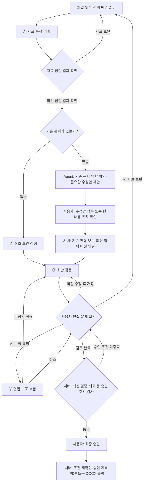
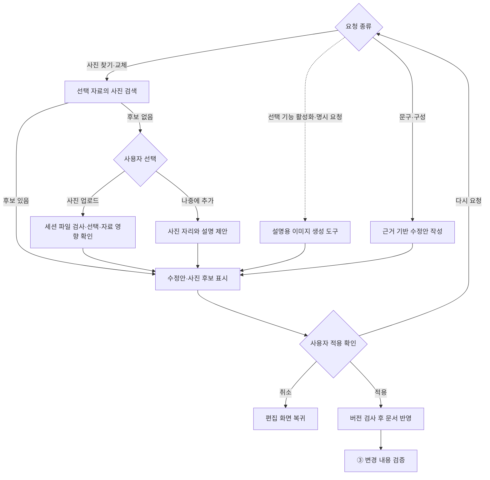

# 핵심 에이전트와 LangGraph 설계

기준일: 2026-09-28 · v1.23 · 적용: 백엔드 레포의 Agent 담당 · 구현 대상 설계와 연결 기준

Agent 담당은 이 문서의 AI/그래프 역할을 구현한다. 파일·세션·API·저장·승인·출력은 같은 레포의 백엔드 담당과 연결한다. 실제 작업은 [task_agent.md](task_agent.md)의 AG-*를 따르며 프론트 화면을 이 레포에서 만들지 않는다.

기존 연결 규격과 mock에 더해, `app/agent_llm.py`에 이전 Agent의 사실 추출·글 초안 생성을 연결했다. 가짜 응답으로 연결을 검사했고 실제 AI의 T01 기본 사실·T02 회사명 누락·T03 수치 충돌·T04 납기 조건 사례의 추출·글 초안도 확인했다. S01의 실제 서버 분석·사용자 확인·초안 Job·저장/조회·중복 요청을 확인하고 시험을 종료했다. 최초 초안의 LangGraph 확인·정리는 4.6절에 연결했다. 실자료 품질·편집 단계 그래프·AI 수정안·의미 검증은 미완료다. AG-01은 IN_PROGRESS이며 연결 구현은 [task_agent.md 6.5절](task_agent.md), 실제 시험 최신 결과는 [6.20절](task_agent.md#620-s01-실제-초안-저장과-시험-종료-2026-09-28)을 따른다. 아래 흐름은 구현할 목표이며, 현재 연결 규격은 4.1절, 후속 합의는 4.2절에 구분했다.

## 1. 핵심 역할은 3개

| 역할 | 질문 | 책임 결과 |
|---|---|---|
| ① 자료 분석·기획 | 무엇을 쓸 수 있고 무엇이 부족한가? | 근거가 연결된 사실, 충돌·누락, 페이지·사진·인증 활용 추천 |
| ② 구성·초안 작성·편집 보조 | 확인한 자료를 어떻게 전달할까? | 페이지·블록 초안, 선택 영역 수정안, 사진 후보 |
| ③ 초안 검증 | 작성·수정하면서 사실이 달라지거나 빠지지 않았나? | 문제 위치·이유·근거·수정 제안 |

①은 작성 전 자료의 충분성을, ③은 작성 후 표현의 정확성과 누락을 점검한다. 모델은 공유할 수 있지만 프롬프트·입력·출력·평가 기준을 분리한다. 검증 역할이 별도로 있어도 진실을 보장하는 것은 아니며 사람이 최종 승인한다.

파일 읽기, 세션 권한, 이미지 표시, 버전 저장, 오류 재시도, PDF/DOCX 출력은 프로그램/도구의 책임이다. 관리자 AI를 추가하여 모든 분기를 맡기지 않는다.

## 2. 전체 서비스 흐름

아래는 사용자 단계와 AI 역할의 목표 연결도다. 모든 상자가 LLM 호출인 것은 아니다. 최종 승인은 사용자가 결정하고, 백엔드는 승인 조건 검사·기록·출력을 맡는다. 사람 대기 중에는 LLM을 계속 호출하지 않는다.


```mermaid
flowchart TD
    P["파일 읽기·선택 범위 준비"] --> A["① 자료 분석·기획"]
    A --> U{"자료 점검 결과 확인"}
    U -->|"자료 보완"| P
    U -->|"최신 점검 결과 확인"| D{"기존 문서가 있는가?"}
    D -->|"없음"| W["② 최초 초안 작성"]
    W --> V["③ 초안 검증"]
    D -->|"있음"| M["Agent: 기존 문서 영향 확인·필요한 수정안 제안"]
    M --> N["사용자: 수정안 적용 또는 현 내용 유지 확인"]
    N --> B["서버: 기존 편집 보존·최신 입력 버전 연결"]
    B --> V
    V --> H{"사용자 편집·문제 확인"}
    H -->|"AI 수정 요청"| E["② 편집 보조 흐름"]
    E -->|"수정안 적용"| V
    E -->|"취소"| H
    H -->|"직접 수정 후 저장"| V
    H -->|"새 자료 보완"| P
    H -->|"검토 완료"| G{"서버: 최신 검증·배치 등 승인 조건 검사"}
    G -->|"승인 조건 미충족"| H
    G -->|"통과"| C["사용자: 최종 승인"]
    C --> X["서버: 조건 재확인·승인 기록·PDF 또는 DOCX 출력"]
```

자료 보완으로 돌아가도 기존 편집본은 보존한다. 첫 작성이면 전체 초안 생성, 기존 문서가 있으면 영향 검사 후 필요한 수정안만 제안한다. 모든 문서를 자동 재생성하는 분기로 해석하지 않는다.

현재 서버는 기존 문서가 있으면 초안 생성을 `DOCUMENT_EXISTS`로 거부하고, 문서의 입력 버전이 뒤처지면 편집을 막는다. 위의 재점검 확인·영향 확인·편집 복귀 경로는 아직 구현되지 않았으며, 호출 방법과 중간 상태는 [contracts.md](contracts.md) 7절 C-05에서 함께 정한다.

## 3. ② 편집 보조의 조건 분기


```mermaid
flowchart TD
    Q{"요청 종류"} -->|"문구·구성"| T["근거 기반 수정안 작성"]
    Q -->|"사진 찾기·교체"| S["선택 자료의 사진 검색"]
    Q -.->|"선택 기능 활성화·명시 요청"| I["설명용 이미지 생성 도구"]
    S -->|"후보 있음"| C["수정안·사진 후보 표시"]
    S -->|"후보 없음"| U{"사용자 선택"}
    U -->|"사진 업로드"| F["세션 파일 검사·선택·자료 영향 확인"]
    U -->|"나중에 추가"| B["사진 자리와 설명 제안"]
    F --> C
    B --> C
    I --> C
    T --> C
    C --> H{"사용자 적용 확인"}
    H -->|"다시 요청"| Q
    H -->|"취소"| R["편집 화면 복귀"]
    H -->|"적용"| A["버전 검사 후 문서 반영"]
    A --> V["③ 변경 내용 검증"]
```

사진 자리는 편집 중 메모다. 출력 전 실제 사진을 넣거나 자리를 제거한다. 사진이 필요 없는 문서는 글 중심으로 승인할 수 있다. 실제 회사 사진을 설명용 생성 이미지로 대체하여 사실처럼 표시하지 않는다.

## 4. 노드 책임과 입출력

| 노드 이름 | 종류 | 입력 | 출력 |
|---|---|---|---|
| prepare_sources | 일반 코드/도구 | 선택 자료 ID·세션 | 읽기 상태, 사용 가능 구간, 자산 목록 |
| analyze_materials | AI ① | 원문 구간·작성 요청 | Facts, Issues, Recommendations |
| validate_preflight | 일반 코드 | AI 결과·자료 목록 | 스키마/출처 검사, can_generate |
| confirm_materials | 사용자 대기 | Preflight ID·입력 버전 | 확인 또는 자료 보완 요청 |
| write_draft | AI ② | 확인된 근거·분량·방향 | 페이지·블록 초안 |
| route_edit_request | 코드 우선; 자연어 분류 시 AI 보조 | 요청 종류·선택 영역 | 문구/구성/사진/선택 이미지 생성 경로 |
| propose_text_edit | AI ② | 현재 선택 내용·근거·요청 | Proposal; 문서 변경 없음 |
| search_assets | 검색 도구 | 선택 자료·세션·사진 요청 | 접근 가능한 asset 후보와 원본 종류 |
| wait_asset_input | 사용자 대기 | 사진 없음 안내 | 업로드 또는 사진 자리 선택 |
| propose_image_edit | 코드 + 필요 시 AI ② | 선택 가능한 asset·캡션 | 이미지 Proposal |
| review_proposal | 사용자 대기 | 수정 전/후·기준 버전 | 적용/취소/재요청 |
| apply_proposal | 일반 코드 | 사용자 선택·예상 버전 | 새 문서 버전 또는 충돌 오류 |
| validate_content | AI ③ + 일반 검사 | 저장 문서·원문·변경 범위 | Validation·Issues |
| review_document | 사용자 대기 | 현재 문서·문제 | 편집/보완/승인 준비 행동 |
| check_layout | 출력 모듈 | 승인 예정 문서·형식 | LayoutCheck·미리보기 |
| approve_export | 백엔드 | 사용자 승인·최신 검사 | Approval·Export |

노드 수가 3개를 넘더라도 핵심 AI 역할은 3개다. 문구를 생성하거나 의미를 비교해야 하는 곳만 LLM을 사용한다. 형식 오류, 버전 충돌, 파일 없음, 명시적 버튼 선택은 코드로 처리한다.

### 4.1 현재 코드에 있는 연결 규격

`app/agent_bridge.py`는 백엔드가 마련한 공통 연결부다. Agent는 이 규격을 사용하는 실제 구현을 맡고, 규격 변경이 필요하면 백엔드와 영향 범위를 먼저 맞춘다. 사용자 승인으로 `app/agent_llm.py`와 `create_bridge(settings)`를 추가했다. `app/agent_legacy.py`에 이관한 기존 검사 규칙을 거쳐 추출·글 초안을 현재 서버 형식으로 변환한다. 실제 호출에는 4.4절의 설정과 D-04 결정이 필요하다.

| 현재 호출 | 서버가 넘기는 입력 | Agent가 반환할 결과 |
|---|---|---|
| `analyze(AnalyzeRequest)` | 세션·입력 버전, Brief, 선택 자료의 읽은 구간·사진 ID | `AnalyzeResult`: `Fact[]`, `Issue[]`, `Recommendations` |
| `draft(DraftRequest)` | 위 입력과 사용자가 확인한 `PreflightOut` | `DraftResult`: 제목과 `Page[]`; 문서 저장은 서버 책임 |
| `propose(ProposeRequest)` | 선택 자료, 기준 `Document`, 대상 블록 ID, 사용자 요청, 수정 종류 | `ProposeResult`: 허용 `Operation[]`, 이유, 필요 시 `Candidate[]`; 현재 문서는 변경하지 않음 |
| `validate(ValidateRequest)` | 선택 자료, 기준 `Document`, 확인한 `PreflightOut`, 변경 블록 ID, 서버 일반 검사 결과 | `ValidateResult`: 내용 검증 `Issue[]`와 메모; 서버의 필수 문제를 지우거나 승인 여부를 결정하지 않음 |

네 함수의 **서버 연결 규격·mock 경로는 구현 완료**다. 이번 이관은 `analyze`의 사실 추출과 `draft`의 글 초안 연결까지다. 실제 `propose`와 `validate`는 미구현임을 알리는 오류를 반환하며, 빈 성공 응답이나 mock으로 대체하지 않는다. 검증 Job, 결과 저장, 전체 미해결 문제 합산과 승인 조건 검사는 기존 서버에 있다. 실제 의미 검증은 AG-07에서 기존 `ValidateRequest`·`ValidateResult`에 연결한다([task_backend.md 6.13절](task_backend.md)).

- 반환형은 `app/models.py`의 기존 모델을 재사용한다. 추천과 후보의 실제 필드는 [contracts.md](contracts.md) 7절 C-02/C-04에서 확인하며 별도 형식을 만들지 않는다.
- `SourceIn`에는 자료 ID·버전·종류·이름·읽기 상태·출처 종류(`origin_kind`), `SegmentIn`의 ID·위치·원문, 사용 가능한 `asset_ids`가 들어온다. `build_sources()`는 사용자가 선택한 등록 자료와 현재 세션 첨부 중 읽기 상태가 `complete` 또는 `partial`인 근거 자료를 조립한다. 등록 자료는 근거 사용이 허용된 것만 포함하며, 작성 조건 첨부(`role=instruction`)와 다른 세션 자료는 제외한다. 시연 자료는 시연 세션에서만 포함한다.
- 분석 결과의 사실 ID는 같은 결과 안에서 중복되지 않아야 한다. 초안은 확인된 사실 ID를 참조하고, 원문 구간·사진 ID는 입력에 존재하는 것만 사용한다. 새 페이지·블록 ID와 구조 편집 범위의 공통 정책은 C-11에서 정한다.
- 동기/비동기 반환을 모두 지원한다. 실패는 `AgentError(code, message, retryable)`로 알리며, 지원하지 않는 편집을 빈 수정안으로 성공 처리하지 않는다. `AGENT_MODE=llm`에서 구현을 불러오지 못하면 작업이 실패하며 mock으로 바뀌지 않는다.
- 서버의 ID·형식 검사를 통과해도 사실 의미가 검증된 것은 아니다. `company_name_hint`는 현재 필드가 없으며, 채택 여부와 근거 처리 방식은 C-07에서 협의한다. 채택하더라도 입력만으로 근거 있는 회사명으로 확정하지 않는다.

Stitch 화면과 연결할 때도 기존 모델을 사용한다([contracts.md 7.5절](contracts.md)).

- 제안 이유·사진 후보·근거 상태는 `ProposeResult`, `Candidate`, `Fact`, `Issue`를 재사용한다. 화면을 채우기 위해 사진 후보 3개나 신뢰도 점수를 만들어 반환하지 않는다. 근거 상태는 수정안 전체의 정확도 보증이 아니다.
- 출처는 `EvidenceRef`의 원자료 ID·버전·구간·파일 형식별 위치를 유지한다. 문장마다 별도 출처를 연결하는 기능은 현재 블록·사실 단위 연결과 구분하며 채택 전 모델을 확장하지 않는다.
- 페이지 카드의 본문 일부 표시와 AI가 새로 작성하는 요약은 구분한다. 별도 AI 요약은 합의 대기이며 화면 보기 전환만으로 LLM 호출을 추가하지 않는다.
- E01~E10은 화면 상태 표시다. 기존 자료 보완·수정안 대기·버전 충돌·검증 흐름에 연결하며 새 Agent 역할이나 오류 코드로 추가하지 않는다.

이전 저장소의 `backend/agent.py`, 프롬프트·스키마·fixture를 확인한 뒤 승인된 범위로 이관했다. 원본과 변환 기준은 4.3절, 현재 파일 위치와 실행 설정은 4.4절을 따른다. 공통 모델·서버 라우트·DB·승인 정책은 변경하지 않았다.

### 4.2 실제 AI 연결과 후속 합의

다음은 기존 서버 기반에서 남은 Agent 구현과 합의 범위다. 새 함수 서명이나 API를 확정한 것이 아니며, 공통 검토 목록의 원본은 [contracts.md](contracts.md) 7절이다.

| 연결 | Agent가 준비할 내용 | 백엔드와 맞출 부분 |
|---|---|---|
| 내용 검증(AG-07, C-08) | 기존 `validate(ValidateRequest) → ValidateResult`에 원문·주장·수치의 실제 의미 검증 연결 | 기존 검증 Job·저장·승인 경로를 재사용하고 실제 AI 결과와 연결 검증. 새 경고 확인 정책의 구체적인 적용은 별도 합의 후 백엔드 후속 작업 |
| 자료 변경 영향 확인(AG-02/AG-05/AG-07, C-05) | 새 점검과 기존 문서를 비교해 영향을 받는 주장·수정안 또는 현 내용 유지 이유 반환 | 재확인 행동, 문서와 최신 입력 버전 연결, 중간 상태와 재시도 |
| 사용자 대기·재개(AG-03, C-03/C-06) | 허용된 사용자 응답에 따른 그래프 재개와 중복 실행 방지 | 내부 호출 방식, 작업·체크포인트 참조, 버전·만료 검사와 종료 시 정리 |

내용 검증의 서버 연결은 이미 있다. 최초 초안의 LangGraph 대기·재개는 4.6절에 연결했으며 자료 변경 영향 확인·편집 단계 그래프는 후속 작업이다. 서버의 버전 검사와 최종 사용자 승인은 구현되어 있으며, 새 경고 확인 정책은 기존 확인 기록을 바탕으로 대상·기록 규격·관련 변경 후 재확인 조건과 `DEMO_VALUE` 적용 범위를 맞춘 뒤 승인 조건에 연결한다. Agent가 서버 상태나 승인 기록을 직접 바꾸지 않는다.

### 4.3 AG-01 원본과 데이터 변환 기준

AG-01은 **기존 AI 작업물을 이해하고 현재 서버에 연결할 준비를 하는 작업**이다. 여기서 어댑터는 같은 정보를 예전 데이터 형식과 현재 데이터 형식 사이에서 바꿔 주는 코드다. 원본 확인·이관과 아래 변환 구현을 진행했으며, 가짜 응답 검사 결과는 [task_agent.md 6.5절](task_agent.md)에 기록한다. D-04의 T01~T04 실제 추출·초안은 확인했고 실자료 품질과 운영 기준 확인은 남아 있어 AG-01은 IN_PROGRESS다.

**확인한 원본**

- 저장소: [agent-ddalgi](https://github.com/agent-ddalgi-team/agent-ddalgi), `develop` · `e8fc52ad84157ab9da752fc905da4228db6a06c1`.
- 현재 PC의 별도 클론: `../previous-agent-ddalgi/`. 필요한 파일은 승인 후 현재 저장소에 이관했으며 실행 코드는 이전 클론을 직접 불러오지 않는다.
- `backend/agent.py`: `extract_company_info()` 정보 추출, `draft_profile()` 본문 생성, 형식·인용 근거 검사.
- `prompts/extract.txt`, `prompts/draft.txt`: 추출·작성 지시문. 추출 프롬프트는 코드가 fact_id를 부여하는 규칙에 맞췄다. 초안의 작성 목적·강조·방향은 참고 정보로만 전달하며 회사 사실의 근거로 쓰지 않도록 명시했다.
- `contracts/profile.schema.json`: 14개 항목·4개 상태·근거 형식의 원본.
- `fixtures/mock_profile.json`: 실행 중 읽는 13개 본문 항목의 순서·제목. 가짜 회사 값을 생성 결과로 복사하지 않는다.
- `backend/validators.py`와 검사 스크립트: 잘못된 인용·없는 사실 ID 등을 거부하는 사례 참고. 옛 API·서버·출력 모듈의 전체 이관은 이번 범위에 포함하지 않는다.

**보존할 14개 항목**

| 원본 키 | 쉬운 설명 | 원본 키 | 쉬운 설명 |
|---|---|---|---|
| company_name | 회사명 | company_summary | 회사 개요 |
| business_areas | 사업 분야 | products_services | 제품·서비스 |
| technology | 기술 | strengths | 강점 |
| customers_markets | 고객·시장 | certifications | 인증 |
| history | 연혁 | processes | 공정 |
| process_count | 공정 수 | capabilities | 수행 능력 |
| lead_time | 납기 | other_info | 기타 정보 |

항목 이름 14개가 현재 mock과 일치함을 확인했다. 하나의 항목에 사실이 여러 개 있을 수 있으므로 결과를 Fact 14개로 제한하지 않는다. 예를 들어 제품 두 개가 있다는 이유만으로 충돌로 바꾸지 않는다.

**D-05 변환 구현 — 기존 공통 모델 사용**

| 이전 데이터 | 현재 데이터 | 보존·검사 기준 |
|---|---|---|
| 항목 이름 + 각 사실의 text | `Fact.field_key` + `value` | 추출 결과의 문자열을 그대로 옮겨 항목별 여러 사실과 수치·단위·조건을 보존. 추출 내용 자체의 의미 정확성은 별도 검증 |
| supported | supported | 사실과 모든 근거를 유지 |
| needs_confirmation | needs_confirmation | 불명확한 원문 표현과 근거를 유지. 빈 값이나 missing으로 바꾸지 않음 |
| conflict + 후보 facts | conflict, `value=null`, `alternatives` | 모든 후보의 값·근거를 보존하고 상위 `evidence_refs`에도 연결. 대표값을 임의 선택하지 않음. 원본 후보 fact_id는 한 번의 추출에 쓰는 번호이며 현재 별도 후보 ID 대응표는 만들지 않음 |
| not_found + 빈 facts | missing, `value=null`, `evidence_refs=[]` | 항목은 남기고 없는 값·근거는 만들지 않음 |
| source_id + 문자열 locator + quote | `EvidenceRef` | 요청에 있던 자료·구간을 정확히 찾아 `source_version`, `segment_id`, 원래 locator를 복원. quote는 원문 포함 여부를 검사한 뒤 excerpt에 연결 |
| 추출 사실 ID → 본문 fact_ids | 사전 확인의 Fact ID → 블록 fact_ids | 새 분석 결과와 구분되는 ID를 발급하고, 사용자가 확인한 결과에서 초안으로 갈 때는 재발급하지 않음 |
| 고정된 13개 본문 항목 | `Page[]` 안의 `Block[]` | 기존 본문 생성 규칙을 재사용하고 요청한 1·4·6·8·10개의 논리 페이지로 글 항목을 나눔. 회사명·지원된 섹션 제목·본문에 사실 ID와 근거 연결. 실제 출력 쪽수·배치 품질은 별도 확인 |

출처 변환은 서버 입력으로 만든 대응표를 사용한다. 같은 PDF 3쪽에도 여러 구간이 있을 수 있으므로, 옛 문자열 locator에는 구간을 구별하는 내부 식별값을 전달하고 반환 후 원래 위치 객체를 복원한다. AI가 자료·버전·위치를 추측하도록 맡기지 않는다. 후보 안의 근거도 같은 검사에 포함한다.

```text
선택한 자료·구간 → 입력 형식 변환 → 이전 추출 로직
→ 원문·출처 검사 → Fact / Issue / Recommendations → 사용자 사전 확인
→ 확인된 supported 사실로 본문 생성 → Page / Block → 기존 서버 저장
```

이전 스키마에는 별도 `conditions` 객체가 없으므로 text 안의 조건을 보존한다. 원자료 연결과 `origin_kind=real/mock/demo`는 서버에 유지되며, 모델이 supported라고 응답했다는 이유로 테스트·시연 자료를 실자료로 바꾸지 않는다. 작성 조건 첨부나 다른 세션 자료를 별도로 읽어 추가하지 않는다. 인용·ID 검사를 통과해도 본문의 숫자·조건이 근거와 같은지는 보장되지 않으므로 실제 의미 검증은 AG-07에서 확인한다.

**현재 연결의 제한:** 글 항목을 나눈 논리 페이지는 PDF/DOCX의 실제 쪽수와 다르다. 자료량에 따른 추천은 4.5절의 초기 규칙을 사용하며, 실제 사진 선택·배치와 추천 목차의 초안 반영은 후속 작업이다. 자료가 없거나 불명확한 항목의 제목(예: 인증·납기)은 기존 서버의 제목 주장 검사에서 필수 문제로 잡힐 수 있다. 가짜 근거를 붙여 통과시키지 않고, 제목 표시와 서버 검사 기준을 백엔드와 후속 조정한다. 이번 이관에서 승인 정책은 바꾸지 않는다.

**구현 시 확인할 조건**

1. 항목 14개, 한 항목의 여러 사실, 부족·불명확·충돌 상태와 후보별 근거가 보존된다.
2. 다른 자료의 구간을 섞은 출처, 없는 구간, 오래된 버전, 원문에 없는 인용은 거부한다. 현재 서버의 ID·버전 검사만으로 위치·인용 정확성까지 확인됐다고 판단하지 않는다.
3. 초안은 확인된 supported 사실 ID만 참조한다. 없는 ID·충돌/미확인 ID·근거 없는 문단·필요한 본문 누락을 성공으로 처리하지 않는다. 문단의 근거는 실제 참조 사실에서 연결한다.
4. 회사명·조건·출처를 보존하고, 사진 없는 첫 연결은 글 중심으로 확인한다. 1·4·6·8·10쪽의 논리 페이지 분할을 검사하고 실제 출력 쪽수·내용 품질·사진 기능은 후속 검증한다.
5. 실제 AI 실패를 mock으로 바꾸지 않는다. 이번에 미구현인 propose/validate는 빈 성공 응답을 반환하지 않는다. 추출·초안 연결만으로 AG-03 전체·AG-04 전체·AG-07 또는 승인·출력까지 완료 처리하지 않는다.

이전 근거·본문 검사 12개는 별도 클론에서 통과했다. 이는 이번 어댑터·서버 연결의 검사 결과와 구분한다. 현재 연결은 외부 AI 호출 없는 가짜 응답으로 검사했으며 실행 결과와 남은 제한은 [task_agent.md 6.5절](task_agent.md)을 따른다. 형식이 맞아도 내용 오류가 남을 수 있으므로 실제 의미 검증은 AG-07에서 별도로 확인한다([OpenAI 공식 Structured Outputs 안내](https://developers.openai.com/api/docs/guides/structured-outputs)).

### 4.4 첫 추출·초안 연결의 파일 범위 — 생성 승인 전

아래는 생성 승인 전에 검토한 범위이며, 현재는 사용자 승인을 받아 7개 파일을 생성했다. 기존 링크를 유지하기 위해 절 제목은 그대로 둔다. 기존 mock과 분리된 연결부를 두고, 서버가 이미 찾도록 되어 있던 `app/agent_llm.py`의 `create_bridge(settings)`를 구현했다.

| 새 파일 | 목적과 해당 위치를 쓰는 이유 |
|---|---|
| `app/agent_llm.py` | 서버가 찾는 실제 AI 진입점. 4.3절 데이터 변환과 analyze/draft 연결, 미구현 호출의 명시적 실패 처리 |
| `app/agent_legacy.py` | 이전 agent.py의 추출·작성·검사 로직을 이관. 서버 형식 변환과 분리해 원본과 대조하기 쉽게 유지 |
| `prompts/extract.txt` | 이전 추출 지시문 이관. 코드의 ID 발급 규칙과 불일치하는 지시 수정 |
| `prompts/draft.txt` | 이전 작성 지시문 이관. 근거 있는 사실만 작성하는 기준 유지 |
| `contracts/profile.schema.json` | 원본 14개 항목 스키마 보존. 현재 API contracts.md와 별개인 이전 AI 결과의 내부 형식 |
| `fixtures/mock_profile.json` | 원본 코드가 읽는 순서·제목 정의 보존. 예시 회사 사실은 실제 결과에 사용하지 않음 |
| `tests/test_agent_llm.py` | 변환·출처·오류·사전 확인 후 생성 연결을 외부 AI 호출 없는 대역으로 검증 |

`pyproject.toml`·`uv.lock`에는 이전 저장소와 같은 `openai==3.14.0`을 추가했고, `.env.example`에는 비밀값 없는 AI 설정 안내를 넣었다. `.env`는 읽거나 수정하지 않았다. 공통 모델·서버 라우트·DB·승인 정책을 유지하고 프롬프트·스키마·fixture 읽기 경로를 현재 저장소에 맞췄다. 기존 검사 규칙과 스키마·fixture를 보존하며, fixture의 예시 회사 내용을 실제 결과로 복사하지 않는다.

**D-04 첫 시험안 승인(2026-09-28):** 모델·입출력 한도·시간·재시도·비용·보관 조건은 [plan.md 4.4절](plan.md#44-d-04-첫-ai-연결-시험안)을 따른다. 6개 필수 설정이 비었거나 승인 범위를 벗어나면 호출 전에 실패한다. 이전 코드의 40,000자는 호환 상한이며 이번 시험은 10,000자로 제한한다. 계정 권한·실제 응답 품질과 운영 기준은 후속 확인 대상이다. API 키나 회사 원문은 오류·측정 기록에 넣지 않는다.

**사용량 기록·시험 중단:** `TrialLedger`가 호출 번호·작업 종류·모델·입출력/캐시/추론 토큰·소요 시간·예상 비용·오류 분류를 메모리에 기록한다. JSON을 받았다는 표시는 내용 검증 완료와 다르다. 원문·프롬프트·응답 본문·SDK 오류 원문은 기록하지 않는다. 사용량이나 비용 조건을 확인하지 못하면 미확인 상태로 중단한다. 코드의 기본 한도는 한 프로세스에서 추출/초안 각 4회·합계 8회·예산 $1이며, 다음 호출의 최대 예상 비용을 미리 확보한다. SDK 자동 재시도와 오류 후 수동 재요청은 같은 시험에서 계속 허용하지 않는다.

**후속 시험 범위 재정리(2026-09-28):** 사용자 요청으로 T03·T04에 각각 추출 1회·사용자 확인 후 초안 1회를 배정했다. 이전 실패 포함 누적 최대 9회(추출 5·초안 4)·전체 $1 예산이다. 이 누적 범위는 코드 기본 한도 변경과 구분한다. 후속 실행은 사례별 최대 2회로 제한하고 과거 기록·확인 비용·미확인 예약액을 이어서 검사한다. T04까지 합계 9회를 모두 실행했으며 추가 호출은 배정하지 않았다. 결정은 [plan.md 4.4절](plan.md#44-d-04-첫-ai-연결-시험안), 진행은 [task_agent.md 6.17절](task_agent.md#617-t04-납기-조건-시험과-첫-시험-종료-2026-09-28)을 따른다.

**개발자가 확인·중단하는 방법:** AI를 실행하는 **같은 Python 프로세스**에서 `app.agent_llm.trial_report()`로 기록의 복사본을 조회하고 `app.agent_llm.stop_trial()`로 중단한다. 두 함수 자체는 외부 API를 호출하지 않는다. 새 터미널의 별도 Python으로 실행하면 다른 프로세스의 기록이므로 실행 중인 서버를 조회·중단할 수 없다. 프론트 버튼·관리 API는 이번에 추가하지 않았다. 이미 전송한 요청을 제공자 쪽에서 취소하거나 과금을 되돌리는 기능은 아니며, 중단 뒤 늦게 도착한 결과는 전달하지 않는다.

위 두 함수는 현재 전역 `_trial`을 사용한다. 직접 시험에서 요청기에 별도의 `ledger`를 주입했다면, 실제로 연결한 그 객체의 `snapshot()`·`stop()`을 사용해 조회·중단 대상을 맞춘다.

기록은 재시작 때 사라지므로 첫 시험에서는 단일 프로세스·reload 없음 조건을 지킨다. 중단 뒤 자동 초기화·재개 기능은 두지 않았으며, 원인과 누적 사용량을 확인한 뒤 다음 시험 범위를 다시 정한다. 이번 준비·검사 기록은 [task_agent.md 6.8절](task_agent.md#68-d-04-승인사용량-기록시험-중단-준비-2026-09-28)을 따른다.

**시험 입력·평가표:** 기존 tests/test_agent_llm.py의 `D04_TRIAL_CASES`·`build_d04_trial_request()`가 가짜 자료 4종의 입력을 구성한다. 기대값은 모델에 보내지 않으며 `run_d04_offline_case()`는 가짜 SDK 응답과 가짜 사전 확인만 사용하는 테스트 보조 함수다. 실제 호출 실행기로 사용하지 않는다. 원문과 사람이 확인할 기준은 [task_agent.md 6.9절](task_agent.md#69-첫-시험용-가짜-자료-4종과-확인-기준-2026-09-28)을 따른다. 가짜 원문의 출처는 mock을 유지하고 승인용 실자료·시연 자료로 바꾸지 않는다.

호출 코드는 Responses API의 구조화된 JSON 결과(`strict=true`)와 `store=false`를 사용하도록 구현했다([OpenAI 공식 Responses 안내](https://developers.openai.com/api/docs/guides/migrate-to-responses)). 이 설정을 외부 제공자의 모든 기록 삭제나 무보관 보장으로 해석하지 않는다([공식 데이터 보관 안내](https://developers.openai.com/api/docs/guides/your-data)). 첫 키 인증 실패 후 T01 기본 사실 사례를, 후속으로 T02 회사명 누락·T03 수치 충돌·T04 납기 조건 사례를 확인했다. 네 사례 모두 실제 추출 결과에 대한 사용자 확인 후 실제 Fact·근거로 본문을 생성해 추출·초안 기준을 통과했다. 누적 요청은 9회(추출 5·초안 4)이며 성공 요청의 사용량과 첫 실패의 비용 미확인을 구분한다. T02 회사명 부족·T03 공정 수 충돌은 최종 승인 차단 대상으로 남으며 실제 승인·출력·서버 연결은 후속이다. 첫 시험의 호출을 모두 소진했으며 다음 실제 서버 연결 시험과 운영 기준은 별도 범위를 정한다. 결정은 [plan.md 4.4절](plan.md#44-d-04-첫-ai-연결-시험안), 실제 실행 결과는 [task_agent.md 6.17절](task_agent.md#617-t04-납기-조건-시험과-첫-시험-종료-2026-09-28)을 따른다.

**AG-03 서버 시험(2026-09-28):** 가짜 SDK 준비 검사(6.18절) 이후 [plan.md 4.5절](plan.md#45-ag-03-서버-job-연결-시험)의 추가 승인 2회로 T04 mock 등록 자료의 실제 분석 → 사용자 확인 → 초안 Job·저장/조회·중복 요청을 확인했다. 사용자의 재검토 요청 뒤 명시적인 “생성해” 응답을 받아 `POST /drafts`의 `confirmed=true`로 확인 시각을 기록했다. 본문 3문단·자료 없음 안내 10개·논리 페이지 6개·27블록의 근거와 납기 조건을 확인했다. S01 2/2회·누적 11/11회를 사용하고 시험 프로세스·임시 DB/자료를 정리했다. LangGraph 중단/재개·체크포인트 정리·의미 검증·최종 승인·출력은 남아 있다. 결과와 다음 작업은 [task_agent.md 6.20절](task_agent.md#620-s01-실제-초안-저장과-시험-종료-2026-09-28)을 따른다.

### 4.5 구성·보완 추천 구현

`LlmAgent._recommendations()`는 추출된 Fact와 기존 Brief·선택 자료를 사용하고 추가 모델을 호출하지 않는다. 근거가 있는 supported 본문 항목 수와 중복을 줄인 사실/원문 길이로 1·4·6·8·10쪽 중 추천한다. 회사명·충돌·불확실·자료 없음 항목은 본문 분량에 넣지 않는다. 초기 임계값과 적용 조건은 [plan.md 4.6절](plan.md#46-ag-02-구성보완-추천-기준)을 따른다.

- `suggested_pages`: 사용자 목표 이하의 권장 분량. 요약 목적·짧은 자료에는 1쪽을 권하되 Brief와 기존 초안을 바꾸지 않는다. 텍스트가 없으면 요청값을 보존하고 추천 보류를 명시한다.
- `reason`: 분량 근거, 강조·목적·방향별 추천 항목 순서, 사진 유무에 따른 안내. 기존 항목 제목만 재사용하며 fixture의 예시 회사 사실을 추가하지 않는다.
- `needed`: 필수 근거·충돌·불확실·부분 읽기의 보완 방법과 목적상 선택 보완. 비필수 누락은 Fact에 유지하며 모든 목적에 인증과 사진을 요구하지 않는다.

자산 ID는 사진의 유무·중복을 제외한 개수 확인에만 사용한다. 사진 내용·관련성은 아직 판단하지 않고 사용자 확인을 안내한다. 자유 문구의 의도는 키워드와 간단한 제외 표현만 처리하며 의미 해석 전체를 구현한 것은 아니다. 구성은 추천 문장으로 제공하고 초안 생성은 기존 사용자 목표 분량을 유지한다. 추천 적용 후 재점검·사용자 확인과 기존 필수 문제의 유지가 필요하다.

기존 C-04 반환형·서버 저장 규격을 유지한다. 가짜 응답·SQLite 서버 경로의 회귀 확인 결과와 미확인 범위는 [task_agent.md 6.21절](task_agent.md#621-구성보완-추천-구현-2026-09-28)에 기록한다.

### 4.6 최초 초안의 확인 그래프 구현

`app/agent_llm.py`의 `DraftConfirmationGraph`는 서버가 저장한 사전 점검 참조로 대기하고 확인된 초안 Job에서 한 번 재개한다. 실제 추출·초안 모델과 문서 저장은 interrupt 노드 밖에 둔다. 공개 API·Job 상태는 유지하며, 선택적 동기 훅과 서버 트랜잭션 책임은 `app/agent_bridge.py`에 명시했다.

실제 State는 `session_id/input_revision/preflight_id/consumed/job_id`다. 아래 6절의 나머지 필드는 후속 편집·검증 그래프 설계다. 한 세션의 최신 확인 지점을 저장하고 DB의 사용자 확인·입력 버전·현재 preflight와 일치할 때만 `Command(resume=...)`을 호출한다. 같은 Job 재진입은 원래 Job 상태를 보존하고 모델을 반복 호출하지 않는다. 다른 Job의 이미 소비한 확인 재사용은 거부한다.

체크포인트는 세션 폴더의 SQLite에 참조만 저장한다. 쓰기는 세션 종료와 같은 서버 DB 잠금 안에서 끝내고, 모델의 늦은 응답 뒤에는 체크포인트를 쓰지 않는다. BE-09가 세션 폴더 전체를 지우므로 DB·WAL·SHM과 삭제 실패 재시도를 함께 처리한다. 외부 추적은 끈다.

두 DB의 커밋 사이 장애나 확인 소비 후 생성 실패는 자동 재개하지 않는다. 재점검이 필요한 오류와 `retryable=false`를 반환한다. 새 앱 인스턴스의 대기 상태 읽기는 확인했고 실제 프로세스 강제 종료·생성 중 자동 복구·편집 단계 재개는 미확인이다. 기준·의존성 영향은 [plan.md 4.7절](plan.md#47-ag-03-확인-대기재개와-체크포인트-정리), 직접 실행한 확인은 [task_agent.md 6.22절](task_agent.md#622-langgraph-확인-대기재개정리-연결-2026-09-28)을 따른다.

## 5. 역할별 생성 규칙

### ① 자료 분석·기획

- 사용자가 선택한 자료와 현재 세션 범위만 사용한다.
- 근거 검색도 같은 범위 안에서 수행한다. Chroma나 새 벡터 DB 도입은 미정이며 기존 검색 코드 확인 후 백엔드와 정한다.
- 원문 안의 명령·프롬프트·HTML·스크립트는 자료로만 취급하고 시스템 지침이나 실행 코드로 사용하지 않는다.
- 필수 사실과 목적별 추천을 구분한다. 모든 목적에 인증과 많은 사진을 요구하지 않는다.
- 값·조건·기준 시점·출처 위치를 함께 추출한다.
- 읽기 불확실 구간은 확정 사실에 포함하지 않는다.
- 충돌 값 중 하나를 임의로 선택하지 않는다.
- 페이지 수는 정보량·사진·목적에 따라 추천하고 이유를 제공한다. 자료가 부족하면 분량 축소나 추가 자료를 제안한다.

### ② 구성·초안 작성·편집 보조

- 근거가 있는 내용을 사용하고 누락은 확인 항목으로 남긴다.
- 수치·인증·납기·실적을 문장을 매끄럽게 만들기 위해 보완 생성하지 않는다.
- 최초 작성은 목표 분량과 방향에 맞춰 페이지·블록을 구성하고 사용 가능한 사진을 배치한다.
- 사진은 확인된 asset_id만 사용한다. 이미지 표시 여부는 프론트/백엔드가 검사한다.
- 사진 ID나 파일명만으로 시설·제품·인증 내용을 추정하지 않는다. 현재 입력은 이미지 바이트나 검증된 내용 설명을 제공하지 않으므로, 관련성·캡션 판단에 필요한 입력과 사용자 확인 방법을 AG-06에서 백엔드와 맞춘다.
- 편집 시 선택 범위를 기본으로 하고, 다른 블록까지 바꿔야 하면 영향 범위를 제안에 포함한다.
- 전체 문서 재구성은 사용자 요청이 있을 때 제안하며 기존 수정본을 보존한다.
- 이미지를 찾았다는 사실과 이미지가 요청 의미에 맞는다는 판단을 구분한다. 사용자가 후보를 확인한다.

### ③ 초안 검증

- 작성 에이전트의 자기 설명만 보지 않고 연결된 원문 구간을 대조한다.
- 회사명·주요 사업/공정·목적별 필수 내용, 숫자·날짜·단위·조건, 근거 없는 과장을 검사한다.
- 사진과 캡션의 불일치도 확인한다. 이미지의 실세계 진위까지 보증하지 않는다.
- AI 의미 검사와 코드 검사를 함께 사용한다. 존재하지 않는 ID, 빈 필수 필드, 깨진 자산은 코드로 탐지한다.
- 문제 위치·원인·근거·권장 행동을 구조화하여 반환한다. 문제의 최종 해결은 사용자의 조치 및 서버 재검사로 기록한다.
- 문제 분류는 [PRD BR-08/09](prd.md)와 plan D-07을 따른다. 정확성·출력 이용에 영향 있는 문제는 승인 차단 대상이며, 사용자 확인을 이유로 경고로 낮추지 않는다. 영향 없는 경고의 확인 기록·버전 유효성·관련 변경 후 재확인은 서버가 검사한다.
- 문서 순서만 변경했다면 동일 문장의 사실 검사 결과를 재사용하고 배치/필수 구조를 다시 검사한다.
- 부분 재검증에서는 다른 영역의 미해결 blocker를 유지한다. Agent는 내용 판단을 반환하고, 서버가 기존 문제와 합쳐 최신 문서 전체의 승인 가능 여부를 검사한다.

## 6. LangGraph State와 서비스 데이터의 관계

공통 객체의 원형은 contracts.md를 따른다. 그래프 상태에 서비스 데이터 전체를 중복 저장하기보다 아래 참조와 진행 상태를 둔다.

| 상태 필드 | 의미 |
|---|---|
| session_id / job_id | 세션과 현재 실행 |
| input_revision / document_revision | 시작/재개 시 확인할 버전 |
| preflight_id / document_id / proposal_id | 서비스 저장소의 작업 결과 참조 |
| source_ids / fact_ids / target_block_ids | 이번 작업 범위 |
| action | 허용된 사용자 행동 |
| pending_interrupt_id | 응답 대기 중인 확인 지점 |
| attempt_count / last_error | 제한된 재시도 상태 |

노드에서 원문·본문을 읽어도 그 내용이 저장된 체크포인트는 세션 수명을 따라야 한다. 영구 체크포인트에 임시 사실을 남기지 않는다. 서버의 최신 문서가 기준이며 과거 체크포인트가 최신 저장 문서를 덮어쓰지 못하게 한다.

## 7. 사용자 대기와 재개

- 자료 확인, AI 수정안 적용, 문서 확인은 사용자 응답 지점이다.
- `interrupt()`를 사용하는 경우 상태 저장기와 실행별 thread_id를 연결한다. thread_id는 서버에서 세션·작업에 연결하고 사용자 입력을 그대로 신뢰하지 않는다.
- 서비스 API가 세션·권한·버전·허용 action을 확인한 뒤 내부 `Command(resume=...)`를 사용한다.
- 종료·만료된 세션은 체크포인트가 남아 있어도 재개하지 않는다. 서버의 종료·만료 처리와 늦은 결과 폐기는 기존 BE-09 기반을 사용한다. 최초 초안의 체크포인트 재개·정리 연결은 4.6절, 편집 단계 연결과 실제 운영 검증은 후속이다.
- 한 번 소비한 응답은 중복 처리하지 않는다. 오래된 interrupt나 수정안은 충돌로 돌려준다.
- interrupt를 포함한 노드는 재개 시 처음부터 다시 실행될 수 있으므로, 대기 앞에서 문서 적용·업로드·외부 생성 같은 부작용을 중복 실행하지 않도록 분리한다.
- 직접 편집으로 문서가 바뀌면 대기 중인 오래된 수정안은 무효화한다. 새 버전을 기준으로 다음 실행을 시작한다.
- 긴 사용자 대기를 서버 요청 하나로 계속 붙잡지 않는다. 작업 상태를 반환하고 사용자의 다음 요청으로 재개한다.

전체 서비스 화면을 무조건 하나의 장기 실행 그래프로 구현할 필요는 없다. 자료 점검/초안 생성과 편집 보조를 하위 그래프 또는 실행 단위로 나누어도 되지만, 사용자 승인 지점과 공통 버전 규칙은 동일해야 한다.

## 8. 변경 후 재검증

| 변경 | 처리 |
|---|---|
| 문구 생성·사실 문장 수정 | 관련 사실·조건·근거 검사, 필수 내용 검사 |
| 같은 의미의 축약 | 해당 문장의 중요 조건/단위가 사라지지 않았는지 검사 |
| 목차 이동·페이지 순서 변경 | 사실 확인 기록 유지, 구조·배치 검사 |
| 사진 교체·캡션 수정 | 자산 접근·캡션·출처·배치 검사 |
| 새 증빙 추가·선택 근거 제거 | 사전 점검 갱신, 관련 사실/문장/제안/승인 상태 재평가 |

사용자가 문서를 타이핑하는 동안 매 입력마다 AI를 호출하지 않는다. 저장 시 변경 범위를 모으고, AI 제안 적용 직후 또는 승인 준비 전에 필요한 검사를 수행한다.

## 9. 오류·재시도·중단

| 오류 | 처리 |
|---|---|
| 일시적인 API 지연/제한 | 설정된 횟수 안에서 재시도; 개발 제안 max_attempts=2는 최초 1회+재시도 1회 |
| 결과 형식 오류 | 형식 교정 1회 범위 내 재시도 후 실패; 기존 문서 유지 |
| 자료 없음·근거 불충분 | 보완·제외·분량 축소를 사용자에게 제시 |
| 파서 실패 | 파일별 원인 안내 및 대체 자료/선택 해제 |
| 문서/입력 버전 충돌 | 최신 버전에서 재요청; 자동 덮어쓰기 금지 |
| 출력 오류 | 승인 스냅샷으로 출력 모듈만 재시도 |

표의 형식 교정·재시도 횟수는 후속 설계 제안이다. 이번 추출·초안 연결은 설정한 SDK 통신 재시도만 사용하고, 잘못된 결과를 자동 보정하거나 다시 생성하지 않는다. D-04에서 운영 한도를 결정한다.

자동 수정 루프는 기본 MVP에 추가하지 않는다. 검증 문제는 사용자에게 보여주고 요청한 부분만 수정한다. 재시도 제한은 작업 실행마다 적용하며 사용자 대기를 재시도 소모로 세지 않는다.

## 10. 평가 기준

- 자료에서 가져온 주장에 실제로 존재하는 근거 ID·위치가 붙어 있는가?
- 가상 수치나 인증을 새로 만들지 않는가?
- 충돌과 부족을 사실처럼 해결하지 않고 표시하는가?
- 한 문단 수정 요청에 관련 없는 문단을 덮어쓰지 않는가?
- 단축 과정에서 납기 조건·단위·날짜가 사라지지 않는가?
- 사진 요청에서 실제 존재하고 접근 가능한 후보만 반환하는가?
- 재검증이 변경 범위에 맞고 불필요한 전체 재호출이 없는가?
- 반복 실행에서 치명적인 오류가 발생하면 ‘한 번 성공’만으로 완료하지 않는가?

정량 기준과 평가 결과는 AG-01/AG-08에서 실제 실행 후 기록한다. 사전에 정확도나 성능 수치를 만들어 넣지 않는다.

## 11. 공식 구현 참고

- [Graph API: State, Nodes, Edges](https://docs.langchain.com/oss/python/langgraph/graph-api)
- [Interrupts: 사용자 대기·재개·재실행 주의사항](https://docs.langchain.com/oss/python/langgraph/interrupts)

2026-09-28 최초 초안 그래프 구현 시 [Persistence](https://docs.langchain.com/oss/python/langgraph/persistence)와 위 Interrupts 문서를 다시 확인하고 설치된 LangGraph 1.2.12·SQLite 저장기 3.1.1의 API와 대조했다. `interrupt` 재개 시 노드가 처음부터 다시 실행될 수 있어 모델 호출을 확인 노드 밖에 둔다.
