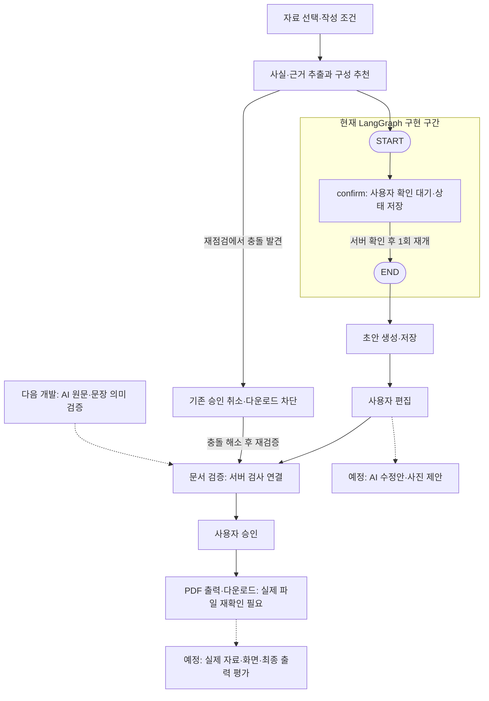

# Agent 담당 전용 작업 목록

기준일: 2026-09-28 · v1.41 · 이 파일의 작업 상태·결과 기록 담당: Agent 담당

범위: 사실/근거 추출·자료 분석·추천·초안·편집 보조·검증·LangGraph. 서버 상세 작업은 [task_backend.md](task_backend.md)에 있다.

- [x] **완료한 부분: 이전 작업물 이관·가짜 응답 연결 확인.** 관련 테스트 **159개 통과**. 상세 근거는 [6.5절](#65-승인-범위의-추출글-초안-연결-2026-09-28)을 따른다.
- [x] **완료한 부분: AG-01 · D-04 첫 시험안 승인.** 모델·한도·비용·자료 보관 조건은 [plan.md 4.4절](plan.md#44-d-04-첫-ai-연결-시험안)을 따른다. T01 최초 2회와 추가 초안 1회를 승인받아 모두 사용했다(6.10~6.13절).
- [x] **완료한 부분: 사용량 기록·시험 중단 기능 준비.** 가짜 응답을 사용한 Agent·기존 서버 검사 **197개 통과**. 실제 API 호출은 하지 않았다(6.8절).
- [x] **완료한 부분: 실제 시험용 가짜 자료 4종·확인 기준 준비.** 원문과 평가표는 [6.9절](#69-첫-시험용-가짜-자료-4종과-확인-기준-2026-09-28), 재사용할 입력은 tests/test_agent_llm.py의 `D04_TRIAL_CASES`에 있다.
- [x] **완료한 부분: T01 실제 시험 최대 2회 승인.** 추출 결과를 실제 사용자가 확인한 뒤에만 초안을 요청한다(6.10절).
- [x] **완료한 부분: T01 실제 요청과 오류 중단 확인.** 요청 1회가 HTTP 401 / `invalid_api_key`로 실패해 중단했다. 추출·초안 품질은 평가하지 못했다(6.11절).
- [x] **완료한 부분: T01 실제 추출 재시험 성공.** 기본 사실 3개와 원문 근거가 일치하고 나머지 11개는 자료 없음으로 처리됐다. 이번 응답의 사용량도 확인했다(6.12절).
- [x] **완료한 부분: 사용자 확인 후 T01 실제 초안 생성·검토.** 회사 개요·사업 분야 2문단과 근거가 일치하며 자료 없음 안내를 포함한 논리 페이지 1개를 구성했다. T01 추출·초안 기준 통과(6.13절).
- [x] **완료한 부분: T02 회사명 누락 시험.** 회사명 부족 문제를 표시하고 사용자 확인 후 사업 분야·공정 수만 본문으로 생성했다. 추출·초안 기준 통과, 기존 작업은 `b2c3221`로 커밋(6.14절).
- [x] **완료한 부분: 남은 T03·T04 호출 범위 재정리.** 각 추출 1회·사용자 확인 후 초안 1회, 추가 최대 4회로 정리했다. 기존 실패 포함 누적 최대 9회·예산 $1이며 새 API 호출은 없다(6.15절).
- [x] **완료한 부분: T03 실제 수치 충돌 시험.** 추출에서 2개·3개와 양쪽 근거를 보존하고, 사용자 확인 후 초안에는 `추가 확인 필요`로 표시했다. 생성 뒤에도 충돌 필수 문제를 유지해 추출·초안 기준 통과(6.16절).
- [x] **완료한 부분: T04 납기 조건 시험.** 일반 주문·승인 후·영업일 7일·특수 주문 예외가 추출과 초안에서 유지됐다. T01~T04 기본 시험 완료, 누적 9/9회 사용(6.17절).
- [x] **완료한 부분: AG-03 서버 Job 연결 시험 준비.** 저장·조회·중복/버전·호출 중단 검사를 보강하고 T04 추가 최대 2회 시험안을 정리했다. 실제 호출 없이 확인한 결과는 6.18절을 따른다.
- [x] **완료한 부분: S01 추가 2회 승인·실제 서버 분석 Job 저장/조회.** T04 mock 자료의 사실·조건·근거를 확인했고 분석 중복 요청은 호출을 늘리지 않았다. S01 1/2회·누적 10/11회 사용(6.19절).
- [x] **완료한 부분: S01 사용자 확인 후 실제 초안 Job·저장·조회.** 본문·납기 조건·근거·중복 요청을 확인하고 임시 자료를 정리했다. S01 2/2회·누적 11/11회 사용(6.20절).
- [x] **완료한 부분: AG-02 구성·보완 추천의 초기 규칙 구현.** 자료량·목적·강조·방향·사진 유무를 반영하고 사용자 설정을 유지한다. 가짜 응답·서버 회귀 검사 180개 통과(6.21절).
- [x] **완료한 부분: AG-03 최초 초안의 LangGraph 대기·재개·정리 연결.** 참조 체크포인트를 세션 폴더에 저장하고 중복 호출·오래된 확인을 거부한다. 가짜 응답·서버 관련 검사 200개 통과(6.22절).
- [x] **완료한 부분: AG-04 작성 설정에 따른 초안 구성.** 추천과 초안이 같은 순서·제외 규칙을 사용하고 근거·사전 점검·목표 분량을 보존한다. 가짜 응답·서버 관련 검사 233개 통과(6.23절).
- [x] **완료한 부분: AG-04 자료 부족 안내와 서버 주장 검사 정합성.** 항목 제목·대체 표지 오탐을 수정하고 부족 경고·필수 내용·실제 주장 차단을 확인했다(6.24절).
- [x] **완료한 부분: AG-03/04 커밋·PR 준비 검토.** 제외 연결어 오판과 재점검 중 초안 Job 중복 실행 문제를 수정했다. 검증 범위와 push·PR 준비 판단은 6.25절을 따른다.
- [x] **완료한 부분: AG-04 미참조 충돌의 문서 검증·새 승인 연결.** 본문 참조 없는 충돌·부분 재검증·해결 조치·새 승인 차단을 보강했다(6.26절).
- [x] **완료한 부분: AG-04 재점검 후 기존 승인·출력 차단.** 충돌 저장·기존 승인 무효화·재전송/출력 차단과 재검증·새 승인 후 복구를 확인했다(6.27절).
- [x] **완료한 부분: 충돌 연결 변경의 커밋 전 검토·안내 보완.** 관련 검사 342개를 다시 통과했고 현재 LangGraph 구현 범위를 전체 흐름과 대조했다(6.28절).
- [x] **완료한 부분: 사용자 승인 후 push·PR 등록, 검토 준비 완료로 전환.** `develop` 대상 [PR #17](https://github.com/agent-ddalgi-team/agent-ddalgi-backend/pull/17)에 누적 변경·검증 결과·남은 제한을 정리했다(6.29절). 이후 GitHub에서 병합된 상태를 확인했다(6.38절).
- [x] **완료한 부분: AG-07 원문·문장 검증의 첫 연결.** 검증 프롬프트·응답/근거 검사와 서버 저장·부분 재검증을 가짜 응답으로 확인했다(6.30절). 유료 검증 호출은 차단 상태다.
- [x] **완료한 부분: AG-07 실제 의미 판단 평가 준비.** 정상/오류 18개 사례·별도 정답표·자동 대조/사람 판단 기준과 V01·V02 최대 2회 시험 제안을 준비했다(6.31절). 실제 유료 호출은 하지 않았다.
- [x] **완료한 부분: AG-07 첫 실제 검증 2회.** V01 정상 문장은 문제 없음, V02 조건 손실은 원문·수정 제안이 있는 blocker로 반환됐다. 자동 대조·Codex 원문 검토가 기대와 일치했으며 사용자 최종 품질 판단은 미확인이다. 추가 2/2회·누적 13/13회 사용, 상세 결과는 6.32절을 따른다.
- [x] **완료한 부분: AG-07 V03 실제 숫자 사례의 예상 불일치 확인·중단.** 정상 문장의 “운영합니다”를 근거 없는 주장으로 지적해 추가 호출을 멈췄다. V04는 미실행이다. 자동 검사 289개 통과, 이번 1/2회·누적 14/15회 사용. 상세 결과·원인 검토·다음 비교안은 6.33절을 따른다.
- [x] **완료한 부분: AG-07 숫자만 바꾼 N01/N02 실제 비교.** 정상 3개는 문제 없음, 오류 30개는 수치 불일치 blocker 1개·정확한 원문·3개 복원 조치를 반환했다. 자동 대조·Codex 검토 일치, 이번 2/2회 사용. 기존 V03 표현 판단 문제는 남아 있다(6.34절).
- [x] **완료한 부분: AG-07 바꿔쓰기와 새 사실 추가의 기준안·비교 사례 준비.** 주장별 대조 기준, 같은 원문의 문장 비교 12쌍·운영 문맥 3조건과 지침 보완 제안을 정리했다. 문서 준비 결과이며 실제 지침 적용·모델 품질 확인은 후속이다(6.35절).
- [x] **완료한 부분: AG-07 검증 지침 보완과 27개 평가 입력 반영.** 주장별 의미 비교 지침, 정답표 분리, C03 평가 보류와 기존 V 입력 보존을 구현했다. 가짜 응답을 사용한 Agent 검사 352개 통과, 실제 추가 호출 0회(6.36절).
- [x] **완료한 부분: AG-07 P03A/P03B 실제 비교 2회.** 명시된 3개 공정 운영의 바꿔쓰기는 허용하고, “자체 인력만으로”라는 추가 주장은 원문·수정 안내와 함께 지적했다. 자동 대조·Codex 원문 검토가 기대와 일치했고 이번 2/2회로 종료했다(6.37절).
- [x] **완료한 부분: AG-07 누적 변경 커밋·push·PR 게시.** 회귀 검사 664개를 통과하고 `develop` 대상 일반 [PR #18](https://github.com/agent-ddalgi-team/agent-ddalgi-backend/pull/18)을 생성했다. AG-07 전체는 진행 중이다(6.38절).
- [ ] **진행 중: AG-07 나머지 의미 검증 평가.** 다음은 지침 작성에 직접 사용하지 않은 다른 어휘·업종의 비교 사례 준비다. 원래 18사례는 3개 실행(기대 일치 2·불일치 1)·15개 미실행이고, 별도 숫자 비교 2개는 기대와 일치했다. 새 27개는 P03A/P03B 2개 기대 일치·25개 미실행(C03 평가 보류 포함)이다. V03/C03 경계·반복 안정성·일반 품질·사용자 최종 품질 판단은 남아 있다. AG-07 전체는 IN_PROGRESS이며 사진·목적별 추가 필수 기준·재점검 Fact 연결·자료 변경 후 편집 복귀·실자료 품질·출력·프론트·편집 그래프·운영 기준도 미완료다.

### 체크박스 읽는 법

- `[x] 완료`: 해당 줄에 적힌 범위의 구현·확인을 끝냈다.
- `[ ] 진행 중`: 일부를 끝냈지만 남은 완료 조건이 있다. 안쪽 체크박스에서 끝낸 부분을 확인한다.
- `[ ] 예정`: 아직 시작하지 않았거나 먼저 결정할 사항이 있다.

AG-01 같은 큰 작업은 안쪽 완료 조건을 모두 충족한 뒤 체크한다. 가짜 응답 시험이 끝났어도 실제 AI 품질 확인까지 끝난 것으로 표시하지 않는다. [2.1절](#21-기존-작업-id와-상태)은 큰 작업 상태, 2.2~2.7절은 실제 구현 체크리스트, 6절은 당시 작업 기록이다.

## 1. AI가 읽을 파일

[AGENTS.md](AGENTS.md) → [plan.md](plan.md) → [contracts.md](contracts.md) → [agent.md](agent.md) → 이 파일. 제품 동작의 완료 조건이 필요하면 [prd.md](prd.md)를 확인한다.

공통 [task.md](task.md)는 연결 지점과 검수 위치를 확인할 때 읽는다. 다른 담당자의 상세 작업은 필요한 입력/결과를 확인할 때만 참조한다. 타 담당의 작업 상태를 임의로 바꾸거나 해당 작업까지 자기 구현 범위로 해석하지 않는다.

### 백엔드 선행 결과 확인

AG-01 시작 시 task_backend.md의 다음 항목을 확인한다.

- 6.1-5절: 기존 Agent 코드·프롬프트·스키마 이관 요청
- 6.4-3절: analyze / draft 연결 규격
- 6.5-3절: propose 연결 규격
- 6.13절: validate·검증 Job·서버 저장/승인 연결
- 6.16~6.17절: 서버 정리·시연 출처·작성 조건 첨부의 근거 제외

실제 연결 기준 파일인 app/agent_bridge.py와 관련 모델을 함께 읽는다.
기록·실제 코드·contracts.md가 다르면 차이를 보고하고,
미합의 내용을 임의로 확정하지 않는다.

필요한 AI 패키지와 모델 설정은 AG-01에서 확인한다.
기존 Windows 로컬 경로를 Mac에서 그대로 사용하지 않는다.

### 1.1 작업 진행을 알려주는 방식

사용자 요청(2026-09-28)에 따라 작업을 시작하거나 진행 상황을 보고할 때 **작업 ID·이름 + 현재 단계/전체 단계**를 표시한다. 작업을 마칠 때는 **완료한 일 + 확인 결과 + 다음 할 일**을 함께 적는다.

```text
작업: AG-01 · 모델·호출 한도 결정안 — 2/4 · 설정안 정리 중
완료: 기존 설정 항목과 미정 사항 확인
다음: 선택 이유·비용·자료 보관 조건을 정리해 사용자에게 제시
```

위 문구는 표시 형식의 예시다. 실제 시작 시 해당 작업의 단계를 정하고 현재 위치를 갱신한다. `2/4`는 두 번째 단계 진행 중이라는 뜻이며 전체 프로젝트 완성도나 예상 소요 시간을 뜻하지 않는다. 시작하지 않은 단계·검사하지 않은 결과를 완료로 표시하지 않고, 확인이나 승인을 기다리는 경우에는 `확인 대기`로 적는다. 작업 범위가 바뀌면 단계 수를 바꾼 이유를 함께 알린다.

**사용자 요청 추가(2026-09-28):** 완료 보고는 비전공자가 기능과 수정할 지점을 이해할 수 있도록 전체 흐름의 **기존 완료 부분 / 이번에 추가한 부분 / 남은 부분**을 비교한다. `agent.md`의 세 역할과 실제 구현 기능을 연결하고, 코드 연결·가짜 응답 검사·실제 AI 품질 확인을 구분한다. 테스트 개수만으로 기능 전체가 완료됐다고 설명하지 않으며, 쉬운 전후 예시와 다음 결정 항목을 함께 제시한다.

**완료 설명 고정(2026-09-28 사용자 재요청):** 앞으로 작업 완료 보고마다 ① 무엇을 했는지 ② 왜 필요한 작업이었는지 ③ **자료 선택 → 자료 분석 → 초안 작성·편집 → 내용 검증 → 승인 → 출력**에서 현재 어디를 작업했는지 ④ 실제 확인 결과·남은 일·다음 작업을 쉬운 말로 설명한다. 어려운 용어는 처음 나올 때 풀어 쓰고, 가능하면 원문과 바뀐 문장을 짧게 비교한다. 개별 시험 완료와 AG 작업 전체 완료를 구분한다. 이 방식은 별도 설명 요청이 없는 후속 작업에도 적용한다.

## 2. 내 작업

### 2.1 기존 작업 ID와 상태

**진행 중 — AG-01~04**

- [ ] **AG-01 · 기존 작업물 연결과 실행 준비 — 진행 중(IN_PROGRESS)**
  - 선행: 없음. BE-01과 담당 경계를 맞춘다.
  - 범위: 기존 추출 코드·프롬프트·사실 스키마와 상세 필드를 보존한다. D-04 설정·D-05 변환을 공통 계약에 맞춘다.
  - 현재: 이관·가짜 응답 연결·D-04 준비와 T01~T04 직접 호출 시험을 마쳤다. S01 실제 서버 분석/초안 Job의 저장·조회도 확인해 누적 11/11회를 사용했다(6.20절). 실자료 품질·운영 기준은 남아 있다. 이전 검사 기록은 6.8~6.9절, 서버 시험 준비 검사는 6.18절을 따른다.

- [ ] **AG-02 · 자료 분석과 사전 확인 — 진행 중(IN_PROGRESS)**
  - 선행: AG-01, BE-03.
  - 범위: 사실·출처·누락·충돌을 분석하고 페이지·사진·인증 활용을 추천한다. 읽기 불확실 부분을 확정값으로 사용하지 않는다.
  - 현재: S01 실제 추출·서버 저장 확인(6.19절)에 이어 구성·보완 추천의 초기 규칙을 구현했다(6.21절). 같은 구성 규칙의 초안 반영은 AG-04에서 연결했다(6.23절). 실자료 추천 품질·사진 관련성·프론트 확인·세션 첨부의 실제 모델 연결은 남아 있다.

- [ ] **AG-03 · 서버 호출과 사용자 확인·재개 — 진행 중(IN_PROGRESS)**
  - 선행: AG-02, BE-04.
  - 범위: LangGraph 점검·확인·재개·분기를 연결한다. 세션·입력 버전과 중복 실행을 검사하고 체크포인트 저장·정리를 서버와 연결한다.
  - 현재: S01 실제 서버 시험(6.19~6.20절)에 이어 최초 초안의 LangGraph 확인 대기·재개와 BE-09 체크포인트 정리를 연결했다(6.22절). 재점검 중 같은 초안 Job이 중복 실행될 때 원래 작업이 실패하는 문제도 수정했다(6.25절). 실제 모델을 붙인 그래프·실제 서버 오류 경로·편집 단계 그래프·프로세스 장애 복구는 남아 있다.

- [ ] **AG-04 · 근거가 연결된 최초 초안 — 진행 중(IN_PROGRESS)**
  - 선행: AG-02.
  - 범위: 목적·목표 분량·방향에 맞는 블록과 근거를 만든다. 실제 사진만 배치하고 1쪽/6쪽부터 확인하며 없는 사실로 분량을 채우지 않는다.
  - 현재: 목적·강조·방향별 구성(6.23절), 자료 부족 제목 검사(6.24절), 제외 연결어 보강(6.25절), 미참조 충돌의 검증·새 승인 차단(6.26절)에 이어 재점검 후 기존 승인 무효화·출력 차단과 복구를 확인했다(6.27절). 실제 모델 품질·사진·실제 출력 배치는 남아 있다.

위 네 작업의 상태 기준일은 **2026-09-28**, 첫 연결 근거는 [6.5절](#65-승인-범위의-추출글-초안-연결-2026-09-28), 실제 시험 최신 기록은 [6.20절](#620-s01-실제-초안-저장과-시험-종료-2026-09-28), 추천은 [6.21절](#621-구성보완-추천-구현-2026-09-28), 그래프는 [6.22절](#622-langgraph-확인-대기재개정리-연결-2026-09-28), 초안 구성은 [6.23절](#623-작성-설정에-따른-초안-구성-2026-09-28)이다.

**진행 중 — AG-07**

- [ ] **AG-07 · 원문 대조와 내용 검증 — 진행 중(IN_PROGRESS)**
  - 선행: AG-04, BE-05.
  - 범위: 필수 내용·숫자·조건·인증·과장·사진 캡션을 검사한다. 변경 부분을 재검증하고 구조만 바뀌면 같은 사실 질문을 불필요하게 반복하지 않는다.
  - 현재: 가짜 응답으로 글 검증·서버 연결을 확인했다(6.30절). 실제 V01·V02 납기 비교는 기대 일치(6.32절), V03는 표현 판단의 예상 불일치로 중단했다(6.33절). 별도 N01/N02 숫자 비교는 기대와 일치했다(6.34절). 기준 준비·지침과 27개 평가 입력 반영(6.35~6.36절) 후 P03A/P03B 실제 비교도 정상 허용·자체 인력 추가 지적이 기대와 일치했다(6.37절). 원래 18개 중 15개, 새 27개 중 25개는 미실행이다. V03/C03 경계·반복 안정성·일반 품질·사용자 판단·사진·목적별 추가 필수 규칙·Fact 재연결은 남아 있다. 이번 2/2회·누적 18회 사용이며 이전 보류 1회·서버 기본 유료 검증 차단을 유지한다.

**아직 시작하지 않은 작업 — AG-05·06·08**

- [ ] **AG-05 · 선택 영역의 문구·구성 수정안 — 예정(TODO)**
  - 선행: AG-03, AG-04, BE-05.
  - 범위: 제안과 적용을 구분하고 관련 없는 내용은 보존한다. 적용·취소·재요청으로 이어지며 AI가 자체 승인하지 않는다.

- [ ] **AG-06 · 사진 후보와 캡션 — 예정(TODO)**
  - 선행: AG-05, BE-03.
  - 범위: 실제 사진의 관련성과 캡션을 제안한다. 후보가 없으면 업로드·사진 자리로 안내하고 존재하지 않는 자산을 만들지 않는다. AI 이미지 생성은 기본 범위 밖이다.

- [ ] **AG-08 · 실제 품질과 전체 흐름 평가 — 예정(TODO)**
  - 선행: AG-06, AG-07, BE-08.
  - 범위: 실제 자료와 가상 오류로 충돌·누락·조건 손실·사진 없음·수정 범위를 확인한다. 검수 근거와 실행 시간·호출량·비용을 기록한다.

기존 작업 ID·선행 조건과 과거 기록을 유지한다. AG-01~04·AG-07은 진행 중, AG-05·06·08은 TODO다(6.30절). 선행 작업 중 확인된 입출력을 사용해 일부를 병행했으며 전체 선행 완료를 뜻하지 않는다. 상태는 TODO / IN_PROGRESS / DONE / BLOCKED로 관리한다. 가짜 응답으로 확인한 결과와 실제 AI 연동 완료를 구분한다.

### 2.2 기존 AI 자산과 실행 준비

아래는 구현 순서에 따른 작업 단위다. Requirement ID의 설명·통과 기준은 [prd.md](prd.md)를 따른다. 굵은 제목은 한 번에 진행할 작업이고, 안쪽 체크박스는 이미 끝낸 부분과 남은 완료 조건이다. 실제 확인 결과를 5·6절에 기록한 뒤 체크하며 기존 AG ID와 2.1절 선행 조건을 유지한다.

- [x] **AG-01 · 기존 Agent·프롬프트·상세 스키마 확인하고 현재 규격에 연결하기** — BR-05, BR-06.
  - 선행/연결: BE-01과 담당 경계를 맞추고 백엔드 6.1-5·6.4-3·6.5-3절 및 실제 연결 파일을 확인한다.
  - 완료 확인: 원본의 저장소·브랜치·파일 위치를 확보해 읽고 상세 필드를 보존하는 D-05 변환표를 정리한다. 없는 원본을 mock으로 추정하지 않으며, 현재 모델·근거/사진 ID·오류 연결과 차이를 기록한다.
  - 현재 결과: 원본 `develop e8fc52a`와 14개 항목을 보존해 승인된 파일을 이관했다. 변환 기준은 [agent.md 4.3절](agent.md#43-ag-01-원본과-데이터-변환-기준), 가짜 응답으로 확인한 연결 결과·제한은 6.5절을 따른다. 사진·수정안·의미 검증은 후속이며 AG-01 전체 완료는 D-04 설정 확인까지 필요하다.

- [ ] **AG-01 · 모델·호출 한도·비밀값과 원문 보호 설정하기** — BR-12, NFR-01.
  - [x] SDK와 설정 안내 추가, 설정 누락·호출 실패·비밀값을 숨긴 오류 처리를 가짜 응답으로 확인.
  - [x] D-04 첫 시험의 모델·한도·비용·자료 보관 제안과 선택 이유 정리(6.7절). 운영 기준 확정은 아님.
  - [x] D-04 첫 시험안 사용자 승인. 운영 기준은 시험 후 결정하며 실제 호출은 별도 승인 절차를 따름.
  - [x] 사용량 측정·시험 중단 기능 준비 및 가짜 응답 검사. 기존 서버 검사 포함 197개 통과(6.8절).
  - [x] 첫 시험용 가짜 자료 4종·기대 결과·사람이 확인할 기준 준비 및 가짜 응답 연결 확인(6.9절).
  - [x] T01 실제 추출 1회·사용자 결과 확인 후 초안 1회 승인(6.10절). 당시 후속 사례는 승인 범위 밖이었으며 T02 후속 진행은 6.14절을 따름.
  - [x] 사용자 입력 키로 T01 실제 요청 1회·인증 실패 후 중단·키 비노출 확인(6.11절).
  - [x] 사용자 키 재입력 후 T01 실제 추출 응답·원문 근거·사용량 확인(6.12절).
  - [x] 사용자 확인·추가 승인 후 T01 실제 초안·근거·사용량 확인(6.13절).
  - [x] T02 실제 추출·사용자 결과 확인·초안의 근거와 누적 사용량 확인(6.14절).
  - [x] T03·T04 추가 최대 4회·누적 최대 9회로 범위 정리, $1 예산과 이전 실패 기록 유지(6.15절). 실제 추가 호출·코드 기본 한도 변경은 없음.
  - [x] T03 실제 추출·사용자 확인 후 초안·근거·미해결 충돌 유지·누적 사용량 확인(6.16절).
  - [x] T04 실제 추출·사용자 확인 후 초안의 납기 조건과 근거 보존, 누적 9회 사용·시험 종료 확인(6.17절).
  - [ ] 실자료 품질과 계정 운영 조건 확인. 가짜 자료 4개 사례의 통과로 전체 품질을 확정하지 않음.
  - 선행/연결: 원본 확인, D-04 및 BE-01의 실행 설정. 필요한 패키지·모델·선택 자료 내 검색 방법을 정한다.
  - 완료 확인: 호출·재시도 한도를 설정하고 키와 실회사 원문이 로그·오류에 노출되지 않도록 확인한다. 첨부 속 지시를 시스템 지침으로 삼거나 HTML·스크립트를 실행하지 않고 외부 AI/추적 서비스에 남는 자료의 범위·정리 방법을 백엔드와 맞춘다.

### 2.3 자료 분석과 사전 확인

- [ ] **AG-02 · 선택 자료에서 사실·수치·조건·근거 추출하기** — BR-02, BR-04, BR-05.
  - [x] 가짜 응답으로 14개 정보 항목·여러 사실·충돌 후보와 출처 변환, 잘못된 근거 거부 확인.
  - [x] 실제 모델의 T01 기본 사실 3개·근거와 원문 대조, 나머지 11개 자료 없음 처리 확인(6.12절).
  - [x] T02 실제 모델의 회사명 누락·필수 문제와 사업 분야·공정 수 근거를 원문과 대조(6.14절).
  - [x] T03 실제 추출의 공정 수 2개·3개 후보와 원문 근거·충돌 필수 문제 확인(6.16절).
  - [x] T04 실제 추출의 일반 주문·시작 기준·영업일·특수 주문 예외와 원문 근거 확인(6.17절).
  - [x] S01의 mock 등록 자료를 실제 모델·서버 Job으로 추출해 SQLite 사실·구간·위치·원문 발췌와 대조하고 재조회/중복 요청의 추가 호출 없음 확인(6.19절).
  - 선행/연결: AG-01, BE-03의 읽기 구간·출처 위치·선택 자료. 등록/세션 자료 입력을 모두 확인한다.
  - 완료 확인: 실제 파일·구간·위치·원문에 연결된 사실을 반환한다. 다른 자료·읽지 못한 구간을 사용하지 않고 부족·불일치·불확실성을 원문 위치와 함께 표시한다. 사진만으로 회사 사실을 만들지 않는다.

- [ ] **AG-02 · 목적·분량·사진에 맞는 구성과 보완 추천하기** — FR-01, BR-05.
  - [x] 사진만 선택했을 때 텍스트 자료 요청·생성 차단을 가짜 자료로 확인.
  - [x] 목적·강조·방향·자료량·사진 유무에 따른 추천 분량·구성·보완 이유 구현. 가짜 응답·서버 저장·사용자 설정 보존 검사 통과(6.21절).
  - [ ] 실자료로 추천 기준을 평가하고 사진 관련성·실제 배치와 프론트 표시를 확인. 자유 문구의 의미 해석은 현재 키워드·간단한 제외 표현에 한정됨.
  - 선행/연결: 위 사실 추출, C-04의 추천·경고 규격. 보완 메모 지원 여부는 C-10을 먼저 확인한다.
  - 완료 확인: 목적·강조·방향·분량·사진 비중에 맞는 추천과 이유·보완 방법을 제공하고 선택값은 자동 변경하지 않는다. 텍스트 근거가 없으면 생성 불가를, 필수 내용 일부만 부족하면 누락을 표시한 검토용 초안 가능 여부를 구분한다. 최종 승인 시 필수 누락은 계속 차단 대상이다.

### 2.4 실제 AI 연결·사용자 확인·초안

AG-03과 AG-04는 AG-02 이후 가능한 부분을 병행한다. 서버 연결은 AG-03, 초안 내용 생성은 AG-04에서 맡고 실제 연결을 함께 확인한다.

- [ ] **AG-03 · 실제 분석·생성 호출과 진행·오류 결과 연결하기** — BR-05, BR-12, NFR-02.
  - [x] 가짜 응답으로 서버 Job·결과 조회·초안 저장·오류 시 기존 문서 보존 확인.
  - [x] T04 세션 첨부·mock 등록 자료로 기존 factory/가짜 SDK/SQLite 저장·재조회·중복 요청·2회 한도 중단 확인(6.18절). 실제 모델 추가 호출은 없음.
  - [x] S01 실제 모델의 분석 Job 성공·사전 점검 저장·조회·사용자 확인 대기·분석 중복 요청의 추가 호출 없음 확인(6.19절).
  - [x] S01 실제 사용자 확인 후 초안 Job 성공·문서 버전 1 저장·본문/근거 재조회·중복 요청의 추가 호출 없음 확인(6.20절).
  - [ ] 실제 모델을 사용한 서버 실패 경로와 기존 문서 보존 확인. 정상 흐름과 가짜 SDK 오류 검사는 완료했으며 실제 실패 시험은 남아 있음.
  - 선행/연결: AG-02, BE-04의 내부 연결 규격. 생성 내용 구현은 AG-04와 맞춘다.
  - 완료 확인: 실제 AI 결과가 서버의 작업 상태·결과 조회로 이어진다. 제한된 재시도 후에도 실패하면 원인과 다음 행동을 전달하고 기존 문서를 보존한다. 실제 실패를 mock·빈 결과·성공 상태로 감추지 않는다.

- [ ] **AG-03 · 사용자 확인 대기·재개·중복/만료 처리 연결하기** — BR-01, BR-03, BR-05, BR-11.
  - [x] 기존 서버 경로에서 최신 사전 확인과 중복 초안 요청 방지를 가짜 응답으로 확인.
  - [x] 미확인·입력 변경 뒤 오래된 점검 거부, 완료한 분석/초안의 같은 키 재전송 시 추가 호출 없음 확인(6.18절).
  - [x] 최초 초안의 LangGraph 대기·재개·중복/만료 거부와 세션 폴더 체크포인트 정리를 서버에 연결하고 가짜 응답으로 확인(6.22절).
  - [ ] 실제 모델을 붙인 그래프·실제 프로세스 재시작·편집 단계의 확인/재개 연결 검증. 소비 후 장애의 자동 복구는 미구현이며 재점검이 필요함.
  - 선행/연결: AG-02, BE-04, C-03/C-06. LangGraph의 중간 저장·재개 지점을 서버와 정한다.
  - 완료 확인: 최신 점검을 사용자가 명시적으로 확인한 뒤에만 생성하며 입력 변경 시 재확인한다. 응답 대기 중 AI를 반복 호출하지 않고 중복 재개·오래된 응답·만료 세션의 저장을 막는다. 체크포인트 정리 지점을 제공하고 BE-09에서 전체 정리를 함께 확인한다.

- [ ] **AG-04 · 근거가 연결된 목차·페이지·블록 초안 만들기** — FR-01, FR-02, BR-06.
  - [x] 가짜 응답으로 근거를 유지한 글 초안과 1·4·6·8·10개 논리 페이지 분할 확인.
  - [x] 실제 T01 글 초안 2문단·원문 근거·11개 자료 없음 안내·논리 페이지 1개 확인(6.13절).
  - [x] 실제 T02 글 초안 2문단·원문 근거·12개 자료 없음 안내·논리 페이지 6개 확인(6.14절).
  - [x] 실제 T03 본문 2개·근거·공정 수 `추가 확인 필요` 안내·미해결 blocker·논리 페이지 6개 확인(6.16절).
  - [x] 실제 T04 본문 4개·납기 조건/예외·근거·논리 페이지 6개 확인(6.17절).
  - [x] 실제 S01 서버 초안 본문 3개·납기 조건/예외·근거·논리 페이지 6개·27블록 저장 및 조회 확인(6.20절).
  - [x] 목적·강조·방향별 초안 구성과 명시적 제외 구현. 1쪽/6쪽 순서·가짜 응답의 조건·근거·문제 보존과 실제 서버 저장 규격 확인(6.23절).
  - [x] 서버가 자료 없는 항목 제목·대체 표지를 사실 주장으로 판정하는 오탐 수정. 부족 warning·필수 누락·mock·실제 주장 blocker와 재검증 기록 확인(6.24절).
  - [x] 사전 점검의 미해결 충돌이 문서에서 참조되지 않아도 검증·부분 재검증에서 유지하고 새 승인을 차단하는 경로 확인(6.26절).
  - [x] 승인 후 같은 입력 재점검에서 새 충돌이 생길 때 기존 승인 무효화·멱등 응답·출력 접근과 재검증·새 승인 후 복구 확인(6.27절). 백엔드 BE-06/08 연결 결과이며 실제 PDF/AI 검증은 별도.
  - [ ] 실제 AI 내용 품질·목적별 구성·사진·PDF/DOCX 배치를 확인.
  - 선행/연결: AG-02의 사실·추천, BE-04와 AG-03의 생성 연결.
  - 완료 확인: 목적·방향·목표 분량에 맞춰 원문 근거와 실제 사진 ID만 사용한다. 없는 사실·수치·실적을 만들지 않고 자료 부족·충돌을 표시한다. 사진 없음/사용 안 함은 글 중심으로 구성한다. 먼저 1쪽/6쪽을 확인하고 최종 평가는 1·4·6·8·10쪽 모두 포함한다.

### 2.5 선택 수정안과 사진

- [ ] **AG-05 · 선택 영역의 문구·구성 수정안 만들기** — BR-07, BR-11, NFR-02.
  - 선행/연결: AG-03/04, BE-05. C-02/C-11의 후보·허용 편집 범위와 버전 규격을 맞춘다.
  - 완료 확인: 기존/제안 내용·이유·근거를 반환하고 적용·취소·재요청으로 연결한다. 사용자 적용 전 본문을 바꾸지 않고 관련 없는 내용은 보존한다. 다른 영역에도 변경이 필요하면 영향을 알리고, 기준 버전이 바뀐 제안은 서버가 거부하도록 연결한다.

- [ ] **AG-06 · 실제 사진 후보·관련성·캡션 제안하기** — FR-02, BR-06, BR-07.
  - 선행/연결: AG-05, BE-03. 사진 내용 판단에 사용할 이미지 또는 확인된 설명의 전달 방식을 백엔드와 맞춘다.
  - 완료 확인: 선택 자료에 실제 있는 사진만 추천하며 ID·파일명만으로 내용을 추정하지 않는다. 후보 수를 꾸며내지 않고 선택·교체 전 원본을 유지한다. 사진이 없으면 추가 첨부·글 중심 구성·사진 자리를 안내한다. 남겨 둔 사진 자리는 최종 승인 전에 채우거나 제거해야 한다.

### 2.6 원문 대조·재검증·자료 변경 후 복귀

- [ ] **AG-07 · 원문과 문서를 대조하고 문제·해결 방법 반환하기** — BR-08, BR-09.
  - [x] 기존 validate 입력·서버 규칙 확인, 글 검증 프롬프트·응답 스키마·원문/범위 검사 연결 및 가짜 응답 확인(6.30절).
  - [x] 정상/오류 18개 평가 사례·정답표 분리·자동 대조와 사람 판단 구분·첫 실제 검증 2회 제안 준비(6.31절).
  - [x] V01·V02 실제 모델 호출, 정상 오탐 없음·조건 손실 검출·근거/조치의 자동 대조와 Codex 검토 완료(6.32절). 사용자 최종 품질 판단은 미확인.
  - [x] V03 실제 응답의 정상 문장 지적과 예상 불일치를 기록하고 V04 전 추가 호출 중단·원인 분리 시험안 준비(6.33절). 숫자 검증 성공을 뜻하지 않음.
  - [x] 숫자만 바꾼 별도 N01/N02 실제 비교의 정상 허용·수치 오류 검출 및 원문/조치 대조 완료(6.34절). V03 표현 판단 해결이나 일반 정확도 확인은 아님.
  - [x] 바꿔쓰기·새 사실 추가 기준안, 같은 원문의 문장 비교 12쌍·운영 문맥 3조건, 검증 지침 보완 제안 준비(6.35절). 문서 사례이며 모델 평가 미실행.
  - [x] 명확한 바꿔쓰기 기준을 지침에 반영하고 27개 입력·별도 정답표·C03 미채점·기존 V 입력 보존을 가짜 응답으로 확인(6.36절). 실제 의미 품질은 미확인.
  - [x] P03A/P03B 실제 응답 비교에서 명시된 운영 바꿔쓰기 허용·자체 인력 추가 주장 지적 및 원문·조치 대조 완료(6.37절). 각 1회 개발 사례 확인이며 일반 품질은 미확인.
  - [ ] 다른 어휘·업종 비교 사례 준비·남은 실제 평가·V03/C03 경계 판단, 원래 미실행 15사례와 실자료 평가, 사진 입력 연결, 목적별 추가 필수 규칙 합의.
  - 선행/연결: AG-04, BE-05. 목적별 필수 항목과 검증 결과 규격은 C-08에서 맞추고, 서버 저장·승인은 BE-06에 전달한다.
  - 완료 확인: 회사명·주요 사업/공정 설명과 목적별 필수 내용을 확인하고, 수치·인증·기간·조건·과장·사진 캡션을 근거와 대조해 위치·원인·원문·해결 행동을 반환한다. 인증 자체를 모든 소개서의 필수 항목으로 요구하지 않는다. D-07에 따라 정확성·출력 이용에 영향 있는 문제와 허용 경고를 구분한다. 사용자 확인만으로 필수 문제를 낮추지 않는다. 실제 파일 배치 검사는 백엔드가 맡는다.

- [ ] **AG-07 · 변경 부분을 재검증하고 다른 미해결 문제 유지하기** — BR-08, BR-09, NFR-02.
  - [x] 가짜 응답으로 서버 저장·부분 검사·다른 blocker 유지·순서 이동 호출 생략·수정 후 해결/재검출·오래된 결과 폐기 확인(6.30절).
  - [ ] 실제 모델 검증·사진 변경·재점검 이후 Fact 연결 확인. 문서 자동 재연결은 C-05 후속.
  - 선행/연결: 위 원문 대조, BE-05의 변경 내용·버전. 검증 결과와 관련 범위를 BE-06에 전달한다.
  - 완료 확인: 문장·사진·출처 등 영향 있는 범위를 다시 검사하며 다른 영역의 필수 문제를 잃지 않는다. 순서만 바뀌면 불필요한 사실 질문을 반복하지 않고 재사용한 검사와 근거의 유효성을 연결한다. 관련 변경의 경고 재확인에 필요한 정보를 제공하며 확인 기록·승인 무효화는 서버가 처리한다.

- [ ] **AG-02/05/07 후속 · 자료 변경이 기존 편집에 미치는 영향 확인하기** — BR-04, BR-05, BR-07, BR-08.
  - 선행/연결: AG-03의 확인/재개, BE-04/05 후속과 BE-06. C-05의 편집 복귀 규격을 먼저 맞춘다.
  - 완료 확인: 새 선택 자료로 재점검·사용자 확인을 거친 뒤 문장·사진·근거 영향을 반환한다. 필요한 부분의 수정안 또는 현 내용 유지 사유를 제시하고 선택 적용·최신 입력 연결·재검증으로 이어진다. 전체 재생성으로 직접 편집을 덮지 않으며 필수 문제는 유지 사유만으로 해결하지 않는다.

### 2.7 실제 자료 평가와 전달

- [ ] **AG-08 · 실제 초안·편집·검증·출력 내용 평가하기** — BR-06, BR-07, BR-08, BR-10.
  - 선행/연결: AG-06/07, BE-08. 부분 평가는 앞 작업에서 수행하되 최종 평가는 실제 출력 파일까지 확인한다.
  - 완료 확인: 목표 1·4·6·8·10쪽 모두에서 사실을 만들어 분량을 채우지 않는지, 수정 범위·근거·조건이 유지되는지 확인한다. PDF/DOCX 실제 내용 대조 결과와 자료·모델·프롬프트 버전을 기록해 BE-10에 전달한다.

- [ ] **AG-08 · 실패·예외 사례 평가하고 실행 측정값 기록하기** — BR-05, BR-08, BR-12, NFR-02.
  - 선행/연결: 위 평가와 백엔드의 오류/버전 처리.
  - 완료 확인: 누락·충돌·조건 손실·사진 없음·AI 실패·오래된 결과를 재현해 동작과 남은 제한을 기록한다. 실행 시간·호출량·비용은 실제 측정값을 남기고 미합의 정확도·응답 시간 목표를 만들지 않는다.

미정사항의 원본은 [plan.md](plan.md) 4.1절과 [contracts.md](contracts.md) 7절이다. 해당 기능 착수 전에 필요한 부분을 정한다. AG-07은 BE-06 완료를 기다리지 않으며, AG-03은 BE-09 완료를 기다리지 않는다. 각자 결과를 제공한 뒤 실제 연결을 확인한다. 로그인·회원가입·AI 이미지 생성·OCR·별도 AI 페이지 요약은 이번 작업에 추가하지 않는다.

## 3. 상대 담당에게 전달할 것

- 백엔드에게: 스키마를 지킨 사실·근거·사전 점검·초안·수정안·검증 결과.
- AI 호출/그래프의 실행 방법, 사용자 대기·재개 조건, 오류와 제한.
- 모델·근거 평가 결과와 코드/프롬프트 버전. API나 최종 승인 상태는 직접 바꾸지 않는다.

## 4. 상대 담당에게 받아야 할 것

- 백엔드의 선택 자료/읽기 구간/자산 ID/세션·문서 버전과 내부 호출 계약.
- 저장·승인·작업 상태·체크포인트 정리의 서버 연결 지점.
- 실제 화면의 문제는 프론트 관찰 결과를 받아 재현한다. 프론트 코드를 이 레포에 만들지 않는다.

선행 결과가 없으면 요청/응답 계약 예시로 가능한 부분을 먼저 진행할 수 있다. 실제 연결이 필요한 완료 조건은 검증 후에만 통과시킨다. 부족한 입력과 요청 대상·작업 ID를 자기 진행 기록에 적는다.

## 5. 내가 결과를 기록할 필수 검수

아래 항목은 이 파일이 결과 기록의 원본이다. 다른 담당과 함께 확인하는 항목도 기록은 한 곳에 모은다. 수정/테스트가 다른 역할에 걸치면 그 담당의 확인 근거를 함께 남긴다. 확인·보조 담당자는 추가 육안 확인만 맡고 필수 검증의 단독 책임자가 되지 않는다.

| ID | 검수 내용 | 확인 참여 | 기대 결과 | 결과 |
|---|---|---|---|---|
| QA-01 | 등록/세션 자료의 근거 연결 | Agent | 선택 원문과 파일·위치로 연결 | 가짜 SDK로 등록/세션 API 저장·근거 연결 확인(6.18절), S01 실제 모델의 mock 등록 자료 분석 Job·저장·근거·재조회 확인(6.19절); 세션 첨부의 실제 모델 연결은 후속 |
| QA-05 | 사진만 선택 | Agent | 사실 생성 차단, 텍스트 근거 요청 | 가짜 사진으로 서버 연결 확인(6.5절) |
| QA-06 | 사진 없는 텍스트 자료 | Agent | 글 중심 초안 가능 | T01~T04·S01 실제 초안 기록 유지(6.13~6.20절). 목적별 구성은 가짜 응답·서버 저장으로 확인(6.23절); 실자료 품질은 후속 |
| QA-09 | 1·4·6·8·10쪽 | Agent + 백엔드 | 사실 창작 없이 분량 구성, 넘침·쪽수 차이 안내 | 논리 페이지 분할만 확인(6.5절); PDF/DOCX 배치 미실행 |
| QA-12 | 인증·수치 충돌 | Agent | 원문 비교, 근거 없는 확정 없음 | T03 실제 추출에서 공정 수 두 후보·근거 보존, 초안에서 미확정 안내·미해결 충돌 유지 확인(6.16절); 인증 충돌·자동 의미 검증은 후속 |
| QA-13 | 조건 있는 납기 축약 | Agent | 조건 유지 또는 확인 필요 표시 | T04 실제 추출·초안의 일반 주문 조건과 특수 주문 예외 보존 확인(6.17절); 자동 의미 검증·실제 출력은 후속 |

다른 검수의 결과 위치는 공통 task.md의 인덱스를 따른다. 같은 상태를 여러 파일에 중복 기록하지 않는다. 검수 결과에는 사용한 버전·자료·명령 또는 클릭·실제 관찰을 남긴다.

### 5.1 최신 요구사항에 대한 추가 확인

6.5절의 가짜 응답 확인은 일부 연결 검증이다. 실제 모델·자료·최종 출력의 전체 QA 완료로 표시하지 않는다. AG-08까지 다음을 함께 확인한다.

- QA-01/05/06: 선택한 등록/세션 자료만 근거로 사용한다. 텍스트 근거가 전혀 없는 경우와 일부 필수 내용만 부족한 경우를 구분하고, 사진 후보가 없어도 글 중심 초안을 만든다 — AG-02/04/06, BR-04/05/06, FR-02.
- QA-09: 목표 1·4·6·8·10쪽 모두와 실제 PDF/DOCX 내용을 대조한다. 목표와 실제 쪽수 차이를 숨기거나 사실을 만들어 채우지 않는다 — AG-04/08, BR-06/10.
- QA-12/13: 수치·인증·기간·조건을 원문과 대조하고 필수 문제와 허용 경고를 구분한다. 확인 클릭만으로 필수 문제를 낮추지 않는다 — AG-07/08, BR-08/09.
- 공동 확인: 자료 변경 후 편집 보존은 QA-07, 오래된 결과·중복 재개는 QA-11, 부분 재검증·경고 재확인은 QA-14, 승인 조건은 QA-16, 전체 정리는 QA-20에 연결한다. Agent 확인 근거를 전달하며 최종 결과는 [task_backend.md 5절](task_backend.md#5-내가-결과를-기록할-필수-검수)에 기록한다.

## 6. 진행·전달 기록

| 날짜 | 작업 | 파일/커밋 | 실제 확인·결과 | 상대에게 전달/요청할 내용 |
|---|---|---|---|---|
| 2026-09-27 | 개발 전 문서 준비(AG 작업 상태 유지) | agent.md, task_agent.md | 기존 연결 규격·mock·모델·선택 자료 조립 코드를 읽고 목표 흐름과 미합의 연결 구분. 실행 코드 변경·AI 호출·테스트 없음 | 6.1절의 원본 위치 확인과 공통 규격 협의 후 AG-01 진행 |
| 2026-09-27 | AG-01 원본 확보·변환안·학습 순서 | plan.md, agent.md, task_agent.md, task.md | 별도 클론 develop e8fc52a 확인, 14개 항목 대조, 이전 근거·본문 검사 12개 통과. 현재 서버 이관·실제 AI 호출 미실행 | 6.4절 및 agent.md 4.4절의 파일 범위 확인 후 이관. 모델·한도와 실제 호출은 D-04 결정 필요 |
| 2026-09-28 | AG-01~04 승인 범위 첫 연결·기존 테스트 수정 | 승인된 새 파일 7개, 설정·의존성·기존 문서, 추가 승인한 기존 테스트 2개 | 추가 승인 후 재검사 **159개 통과**(새 57개 + 기존 BE-04/05/06 102개). 실제 API 호출 없음 | 6.5절. D-04·실제 의미 검증·제목 표시와 기존 검사 기준 조정은 후속 |

자료·시스템의 진위를 추정하여 정상 처리하지 않는다. 설명용 이미지 생성·OCR·장기 보관은 별도 범위가 정해지기 전 기본 작업에 추가하지 않는다.

### 6.1 개발 전 문서 준비 결과 (2026-09-27)

**확인한 기반**

- `app/agent_bridge.py`에 analyze/draft/propose 연결 규격이 있고, `app/agent_mock.py`는 개발용 가짜 응답이다. 반환 모델은 `app/models.py`를 재사용하며 실제 구현 파일 `app/agent_llm.py`는 없다.
- `app/services/preflights.py`는 읽힌 세션 선택 자료를 Agent 입력으로 조립한다. `app/services/ai_jobs.py`에 참조·버전 검사 일부가 있지만, 등록 자료 입력·전체 만료 처리·새 자료 추가 뒤 편집 복귀는 후속 작업이다.
- `backend/agent.py`, `prompts/extract.txt`, 상세 14필드 스키마 원본은 현재 저장소에 없다. 백엔드의 옛 Windows 경로를 현재 환경에서 사용할 수 있다고 가정하지 않는다. `pyproject.toml`에는 실제 AI·LangGraph 의존성이 선언되어 있지 않다.
- `agent.md`에 현재 입출력 재사용 방법, 최초 생성과 편집 보존 경로, 내용 검증·영향 확인·재개 연결의 미합의 사항을 정리했다. 사용자 최종 승인과 서버 검사를 구분했다.

**기존 AG 작업과 검토 항목 연결**

아래는 기존 작업을 진행할 때 확인할 목록이다. 새 작업이나 선행 조건을 추가한 것이 아니며, 공통 규격과 미정 사항의 원본은 [contracts.md](contracts.md) 7절이다.

| 검토 항목 | 관련 AG 작업 | Agent가 확인할 것 |
|---|---|---|
| C-01 사진 참조 | AG-01/AG-04/AG-06 | 실제 asset ID만 사용하고 ID·파일명만으로 사진 내용을 추정하지 않음 |
| C-02 수정안 후보 | AG-05/AG-06 | 기존 후보·연산 모델 사용, 사용자 선택·적용 전 문서 보존 |
| C-03 작업·조회 | AG-03 | 서버 작업 상태와 그래프의 대기·재개 연결, 결과 조회 책임 구분 |
| C-04 추천·경고 | AG-02 | 기존 Recommendations 사용, 읽기 경고와 의미 판단 분리 |
| C-05 자료 추가 후 복귀 | AG-02/AG-03/AG-05/AG-07 | 재점검·영향 확인·필요한 수정 제안, 전체 재생성 없이 기존 편집 보존 |
| C-06 늦은 결과 | AG-03/AG-05/AG-07 | 시작 버전에 결과 연결, 오래된 응답·만료된 재개 차단을 서버와 확인 |
| C-07 실제 코드·오류 | AG-01/AG-03/AG-05 | 연결 규격과 실제 오류 처리 대조, 빈 결과나 mock으로 실패를 감추지 않음 |
| C-08 검증·승인 | AG-07 | 의미 검사 결과와 기존 blocker 유지, 최종 승인 결정은 사용자, 조건 검사·저장은 서버 책임 |
| C-09 출력 기준 | AG-04/AG-08 | 승인본의 근거·내용 보존 평가에 참여; 출력 도구 구현은 백엔드 담당 |
| C-10 보완 메모 | AG-01/AG-02 | 지원 여부 결정 전 새 근거 입력 경로로 가정하지 않음 |
| C-11 ID·구조 편집 | AG-01/AG-04/AG-05 | 기존 ID와 참조 보존, 새 ID 발급·페이지 편집 범위를 함께 정함 |

**남은 일과 다음 작업**

1. AG-01에서 기존 Agent·프롬프트·스키마의 저장소·브랜치·파일 위치를 확인한다. 원본을 읽은 뒤 D-05 변환표와 재사용할 파일 범위를 정한다.
2. D-04의 모델·호출 한도와 필요한 의존성, 선택 자료 내 검색 방법을 검토한다. 새 파일 생성은 경로·목적을 설명하고 승인받은 뒤 진행한다.
3. 현재 analyze/draft/propose 규격을 기준으로 AG-02/AG-04/AG-05 구현을 준비하고, AG-03/AG-07의 재개·검증·영향 확인 입출력은 백엔드와 먼저 맞춘다.

문서·코드 대조와 전체 `git diff --check`를 확인했으며 공백 오류는 없었다. 변경 문서의 내부 링크 81개, 작업 상태·과거 기록·계약 본문 보존도 확인했다. 수정 대상 문서 외 기존 파일 55개는 작업 전후 내용이 같았다. 테스트·실제 AI 호출·LangGraph 실행·프론트 연결은 미실행이며 5절 QA 결과도 유지한다. AG-01~AG-08의 상태·선행 조건은 바꾸지 않았다.

### 6.2 Stitch 화면 연결 문서 반영 (2026-09-27)

- 사용자 승인에 따라 `agent.md` 4.1절에 기존 모델로 제안 이유·사진 후보·근거 상태를 표시하는 기준을 추가했다. 고정 후보 수와 임의 신뢰도 점수를 만들지 않는다.
- 페이지 카드의 본문 일부 표시와 별도 AI 요약, 블록·사실 근거와 문장별 출처를 구분했다. 새 기능·노드·모델은 확정하지 않았으며 채택 여부는 `plan.md` 4.1절에서 관리한다.
- 화면 E01~E10과 현재 계약 연결은 `contracts.md` 7.5절, 전체 작업 묶음은 `task_backend.md` 6.7절에서 확인한다.
- 다음 작업은 6.1절 순서를 유지한다. 실제 입력·결과 연결은 백엔드·프론트와 확인하며 화면 예시를 Agent 구현 완료로 기록하지 않는다.

문서 대조, `git diff --check`, 내부 링크와 기존 작업·검증 기록 보존을 확인했다. 전체 점검 수치는 task_backend.md 6.7절을 따른다. AI 호출·LangGraph·서버·테스트·프론트 연결은 미실행이다. AG-01~AG-08의 상태·선행 조건과 5절 QA 결과는 유지한다.

### 6.3 MVP 체크리스트 정리 (2026-09-27)

- 사용자 승인으로 plan v1.7·PRD v1.6에 맞춰 2절에 구현 단위 14개와 Requirement ID·선행/연결·완료 확인을 정리했다. AG-01~08의 TODO·선행 조건·5절 QA 결과·6.1~6.2절 기록은 유지했다.
- 자료 분석·실제 AI/사용자 확인·초안·선택 편집/사진·검증·평가 순서로 배치했다. 자료 변경 복귀와 경고 분류·재확인을 연결하며, 공통 task에는 상세 결과 대신 연결 위치를 적었다.
- 다음 작업: AG-01에서 기존 원본 위치·규격을 확인한다. AG-07은 BE-06에 검증 결과를, AG-03은 BE-09에 정리 지점을 제공하며 서로의 완료를 선행 조건으로 추가하지 않는다.
- 코드·AI 호출·LangGraph·서버·pytest·프론트·출력 파일 확인은 이번 작업에서 실행하지 않았다. 실제 구현·검증은 체크리스트의 남은 작업이다.

실제 확인: 기존 AG 작업표·선행 조건·QA 원본·과거 기록 보존, Requirement ID, 링크·표·공백을 점검했다. 세 문서의 전체 확인 결과는 task_backend.md 6.11절에 기록했다. AG-01~08과 공통 연결 상태는 미완료로 유지했다.

### 6.4 AG-01 원본 확보와 연결 준비 (2026-09-27)

**작업의 뜻과 현재 범위**

AG는 Agent 담당 작업, 01은 첫 번째 작업 번호다. AG-01의 결과물은 사용할 원본·데이터 변환 기준·실행 설정·확인 결과다. 자료에서 사실을 추출하는 구현은 AG-02, 서버의 실제 호출 연결은 AG-03, 초안 내용 생성은 AG-04와 이어진다. 준비가 끝났다고 전체 AI 기능이 완료되는 것은 아니다.

사용자는 Agent 담당자로서 원본 위치와 데이터 변환 기준 정리, 승인 범위에서 추출·초안 연결을 요청했다. 이번에는 기존 문서 네 개를 정리하고, 새 파일은 경로·목적을 제시한 상태다. 현재 작업 브랜치는 `feat/ag-01-agent-integration`이며 PR #16이 병합된 `origin/develop 2a33bf9`에서 시작했다. 백엔드 담당 작업 상태·코드와 이전 저장소는 변경하지 않는다.

**확보한 원본과 실제 확인**

- 저장소·고정 커밋·파일별 역할은 [agent.md 4.3절](agent.md#43-ag-01-원본과-데이터-변환-기준)을 원본으로 사용한다. 현재 PC의 클론은 `/Users/jiyechoi/Documents/20_workspace/projects/agent-ddalgi/previous-agent-ddalgi`다.
- 원본 커밋 `e8fc52a`는 백엔드 BE-01의 당시 검토 기준과 일치한다. 이전 전체 서버를 복사하지 않고 현재 analyze/draft/propose/validate 규격을 읽었다.
- 원본 스키마의 14개 키와 현재 mock의 키가 순서까지 일치하고, 본문 기준은 회사명을 제외한 13개 항목임을 확인했다.
- 별도 클론에서 `python3 -B scripts/test_validators.py` 실행: 정상 2건·거부/부분 검사 10건, 총 **12개 통과**. 파일 저장·실제 API 호출이 없는 기존 검사를 사용했다. 현재 어댑터·AI 품질·서버 통합 검증을 대신하지 않는다.
- 원본은 schema와 mock_profile을 import 시 읽고 프롬프트를 호출 시 읽는다. 이 파일들을 누락하면 실행되지 않으므로 이관 파일 목록에 포함했다.
- `task_agent.md`의 과거 6.1~6.3절은 당시 상태다. 현재 서버의 등록 자료·검증/승인·종료/만료 기반은 구현되어 있으며 원본 확보도 끝났다. 최신 연결 상태는 agent.md 4.1~4.4절과 이번 기록을 따른다.
- 이번 문서 확인: 로컬 링크·앵커 95개와 `git diff --check` 통과. 과거 6.1~6.3절, AG-02~08·백엔드 상태를 보존하고 AG-01의 진행 상태만 공통 task와 동기화했다. 코드·의존성·새 파일·실제 API 호출·커밋·push는 아직 수행하지 않았다.

**배우면서 따라갈 순서**

| 단계 | 무엇을 하는가 | 왜 필요한가 | 이번 상태 |
|---|---|---|---|
| 1. 원본 찾기 | 저장소 주소·브랜치·커밋·파일 역할 확인 | 같은 이름의 다른 버전을 가져오는 실수를 줄임 | 확인 완료 |
| 2. 입력·출력 비교 | 이전 company_info와 현재 Fact·Page·Block 비교 | 코드끼리 주고받는 형식이 맞아야 연결됨 | 변환안 작성 |
| 3. 파일 범위 확인 | 새 파일과 의존성, 수정할 설정을 검토 | 무엇이 왜 추가되는지 알고 승인함 | 생성 승인 전 |
| 4. 가짜 응답으로 검사 | 변환·근거·실패 처리와 서버 연결 시험 | AI 호출 비용 없이 연결 코드의 오류를 먼저 찾음 | 미실행 |
| 5. 실제 모델로 확인 | 정한 모델·한도로 추출·초안 실행 | 가짜 응답 통과만으로 실제 AI 품질을 알 수 없음 | D-04 결정·실행 필요 |

예를 들어 원문에 “납기는 빠르다”만 있으면 납기 일수를 만들지 않는다. 이전 결과의 `needs_confirmation`과 원문 표현을 현재 Fact에 함께 보존한다. 자료에서 납기를 전혀 찾지 못한 `not_found`는 현재의 `missing`으로 이름을 바꾸되, 값은 null·근거는 빈 목록으로 둔다. 이렇게 **정보를 보존하면서 형식을 맞추는 것**이 데이터 변환이다.

본문은 사용자가 확인한 사실 ID를 그대로 참조한다. 이는 “이 문장은 이 사실을 바탕으로 만들었다”는 연결이다. ID가 있다는 사실만으로 문장의 의미가 정확하다고 단정할 수 없으므로 실제 의미 검증은 AG-07에서 확인한다.

**남은 일과 다음 작업**

1. [agent.md 4.4절](agent.md#44-첫-추출초안-연결의-파일-범위--생성-승인-전)에 정리한 새 파일 7개와 의존성·설정 안내 변경 범위를 확인받는다.
2. 승인 후 원본을 이관하고 4.3절 변환 기준을 코드·테스트로 확인한다. 공통 모델이나 서버 정책 변경이 필요하면 이유와 영향을 먼저 정리한다.
3. D-04 모델·호출 한도·비용 범위를 정하고 실제 추출·초안 호출을 확인한다. 값이 정해지기 전에는 이전 한도를 현재 확정값으로 기록하지 않는다.
4. 변경 파일·실제로 실행한 확인·남은 제한을 여기에 누적한다. AG-01 완료 시 공통 task의 해당 상태도 함께 갱신한다. 이후 AG-02/03/04와 AG-07의 남은 작업을 구분한다.

### 6.5 승인 범위의 추출·글 초안 연결 (2026-09-28)

**승인과 변경 범위**

사용자가 새 파일 7개와 설정 변경, 가짜 응답 테스트를 승인했다. 시작할 때 해당 파일이 없음을 확인했고 이전 저장소의 유효한 규칙을 재사용했다. 원본 스키마·fixture는 바이트 단위로 동일하며, 원본 검사 함수·오류 클래스 18개는 구문 트리 비교에서 동일했다. 기존 프롬프트의 사실·조건·근거 규칙을 유지하고 fact_id 생성 주체와 작성 방향 참고 규칙만 맞췄다.

| 파일 | 이번에 맡긴 역할 |
|---|---|
| `app/agent_llm.py` | 현재 서버 입력을 이전 형식으로 변환하고, 추출 결과를 Fact로·본문을 Page/Block으로 반환. SDK 호출·설정·오류 처리 |
| `app/agent_legacy.py` | 원본 추출·본문·검사 로직. 호출 함수를 전달받으므로 실제 AI와 가짜 응답을 교체해 검사 가능 |
| `prompts/extract.txt`, `prompts/draft.txt` | 추출과 글 작성 지시. 원문 속 명령을 따르지 않으며 작성 조건을 회사 사실의 근거로 쓰지 않음 |
| `contracts/profile.schema.json`, `fixtures/mock_profile.json` | 원본 14개 정보 항목과 13개 본문 항목의 순서·제목. 예시 회사 사실을 결과에 복사하지 않음 |
| `tests/test_agent_llm.py` | 가짜 자료·응답으로 변환·출처·실패·서버 저장을 검사. 외부 소켓 연결·실제 SDK 클라이언트 생성을 차단 |
| `tests/test_be04.py`, `tests/test_be06.py` | 사용자 추가 승인 후 기존 테스트 각 1개 수정. 실제 파일 유무에 의존하지 않고 Agent 불러오기 실패를 가짜로 재현 |
| `.env.example`, `pyproject.toml`, `uv.lock` | 비밀값 없는 6개 AI 설정 안내와 원본 버전 `openai==3.14.0` 의존성 |
| `agent.md`, `plan.md`, `task_agent.md`, `task.md` | 변환 기준·현재 구현·미정 사항·실제 검사 결과·공통 상태 |

서버 라우트·공통 모델·DB·승인 정책·백엔드 작업 상태는 변경하지 않았다. `.env`는 읽거나 수정하지 않았고 기존 클론·실회사 원문도 변경하지 않았다. `.env`·`.venv/`·`private_runs/`가 Git 제외 대상이고 추적 파일이 아님을 확인했다. 커밋·push는 하지 않았다.

**무엇이 연결되었는가 — 학습 순서**

1. **읽은 자료를 전달:** 서버가 선택한 자료의 구간을 전달한다. 연결 코드는 파일을 따로 열어 자료를 더하지 않는다.
2. **사실의 형식 변환:** 예전 `company_info`의 14개 항목을 현재 `Fact`로 옮긴다. 여러 제품은 각각 남기고 충돌 후보는 값·출처를 모두 보존한다. 찾지 못한 값은 null로 둔다.
3. **원문 대조:** 자료 ID·구간 ID·버전·원래 위치·인용문이 맞는지 검사한다. 같은 PDF 쪽의 서로 다른 구간도 구별한다.
4. **사용자 확인 후 글 생성:** 서버가 저장한 최신 사전 확인을 사용한다. `supported` 사실만 본문에 전달하고 확정하지 못한 항목은 안내 문구로 남긴다.
5. **현재 문서로 반환:** 사실 ID·근거를 유지한 제목·본문 블록을 페이지에 나눈다. DB 저장·버전·중복 요청 처리는 기존 서버가 한다.
6. **실패를 실패로 표시:** 잘못된 근거·응답은 저장하지 않는다. 미구현 수정안·의미 검증을 빈 성공 결과로 대신하지 않는다.

가짜 응답은 **연결 코드를 검사하기 위해 정해 둔 답**이다. AI가 원문을 정확하게 이해하는지는 검증하지 못한다. 예를 들어 납기 조건 문자열이 변환 중 사라지지 않는 것은 확인했지만, 실제 모델이 그 조건을 올바르게 추출·축약하는지는 AG-07/08에서 확인해야 한다.

**실제로 실행한 확인**

모든 pytest 명령에서 `env -u OPENAI_API_KEY -u OPENAI_MODEL PYTHON_DOTENV_DISABLED=1`을 앞에 붙였다. 기존 서버 설정 모듈의 `.env` 자동 읽기를 끄고 키·모델 환경값을 제거했다. 테스트 자료·DB는 가짜 값과 pytest 임시 폴더만 사용했다.

| 명령·확인 | 결과·범위 |
|---|---|
| `uv add --no-sync 'openai==3.14.0'`, `uv sync --frozen` | 의존성 고정·설치 성공. 기존 패키지 버전은 유지했고 SDK와 필요한 의존성만 추가 |
| `.venv/bin/python -B -m pytest tests/test_agent_llm.py -q -p no:cacheprovider` | **57 passed**, 8.28초. 형식·출처·충돌 후보·조건 문자열·페이지 분할·설정/SDK 가짜 응답·사용자 확인·저장/재시도/중복·사진만 선택·기존 문서 보존 |
| `.venv/bin/python -B -m pytest tests/test_agent_llm.py tests/test_be04.py tests/test_be05.py tests/test_be06.py -q -p no:cacheprovider` | 당시 새 검사 53개를 포함해 **153 passed, 2 failed**, 43.38초. 기존 검사만 보면 100개 통과·2개 실패. 이후 새 예외 검사 4개를 보강한 57개 결과는 위 행 |
| 위 회귀 명령 재실행 — 기존 테스트 2개 수정 승인 후 | **159 passed**, 52.20초(새 57개 + 기존 102개). 이전 실패 2개 해결. 가짜 응답만 사용했으며 실제 AI·최종 출력 품질 확인은 제외 |
| 라이브러리 경고 | Starlette가 사용하는 AnyIO 별칭의 `DeprecationWarning` 1개. 이번 기능 실패와 구분 |
| 정적·변경 범위 확인 | `git diff --check` 통과. 스키마·fixture 2개 바이트 일치, 원본 정의 18개 일치, 기존 의존성 57개 버전 유지. 로컬 파일 링크 98개, 과거 기록·공통표의 백엔드 상태 보존. 추가 승인 후 총 신규 7개·기존 9개이며, 기존 테스트 두 파일은 승인한 함수 외 코드가 구문 트리 비교에서 동일 |

기존 실패 2개는 `tests/test_be04.py::test_llm_mode_without_agent_impl_fails_not_mocks`와 `tests/test_be06.py::test_llm_mode_without_impl_fails`였다. 두 검사는 Agent 파일이 없다는 전제로 오류 안내에 `agent_llm`이 포함되는지 확인했다. 파일을 추가한 뒤에는 모델 설정 누락 오류가 반환되어 안내 문구 검사만 실패했다.

사용자의 추가 승인 후 두 테스트에서 연결부의 모듈 불러오기 참조만 교체해 `ModuleNotFoundError`를 발생시키도록 했다. 다른 라이브러리의 모듈 불러오기에는 영향을 주지 않으며 테스트 종료 후 원래 참조로 복구된다. 기존 실패·오류 안내 검사를 유지하고 오류코드와 실제 불러오기 대상도 확인한다. 실제 SDK 생성 전에 실패하므로 외부 API를 호출하지 않는다. 재검사에서 159개 모두 통과했고 서버 실행 코드는 변경하지 않았다.

**남은 제한·다음 결정**

- **AG-01 / D-04:** 실제 호출 전에 모델, 시간·재시도·입력/출력 한도, 비용 범위, 외부 제공자의 자료 보관 조건을 정한다. 설정은 임의 확정하지 않았으며 40,000자는 원본 코드의 호환 상한이다.
- **AG-02:** 실제 추출 품질과 목적·분량·사진 추천은 미확인이다. 현재는 요청한 목표 분량을 유지하고 보완 항목을 안내한다.
- **AG-03:** 기존 서버 Job 연결만 가짜 응답으로 확인했다. LangGraph 대기·재개·체크포인트 저장·정리와 실제 호출은 남아 있다.
- **AG-04/06:** 글 중심의 논리 페이지 1·4·6·8·10 분할을 확인했다. 실제 PDF/DOCX 쪽수·넘침·한글·사진 배치·사진 후보·프론트 연결은 미확인이다.
- **AG-05/07/08:** 실제 AI 수정안·수치/조건의 의미 검증·실자료 품질 평가는 미구현이다. `validate()`는 명시적으로 실패하므로 이번 초안을 검증 완료·승인본으로 표시하지 않는다.
- **백엔드와 맞출 부분:** 자료 없는 “인증·납기” 같은 제목이 기존 서버 검사에서 사실 주장으로 잡힐 수 있다. 근거 있는 제목에는 사실을 연결했지만, 없는 근거는 만들지 않았다. 제목 표시 규칙과 검사 기준을 실제 의미 검증 연결 전에 조정한다. 새 경고 확인 정책·DEMO_VALUE 범위도 기존 후속 합의 대상으로 유지한다.

AG-01~04는 IN_PROGRESS, AG-05~08은 TODO다. 이번에 확인한 부분만 위에 기록하고 공통 task.md 2절의 Agent 상태·날짜·참조 위치를 맞췄다. 다른 담당자의 완료 기록은 유지한다.

### 6.6 체크박스와 진행 보고 방식 정리 (2026-09-28)

- [x] **Agent 목록 정리:** 상단에 완료한 부분·바로 다음 작업을 배치하고, AG-01~08을 진행 중/예정으로 구분했다. 기존 구현 단위 14개와 Requirement ID·선행 조건·완료 기준을 유지하며 끝낸 부분은 안쪽 체크박스로 표시했다.
- [x] **공통 목록 정리:** 9개 연결 단계별로 백엔드 완료 범위와 Agent의 남은 작업을 표시했다. PDF 완료/DOCX 미완료, mock 확인 범위, LangGraph 정리 미완료를 구분하고 전체 연결 8개는 미완료로 유지했다.
- [x] **진행 안내 반영:** 1.1절에 작업 ID·이름·현재 단계/전체 단계와 완료한 일·다음 할 일을 보고하는 방식을 적었다. 전체 프로젝트 진행률을 임의로 계산하지 않는다.
- [x] **문서 확인:** 로컬 파일·앵커 링크와 `git diff --check`, 과거 6.1~6.5절 보존, 두 파일 외 변경·새 파일 없음, AG 상태 일치를 확인했다. 문서만 수정했으며 pytest·실제 AI 호출은 다시 실행하지 않았다. 이전 159개 통과 기록은 6.5절의 결과다.

**다음 작업:** AG-01 / D-04 모델·호출 한도·비용·자료 보관 조건의 결정안을 정리한다. 승인 후 가짜 회사 자료로 실제 AI 연결을 확인하는 순서다. 이번 가독성 정리는 기능 완료 상태를 바꾸지 않았으며 AG-01~04 IN_PROGRESS, AG-05~08 TODO를 유지한다. 커밋·push는 하지 않았다.

### 6.7 D-04 첫 AI 연결 시험안 정리 (2026-09-28)

- [x] **현재 코드 확인:** 필수 설정 6개의 동작, 입력 글자 수와 전체 입력 토큰의 차이, 통신 단계별 시간 제한, SDK 재시도와 출력 상한을 확인했다. 사용량·비용 기록과 누적 예산 차단은 미구현이다.
- [x] **공식 자료 확인:** OpenAI의 모델·요금·자료 보관·비용 제한 안내를 읽고 [plan.md 4.4절](plan.md#44-d-04-첫-ai-연결-시험안)에 출처와 제안을 정리했다. 계정의 모델 권한·결제·보관 설정은 미확인이다.
- [x] **문서 반영:** plan.md에 승인 대기 제안, agent.md에 참조와 현재 제한, 이 파일과 task.md에 진행 상태를 기록했다. 승인된 설정이나 실제 호출 결과로 표시하지 않는다.
- [ ] **다음:** 사용자 승인 후 사용량·호출 횟수·시간 기록과 중단 방법을 준비하고 가짜 응답으로 검사한다. 실제 호출은 시험 자료·횟수·비용 범위를 보여 준 뒤 별도 승인받는다.

**배운 점:** 가짜 응답 검사는 코드가 약속한 형식을 다루는지 확인하고, 실제 모델 시험은 사실·수치·조건을 얼마나 잘 보존하는지 확인한다. 입력 글자 수 제한만으로 비용이 정해지지 않으므로 실제 토큰 사용량을 함께 기록해야 한다.

**이번 확인:** 문서의 로컬 링크·변경 범위·기존 작업 기록과 상태 보존, 비용 예시 산식, `git diff --check`를 확인했다. 문서만 수정하여 pytest는 재실행하지 않았다. 159개 통과는 6.5절의 이전 검사 결과다. 모델 API 호출·기업 자료 전송·설정 적용·커밋·push는 하지 않았다. AG-01~04 IN_PROGRESS, AG-05~08 TODO를 유지한다.

### 6.8 D-04 승인·사용량 기록·시험 중단 준비 (2026-09-28)

**승인 범위:** 사용자가 첫 시험안을 승인하고 실제 API 호출 없이 사용량 기록·시험 중단 기능을 먼저 준비하도록 요청했다. 기존 파일만 수정하며 `.env`·기업 원문은 읽거나 바꾸지 않는다. 실제 API 호출·자료 전송·커밋·push는 하지 않는다.

- [x] **호출·사용량 기록:** 기존 `app/agent_llm.py`에 `TrialLedger`를 추가했다. 호출 순번·작업 종류·모델·입력/출력/캐시/추론 토큰·소요 시간·예상 비용·오류 분류만 메모리에 보관한다. 원문·전체 응답·키·SDK 오류 원문은 제외한다. 기록 조회는 `trial_report()`다.
- [x] **시험 한도·중단:** 서버가 연결 객체를 다시 만들어도 한 프로세스에서 합계 8회·추출/초안 각 4회를 공유한다. 예상 비용과 다음 1회 예약액을 검사하고, 오류·사용량 미확인·근거 검사 실패·수동 중단 뒤에는 추가 호출을 막는다. 수동 중단은 `stop_trial()`이며 이미 전송한 요청의 취소·환불 기능은 아니다.
- [x] **설정 안내:** `.env.example`에 승인된 비밀값 없는 시험 설정을 채웠다. `AGENT_MODE=mock`·빈 API 키를 유지한다. 호출부는 Standard·중간 추론·자동 잘라내기 없음·공식 기본 주소를 명시한다. 승인 범위를 넘는 설정은 호출 전에 거부한다.
- [x] **가짜 응답 검사:** 기존 Agent·BE-04/05/06 검사 **197개 통과**. 근거 검사·페이지 변환 중 중단과 동시 호출 차단, 마지막 허용 호출 결과 반환, 중단 후 기존 문서 보존을 확인했다.

**확인 기록**

| 확인 | 실제 결과 |
|---|---|
| 1차 Agent 검사(서버 흐름 2개 제외) | 88 passed, 1 failed, 2 deselected. 새 테스트가 서버 Settings의 필수 임시 경로 2개를 빠뜨려 실패했으며 테스트에 경로를 보완 |
| 2차 Agent + BE-04/05/06 | 194 passed, 1 warning, 55.52초. 가짜 응답·SDK 대역만 사용 |
| 후처리 중단 보완 후 같은 범위 재검사 | **197 passed, 1 warning, 45.79초**. Agent 95개(이번 추가 38개) + 기존 BE-04/05/06 102개. 근거 검사·페이지 변환 중 중단/동시 호출과 마지막 정상 결과 반환 확인 |

최종 실행 명령은 `env -u OPENAI_API_KEY -u OPENAI_MODEL PYTHON_DOTENV_DISABLED=1 .venv/bin/python -B -m pytest tests/test_agent_llm.py tests/test_be04.py tests/test_be05.py tests/test_be06.py -q -p no:cacheprovider`다. `.env` 자동 읽기를 끄고 실제 키·모델 환경값을 제거했다. Agent 테스트는 외부 소켓 연결·실제 SDK 생성을 금지하고 가짜 SDK 응답으로 교체했다. 경고 1개는 기존 Starlette/AnyIO 별칭의 폐기 예정 안내다.

문서 링크·변경 범위·`git diff --check`도 확인했다. 이번 변경은 기존 `app/agent_llm.py`, `tests/test_agent_llm.py`, `.env.example`, `plan.md`, `agent.md`, `task_agent.md`, `task.md` 7개다. 새 파일·패키지·DB·서버 라우트·공통 타입을 추가하지 않았고 다른 담당자의 파일·완료 상태를 바꾸지 않았다.

**배운 점:** 토큰은 AI가 처리한 글의 양이다. 캐시 읽기·쓰기와 내부 추론의 요금 계산이 다르므로 응답의 사용량을 확인한다. 응답을 못 받았다고 비용이 0원인 것은 아니다. 호출을 멈춰도 이미 전송한 요청의 요금은 발생할 수 있다. 이번 $1 검사는 앱의 예상 비용 기준이며 계정 전체 청구액의 절대 상한과 다르다.

**남은 제한·다음 작업:** 기록은 메모리 값으로 재시작·reload·다중 worker 사이에 이어지지 않는다. 조회·중단도 AI가 실행 중인 같은 프로세스에서 해야 하며 관리 API·화면은 추가하지 않았다. 실제 첫 시험은 가짜 자료 4종과 확인 기준을 준비하고, 계정의 모델 권한·결제·자료 보관 설정을 확인한 뒤 전송 범위의 별도 승인을 받는다. 실제 한국어 품질·의미 검증·LangGraph·사진·승인/출력 전체 연결은 미완료다. AG-01~04 IN_PROGRESS, AG-05~08 TODO를 유지한다.

### 6.9 첫 시험용 가짜 자료 4종과 확인 기준 (2026-09-28)

아래 호출 한도와 준비 기록은 최초 시험안 기준이다. 현재 후속 호출 범위는 6.15절과 plan.md 4.4절을 따른다. 자료 원문·통과 기준은 유지한다.

**이번 작업:** 사용자가 요청한 다음 단계인 시험 자료와 평가 기준을 준비했다. 실제 API 호출은 승인받지 않았고 실행하지 않았다. T01~T04는 시험 번호이며 새 제품 기능이나 Requirement ID가 아니다. 자동 의미 검증·최종 승인·출력의 완료 여부는 이 시험으로 판단하지 않는다.

**자료 위치·재사용 방법**

- 입력 원본은 [tests/test_agent_llm.py](tests/test_agent_llm.py)의 `D04_TRIAL_CASES`다. `build_d04_trial_request("T01")`처럼 사례를 지정하면 회사 글·줄 위치·작성 설정이 담긴 입력만 만든다. 이 함수는 AI 호출과 사용자 사전 확인을 실행하지 않는다.
- 기존 [mock_source_a.txt](tests/fixtures/mock_source_a.txt)·[mock_source_b.txt](tests/fixtures/mock_source_b.txt)의 필요한 줄을 메모리에서 골랐다. T04의 구체적인 납기 조건은 이번에 만든 가짜 문장이다. fixture 원본·프롬프트·스키마는 변경하지 않았다.
- 아래 글은 앞으로 전송할 후보 원문의 전체다. 기대값 `D04_EXPECTED`는 평가와 가짜 응답 작성에만 사용하며 AI 입력에 넣지 않는다. 실제 모델은 같은 의미를 다른 문장으로 표현할 수 있으므로 문구의 완전 일치를 품질 통과 기준으로 삼지 않는다.
- 자료는 모두 `origin_kind=mock`, `kind=company`로 표시하고 사진은 사용하지 않는다. 이름을 알 수 없는 실제 회사나 실자료로 바꾸지 않는다. 등록/세션 자료의 소유·접근 검사는 별도 서버 확인 범위다.

**T01 — 정상: 필수 회사명·사업 설명이 있는 자료**

```text
회사명: 테스트 회사
회사 개요: 테스트용 기업입니다.
사업 분야: 테스트 사업 A
```

**T02 — 필수 정보 누락: 회사명을 제공하지 않은 자료**

```text
사업 분야: 테스트 사업 A
공정 수: 2개
```

**T03 — 수치 충돌: 같은 회사의 두 자료**

자료 A:

```text
회사명: 테스트 회사
회사 개요: 테스트용 기업입니다.
사업 분야: 테스트 사업 A
공정 수: 2개
```

자료 B:

```text
회사명: 테스트 회사
공정 수: 3개
```

**T04 — 조건부 납기: 기간·시작 기준·예외를 함께 제공한 자료**

```text
회사명: 테스트 회사
회사 개요: 테스트용 기업입니다.
사업 분야: 테스트 사업 A
납기 조건: 일반 주문은 주문 승인 후 영업일 7일, 특수 주문은 납기 별도 협의.
```

**통과 기준과 실제 시험 기록 자리**

공통 작성 설정은 목적 `가짜 자료로 회사소개서 작성 연결 확인`, 강조 내용 없음, 균형형, 사진 없음이다. 아래 쪽수는 논리 페이지이며 PDF/DOCX의 실제 쪽수 검사는 후속이다. 네 사례 모두 읽을 수 있는 글이 있으므로, 누락·충돌을 확인한 사용자는 검토용 초안을 만들 수 있다. 이는 문제 해결이나 최종 승인을 뜻하지 않는다.

| 사례 / 관련 Requirement | 자료 수·목표 | 추출·사전 확인의 통과 기준 | 초안에서 사람이 확인할 기준 | 실제 모델 결과 |
|---|---|---|---|---|
| T01 / BR-05·06 | 1개·1쪽 | 회사명·회사 개요·사업 분야와 원문 근거 보존. 이 필수 항목의 누락·충돌 없음. 나머지 정보는 missing 허용 | 근거 없는 제품·인증·실적을 보태지 않고 회사명·사업 의미 유지 | **추출·초안 기준 통과**: 기본 사실 3개, 생성 본문 2문단의 의미·근거 일치. 사용자 확인 후 초안 생성. 실제 출력 검사는 후속(6.13절) |
| T02 / BR-05·06·08 | 1개·6쪽 | 회사명 missing, 값·근거 없음, REQUIRED_MISSING 필수 문제 표시. 사업 A·공정 2개 유지 | 제목은 `회사소개서 초안`, 없는 정보는 `자료에서 확인되지 않음`. 회사명을 추측하지 않음 | **추출·초안 기준 통과**: 확인된 사실 2개, 회사명 누락 blocker, 사용자 확인 후 본문 2문단·누락 안내·논리 페이지 6개 확인. 실제 승인·출력은 후속(6.14절) |
| T03 / BR-05·06·08 | 2개·6쪽 | 공정 수 conflict, 확정값 없음. 2개·3개 후보와 각 자료의 원문 위치 보존, VALUE_CONFLICT 필수 문제 표시 | 공정 수를 한쪽으로 선택하거나 5개로 합치지 않고 `추가 확인 필요` 표시 | **추출·초안 기준 통과**: 두 후보·각 근거 보존, 사용자 확인 후 초안에 미확정 안내. 생성 뒤에도 미해결 blocker 유지(6.16절) |
| T04 / BR-05·06·08 | 1개·6쪽 | 일반 주문·주문 승인 후·영업일 7일·특수 주문 별도 협의의 의미와 근거 보존 | 시작 기준·영업일·적용 대상·예외를 빠뜨리지 않음. 모든 주문의 7일 납품 보장으로 확대하지 않음 | **추출·초안 기준 통과**: 납기 두 사실과 각 근거 보존, 사용자 확인 후 본문에도 일반 주문 조건·특수 주문 예외 유지(6.17절) |

**공통 확인 순서 — 실제 호출 승인 후에만 진행**

1. 원문·설정·계정 사용 조건을 확인하고 같은 단일 프로세스에서 기록을 시작한다. 전송되는 것은 선택한 가짜 글, 기존 지시문·출력 형식, 작성 조건과 초안 작성용으로 확인한 사실이다. 기대 정답은 보내지 않는다.
2. T01부터 추출 1회를 수행하고 14개 항목의 상태·값·출처 위치와 비용 기록을 확인한다. 잘못된 사실·인용·분류가 있으면 실패 이유를 적고 중단한다. 가짜 응답으로 대체해 계속하지 않는다.
3. 실제 사용자가 사전 점검 내용을 확인한 뒤에만 해당 사례의 초안 1회를 수행한다. 테스트 코드의 가짜 확인 시각을 실제 사용자 확인으로 재사용하지 않는다.
4. 표의 기준으로 초안을 읽는다. 조건 누락·새 수치·근거 없는 내용이 있으면 형식 검사 통과와 관계없이 실패로 기록하고 중단한다. 문장이 달라도 의미·조건·근거가 보존되면 통과할 수 있다.
5. 한 사례씩 검토한 뒤 다음 사례로 진행한다. 합계는 추출 최대 4회 + 초안 최대 4회, 재요청 포함 최대 8회이며 $1 예상 비용 검사를 유지한다. 실제 사용량이 없으면 미확인으로 표시하고 멈춘다. 호출 수를 채우려고 불필요한 생성을 하지 않는다.

실제 결과를 기록할 때에는 위 표에 **통과/실패/미실행과 이유**, 측정 기록에서 **호출 번호·반환 모델·토큰·소요 시간·예상 비용**을 함께 남긴다. 세션 자료·모델 응답 전문·키를 작업 기록에 복사하지 않는다. 계정의 모델 접근·결제·자료 보관 설정은 아직 확인하지 않았다.

**이번에 자동 확인한 것과 한계**

- [x] 네 사례의 입력 구성·원문 위치·가짜 출처 표시와 서로 독립된 입력 객체를 확인했다. 구간 텍스트 합계는 각각 44·23·71·90자로 승인된 10,000자 안이다. 이 수치는 전체 프롬프트 토큰 수나 실제 요금이 아니다.
- [x] 가짜 응답으로 사실·근거·누락/충돌·안내 문구·조건의 전달과 글 중심 논리 페이지 구성을 확인했다. 4종을 같은 기록에서 순차 실행해 대역 호출 합계 8회와 중단을 확인했다. 사용량 수치도 가짜이며 실제 모델 비용을 측정한 결과가 아니다.
- [x] 현재 형식 검사의 한계를 재현했다. 유효한 사실 ID를 붙인 `모든 주문은 7일 이내 납품을 보장합니다.`는 형식 검사를 통과할 수 있다. **실제 평가에서는 실패**다. 이 검사가 통과했다는 것은 알려진 한계를 재현했다는 뜻이며 자동 의미 검증 구현 완료가 아니다.
- [ ] 실제 모델의 추출 정확성·문장 품질·우리 스키마 수용·응답 시간·실제 사용량 확인.

**검사 결과:** 새 사례 검사 7개를 추가했다. 첫 두 실행은 새 테스트에서 전송 payload의 필드와 이미지 참조 이름을 잘못 적어 각각 6개·4개가 실패했다. 실제 규격인 `company_name_hint/source_units`와 `asset_ids`에 맞춰 수정한 뒤 102개가 통과했다. 자료 종류도 서버 규격의 `kind=company`로 명시하고 최종 재검사했다.

- 최종 명령: `env -u OPENAI_API_KEY -u OPENAI_MODEL PYTHON_DOTENV_DISABLED=1 .venv/bin/python -B -m pytest tests/test_agent_llm.py -q -p no:cacheprovider --tb=short`.
- 최종 결과: **102 passed, 1 warning, 6.24초**. 이번 추가 7개 + 기존 Agent 95개이며, 6.8절의 BE 검사 포함 197개와 실행 범위가 다르다. 경고는 기존 Starlette/AnyIO 별칭의 폐기 예정 안내다.
- `.env` 자동 읽기를 끄고 키·모델 환경값을 제거했다. 외부 소켓 연결과 실제 SDK 생성을 막은 상태에서 가짜 응답만 사용했다. 입력 구성만 별도로 실행했을 때도 모델 호출 수는 0이었다.
- 문서 원문과 사례 정의 일치, 로컬 링크, 기존 fixture·실행 코드 보존과 `git diff --check`를 확인했다. 이번 수정 파일은 `tests/test_agent_llm.py`, `task_agent.md`, `task.md`, `plan.md`, `agent.md` 5개이며 새 파일은 없다.

기존 AG-01~04 IN_PROGRESS, AG-05~08 TODO를 유지한다. 이번 변경은 시험 자료·테스트·관련 문서에 한정하며 실행 코드·백엔드 담당 파일·기존 fixture·공통 계약은 바꾸지 않았다. 실제 호출·자료 전송·`.env` 접근·커밋·push는 하지 않았다.

### 6.10 T01 실제 시험 승인과 키 설정 대기 (2026-09-28)

아래는 키 입력 전의 기록이다. 이후 실제 요청 결과는 6.11절을 따른다.

**승인 범위:** 사용자가 T01 실제 유료 API 시험 제안에 동의했다. 6.9절의 가짜 회사 자료 3줄로 추출 1회를 수행하고, 그 결과를 실제 사용자가 확인한 뒤 초안 1회를 수행한다. 합계 최대 2회이며 기존 전체 시험안의 최대 8회·예상 비용 예산 $1 안에서 진행한다. 자동 재시도·T02~T04 추가 호출·실회사 자료 전송은 포함하지 않는다. 모델과 한도는 plan 4.4절을 유지한다.

- [x] 최초 실행 환경의 `OPENAI_API_KEY` 존재 여부만 확인: **없음**. 값·다른 환경 변수는 출력하지 않았고 당시 `.env`를 읽지 않았다. 이 결과만으로 기존 `.env` 파일에도 키가 없다고 판단하지 않았다.
- [x] 이후 사용자가 기존 `.env` 삭제와 `.env.example` 복제를 명시적으로 요청했다. 기존 내용을 읽지 않고 삭제·재생성했으며 새 파일이 예제와 동일하고 API 키는 빈칸·`AGENT_MODE=mock`임을 확인했다. 새 파일은 권한 `0600`이며 Git에서 제외되고 추적되지 않는다.
- [x] 승인 범위와 키 설정 대기 상태를 plan.md·이 파일·task.md·agent.md에 반영했다. AG-01~04 IN_PROGRESS, AG-05~08 TODO와 기존 검사 결과는 유지한다.
- [ ] 사용자의 새 `.env` API 키 입력 및 계정 접근·결제 조건 확인.
- [ ] T01 추출 1회와 사실·근거·사용량 확인 → 실제 사용자 결과 확인 → 초안 1회와 내용 확인.

**실행 확인:** `PYTHON_DOTENV_DISABLED=1`을 지정한 Python에서 앱을 import하지 않고 환경 변수의 존재 여부만 조회해 `False`를 확인했다. **실제 API 요청 0회**, 모델 결과·사용량·품질은 미확인이다. 코드 변경이 없어 기존 자동 테스트는 재실행하지 않았으며, 앞선 102개 통과 기록을 이번 실행 결과로 바꾸지 않는다.

**다음 진행 조건:** 키는 채팅으로 받지 않는다. 사용자가 새 `.env`의 `OPENAI_API_KEY=` 뒤에 키를 로컬에서 입력하고 저장한 뒤 시험 진행을 알려주면 승인된 T01부터 진행한다. 현재 실제 분석 결과나 진행 중인 API 프로세스는 없다. 호출을 시작하면 추출 결과와 사용량 기록을 같은 프로세스에 보존하고, 사용자 확인 전에는 초안을 생성하지 않는다. 테스트의 가짜 확인 시각·가짜 응답으로 실제 결과를 대신하지 않는다.

이번 변경은 기존 문서 4개와 사용자 요청에 따른 `.env` 재생성이다. 기존 `.env` 값은 읽거나 복사하지 않았다. 실행 코드·테스트·`.env.example` 변경, 외부 API 호출·커밋·push는 없다.

### 6.11 T01 실제 요청과 인증 오류 (2026-09-28)

**실행 범위:** 사용자가 새 `.env`에 키를 입력했다고 알리고 시험 진행을 요청했다. `PYTHON_DOTENV_DISABLED=1`로 앱의 자동 설정 읽기를 끈 뒤, `dotenv_values(..., interpolate=False)`로 승인된 6개 AI 설정만 선택해 사용했다. `.env`·서버 모드는 수정하지 않았고 키·오류 응답 원문은 출력하지 않았다. T01 입력 구성 함수만 재사용해 실제 `OpenAIRequester → LlmAgent.analyze()`를 실행했다. 가짜 응답과 가짜 사전 확인은 사용하지 않았으며, 앱 서버·DB 초기화도 실행하지 않았다.

**결과 — 추출 요청 실패, 생성 품질 미평가**

| 확인 항목 | 실제 결과 |
|---|---|
| 호출 번호·작업 | 1 / `company_info` 사실 추출 |
| 입력 | T01 가짜 회사 자료 1개·3줄, 구간 텍스트 합계 44자. 기존 프롬프트·응답 스키마 포함 |
| 요청 모델·설정 | `gpt-6-luna`, Standard·중간 추론, 출력 상한 8,000토큰·통신 단계별 60초·자동 재시도 0회 |
| 제공자 응답 | **HTTP 401 / `invalid_api_key` / `AuthenticationError`** |
| 앱 오류·중단 | `SERVICE_TEMPORARY_FAILURE`, `stopped=true`, `stop_reason=request_failed` |
| 요청 소요 시간 | **3,854.047ms**. 모델 생성 시간의 측정값은 아님 |
| 반환 모델·토큰·예상 비용 | 응답 정보 없음·**미확인**. 비용을 0달러로 확정하지 않음 |
| 이후 실행 | 자동 재시도 0회, 초안 0회, T02~T04 0회. 프로세스 종료 |

- [x] 사용자 입력 키의 존재와 승인된 설정·T01 원문을 전송 전에 확인했다. 키 유효성은 위 인증 응답에서 실패했다.
- [x] 실패 요청도 사용량 기록의 `calls_started=1`에 포함됐고 추가 실행 없이 중단했다. 준비된 중단 기능의 이 실패 경로를 실제로 확인했다.
- [ ] 유효한 키로 추출 결과의 사실·근거·의미와 실제 사용량 확인.
- [ ] 실제 추출 결과 사용자 확인 후 초안 생성·내용 검토.

**호출 한도 보존:** 이번 프로세스는 승인된 T01에 맞춰 `TrialLedger(max_calls=2)`로 제한했다. 실패 1회도 전체 시험의 8회와 이번 승인 2회에 포함한다. 기존 승인 안에서 남은 요청은 최대 1회이지만, 오류 시 중단 원칙에 따라 키 수정 뒤 재시험 지시를 기다린다. 추출 재시험과 이후 초안까지 모두 하려면 추가 호출 범위를 확인해야 한다. 종료된 프로세스의 메모리 기록은 재시작으로 자동 복원되지 않으며, 이번 실패 횟수·비용 미확인을 무시하고 새 예산으로 계속하지 않는다.

**다음 작업:** 사용자가 OpenAI의 유효한 프로젝트 API 키를 확인하거나 새로 발급해 로컬 `.env`의 `OPENAI_API_KEY`만 교체·저장한다. 키를 채팅으로 받지 않는다. `invalid_api_key`는 키 오입력·비활성화 등의 원인으로 발생할 수 있으나 이번 응답만으로 구체 원인은 확정하지 않았다. 모델 접근 권한·결제·스키마 수용·실제 품질도 아직 확인하지 못했다. [OpenAI 공식 오류 안내](https://developers.openai.com/api/docs/guides/error-codes).

이번 파일 변경은 결과·상태를 맞추는 task_agent.md·task.md·plan.md·agent.md 4개다. 실행 코드·테스트·`.env`는 수정하지 않았고 새 파일·커밋·push도 없다. 기존 자동 테스트는 재실행하지 않았으며 6.9절의 102개 통과 기록과 이번 실제 인증 실패를 구분한다. AG-01~04 IN_PROGRESS, AG-05~08 TODO를 유지한다.

### 6.12 T01 추출 재시험 성공과 사용자 확인 대기 (2026-09-28)

아래는 추출 재시험 당시 기록이다. 이후 사용자 확인·초안 추가 승인과 실행 결과는 6.13절을 따른다.

사용자가 키 재입력을 알린 뒤 남은 승인 횟수 1회로 T01 사실 추출을 다시 실행했다. `.env`에서 키·승인된 설정만 선택해 사용했으며 값은 출력하지 않았다. 실행 코드·프롬프트·원문·`.env`는 수정하지 않았다. 이전과 같은 실제 Agent 경로와 T01 입력 구성 함수를 사용했고, 자동 재시도·초안·T02~T04는 실행하지 않았다.

**추출 결과 — T01의 추출 기준 통과, 실제 사용자 확인은 대기**

| 항목 | 실제 추출값 | 원문 근거 |
|---|---|---|
| 회사명 | 테스트 회사 | T01 자료 1번째 줄 |
| 회사 개요 | 테스트용 기업입니다. | T01 자료 2번째 줄 |
| 사업 분야 | 테스트 사업 A | T01 자료 3번째 줄 |

- [x] 14개 항목 중 위 3개는 `supported`, 나머지 11개는 `missing`·값 없음·근거 없음이다. 없는 제품·인증·실적 등은 추가하지 않았다.
- [x] 원문 의미·인용 문구·자료 ID·구간 ID·버전 1·줄 위치가 일치한다. 서버의 기존 `validate_analyze()` 검사도 통과했다. 문제가 0개인 것은 이번 기본 자료에 대한 결과이며 최종 승인 완료가 아니다.
- [x] 실제 Luna 응답과 추출용 구조화 JSON 스키마 수용·사용량 반환을 확인했다. 이 한 사례의 성공을 다른 조건·전체 의미 검증의 완료로 확대하지 않는다.
- [ ] 사용자가 위 추출 결과를 확인하고 초안 추가 1회를 승인.
- [ ] 이번 실제 추출 결과로 글 중심 1쪽 초안을 생성하고 검토. 실제 PDF 쪽수·출력 검사는 후속.

**측정 기록**

| 항목 | 실제 결과 |
|---|---|
| 누적 호출 번호·작업 | 2 / `company_info` 사실 추출 재시험. 1번 인증 실패 기록 유지 |
| 반환 모델·처리 등급 | `gpt-6-luna` / `default`(Standard) |
| 입력 토큰 | 1,118 — 캐시 읽기 0, 캐시 쓰기 1,115, 나머지 입력 3 |
| 출력 토큰 | 557 — 내부 추론 46 포함. 추론을 비용에 다시 더하지 않음 |
| 총 토큰 | 1,675 |
| 요청 소요 시간 | 9,344.597ms(약 9.34초) |
| 이번 요청 예상 비용 | **$0.000418175** — 실제 청구액·세금과 구분 |
| 첫 실패 요청 비용 | **미확인**, 보수적 예약액 $0.2685 유지. 예약액은 확정 비용이 아님 |
| 승인 횟수 | **2/2회 사용**, 추가 호출·초안 0회 |

**이전 실패와 예산을 이어서 관리한 방법:** 종료된 첫 프로세스의 실패 기록을 사용량 보고에 포함했다. 이번 프로세스는 `TrialLedger(max_calls=1, budget_usd=Decimal("0.7315"))`로 제한해 첫 요청의 미확인 비용 예약액 $0.2685를 전체 $1에서 계속 확보했다. 확인된 예상 비용은 $0.000418175이고 전체 비용 확인 상태는 여전히 `false`다. 둘을 합친 $0.268918175는 예산 관리용 금액이며 실제 청구액 합계가 아니다. 정상 결과 반환 뒤 `call_limit`에 도달한 것은 호출 한도 소진이며 추출 실패가 아니다.

**다음 실행에 남길 것:** 이번 실제 Fact 값·ID·근거·입력 버전과 누적 사용량은 실행 대화의 결과로 확보했다. 추출 전용 프로세스는 추가 요청 없이 종료했으며 자동 재개 기능은 없다. 초안 추가 1회가 승인되면 재추출하지 않고 이 실제 결과로 사전 확인 입력을 구성한다. 새 실행에서도 원문·입력 버전이 그대로인지 확인하고 이전 2회·확인된 비용·미확인 예약액을 이어서 적용한다. 해당 결과를 잃었거나 입력이 바뀌었다면 가짜 값으로 복원하지 않고 재확인한다. 사용자 확인 시각은 실제 확인 이후에만 기록한다.

수정 파일은 task_agent.md·task.md·plan.md·agent.md 4개다. 신규 파일·코드·테스트·`.env` 변경·커밋·push는 없다. 기존 자동 테스트는 재실행하지 않았으며, 이번 확인은 실제 API 추출 1회와 원문·참조 대조다. AG-01~04 IN_PROGRESS, AG-05~08 TODO를 유지한다.

### 6.13 T01 초안 생성과 내용 확인 (2026-09-28)

아래는 T01 완료 당시 기록이다. 이후 기존 작업 커밋과 T02 실행은 6.14절을 따른다.

**사용자 확인·실행:** 사용자가 제시된 실제 추출 결과를 확인하고 초안 생성 1회를 추가 승인했다. 입력 자료·관련 코드의 해시가 추출 시점과 같음을 확인하고, 실제 Fact 14개의 값·ID·근거와 입력 버전 1을 재사용했다. 확인 반영 시각은 2026-09-28 02:16:54 KST이며 테스트의 가짜 확인 시각을 사용하지 않았다. 사실 추출을 다시 호출하지 않고 실제 `LlmAgent.draft()`를 1회 실행했다.

**T01 초안 내용 — 원문과 대조해 통과**

| 항목 | 실제 생성 문장 | 연결 근거 |
|---|---|---|
| 회사 개요 | 테스트 회사는 테스트용 기업입니다. | 회사명·회사 개요 Fact, 원문 1·2번째 줄 |
| 사업 분야 | 사업 분야는 테스트 사업 A입니다. | 사업 분야 Fact, 원문 3번째 줄 |

- [x] 제목 `테스트 회사`와 위 본문이 원문의 의미를 유지하며 새 제품·인증·실적·수치·조건을 추가하지 않았다.
- [x] 자료 없는 나머지 11개 항목에는 `자료에서 확인되지 않음` 안내가 붙고 가짜 사실 ID·근거가 없다. 이 안내는 기존 조립 규칙이 만들며 AI가 없는 내용을 채운 결과가 아니다.
- [x] 논리 페이지 1개·블록 27개를 구성했다(제목 1 + 생성 항목 제목/본문 4 + 자료 없음 제목/안내 22). 실제 Fact ID·원문 근거 대응과 서버의 기존 `validate_draft()` 검사가 통과했다.
- [x] **T01의 추출·초안 기준 통과.** 이번 응답의 문장과 원문을 대조한 검토 결과이며 AG-07 자동 의미 검증 구현이나 최종 사용자 승인을 뜻하지 않는다.
- [ ] 다른 사례의 내용·조건 보존, 자동 의미 검증, 서버 Job 저장·프론트 연결·최종 승인·PDF/DOCX 출력 확인.

**실제 측정값**

| 항목 | 결과 |
|---|---|
| 누적 호출 번호·작업 | 3 / `draft_sections` 초안 생성. 재추출·자동 재시도 0회 |
| 반환 모델·처리 등급 | `gpt-6-luna` / `default`(Standard) |
| 입력 토큰 | 722, 캐시 읽기·쓰기 각각 0 |
| 출력·총 토큰 | 출력 152(추론 30 포함), 총 874 |
| 요청 소요 시간 | 6,681.288ms(약 6.68초) |
| 이번 요청 예상 비용 | **$0.0001482** |
| 확인된 누적 예상 비용 | 추출 성공 + 초안 성공 = **$0.000566375** |
| 첫 실패 비용 | 여전히 미확인. 예약액 **$0.2685**는 실제 청구액으로 확정하지 않음 |
| 승인된 요청 | 최초 2회 + 이번 추가 1회 = **3/3회 사용** |

이번 실행은 이전 확인 비용·미확인 예약액을 뺀 `TrialLedger(max_calls=1, budget_usd=Decimal("0.731081825"))`로 제한했다. 누적 보고에 이전 2회 기록을 포함했고 전체 비용 확인 상태는 `false`를 유지했다. 예약액과 확인된 예상 비용을 합친 예산 관리용 금액은 $0.269066375이며 실제 청구액 합계가 아니다. 한도에 도달한 마지막 정상 결과를 반환한 뒤 프로세스를 종료했고 추가 호출은 없다.

**한계·다음 작업:** 여기서 1쪽은 편집용 논리 페이지이며 실제 PDF/DOCX 쪽수는 확인하지 않았다. 자료 없는 인증·납기 등의 제목이 서버의 사실 주장 검사에 걸릴 수 있는 기존 후속 조정 사항도 남아 있다. 다음 제안은 T02 회사명 누락 시험이며 실제 실행은 미승인이다. 전체 시험안의 최대 8회 중 남은 수는 5회이므로 T02~T04 모두에 추출·초안 2회씩 필요한 6회를 자동 배정하지 않는다. 우선 실행 범위와 순서를 정한다.

이번 변경은 task_agent.md·task.md·plan.md·agent.md의 결과·승인·현재 상태 갱신이다. 신규 파일·실행 코드·테스트·`.env` 변경·커밋·push는 없다. 기존 자동 테스트는 재실행하지 않았으며 실제 API 초안 1회·기존 참조 검사·원문 대조를 수행했다. AG-01~04 IN_PROGRESS, AG-05~08 TODO를 유지한다. 제품 전체나 실제 자료의 생성 품질이 완료됐다는 뜻은 아니다.

### 6.14 기존 작업 커밋과 T02 누락 자료 시험 (2026-09-28)

아래는 T02 완료 당시 기록이다. 이후 호출 범위 재정리는 6.15절을 따른다.

**기존 작업 커밋:** 사용자 요청으로 이관·측정/중단 기능·가짜 응답 검사·T01 실제 시험 기록 등 16개 파일을 `b2c3221`(`feat(agent): 사실 추출·초안 연결과 시험 사용량 관리`)로 묶었다. `.env`·`.venv/`·`private_runs/`는 Git 제외·미추적을 확인했고 푸시는 하지 않았다.

**이번 범위:** 사용자의 다음 작업 진행 지시에 따라 6.9절의 T02 가짜 자료 2줄(23자)로 실제 추출 1회를 실행했다. 추출 결과를 보여 준 뒤 사용자가 “확인했어. 검토용 초안 생성해줘”라고 확인해 같은 프로세스·입력 버전 1·실제 Fact와 근거로 초안 1회를 생성했다. 확인 반영 시각은 **2026-09-28 02:35:55 KST**다. 기존 프롬프트·형식을 사용했고 실회사 자료 전송·자동 재시도·재추출은 없다.

**내용 확인 — T02 추출·초안 기준 통과**

| 항목 | 실제 결과와 확인 근거 |
|---|---|
| 회사명 | `missing`, 값 null·근거 없음. `REQUIRED_MISSING` / `blocker` / `open` 문제 1개가 회사명 Fact를 가리킴 |
| 사업 분야 | `사업 분야: 테스트 사업 A` → 본문 `사업 분야는 테스트 사업 A입니다.`. 원문 1번째 줄 연결 |
| 공정 수 | `공정 수: 2개` → 본문 `공정 수는 2개입니다.`. 원문 2번째 줄 연결 |
| 없는 정보 | 14개 Fact 중 위 2개만 supported, 나머지 12개는 missing. 초안의 누락 안내는 `자료에서 확인되지 않음`이며 가짜 Fact ID·근거 없음 |
| 제목·구성 | `회사소개서 초안`, 논리 페이지 6개·블록 29개(제목 1 + 생성 항목 제목/본문 4 + 누락 항목 제목/안내 24) |
| 참조 검사 | 기존 `validate_analyze()`·`validate_draft()` 통과. 실제 값·Fact ID·자료 버전·원문 위치·인용문을 대조해 새 회사명·수치·조건을 만들지 않았음을 확인 |

누락 문제를 담은 사전 확인 입력으로 검토용 초안을 만들었으며, 사용자 확인을 문제 해결이나 최종 승인으로 처리하지 않았다. 문제 해결·승인 API는 실행하지 않았다. 위 통과는 해당 응답의 원문 대조 결과이며 AG-07 자동 의미 검증이나 서버의 승인 차단 시험 완료를 뜻하지 않는다. 누락 안내는 기존 조립 규칙이 만든다. 요청한 6쪽은 편집용 논리 페이지로, 실제 PDF/DOCX 쪽수가 아니다.

**실제 측정값 — 반환 모델 `gpt-6-luna`, 처리 등급 `default`**

| 항목 | 추출 | 초안 |
|---|---|---|
| 누적 호출 번호 | 4 | 5 |
| 입력 토큰 | 1,079(캐시 읽기 0·쓰기 1,076) | 686(캐시 읽기·쓰기 0) |
| 출력 토큰 | 342(추론 70 포함) | 138(추론 35 포함) |
| 총 토큰·요청 시간 | 1,421 · 7,471.522ms | 824 · 2,659.741ms |
| 예상 비용 | $0.0003058 | $0.0001376 |

이번 2회 예상 비용은 **$0.0004434**, T01부터 확인된 누적 예상 비용은 **$0.001009775**다. 첫 인증 실패의 비용은 계속 미확인이며 예약액 **$0.2685**를 유지한다. 두 값을 더한 $0.269509775는 예산 관리용 금액으로 실제 청구액이 아니다. 실행은 이전 확인 비용·미확인 예약액을 뺀 `TrialLedger(max_calls=2, budget_usd=Decimal("0.730933625"))`로 제한했다. 누적 보고에 이전 3회 기록을 포함했고 전체 비용 확인 상태는 false다. 2회 완료 시 한도 중단을 확인한 뒤 대기 프로세스를 종료했다.

**변경·검증:** 이번 후속 변경은 결과·상태를 맞추는 task_agent.md·task.md·plan.md·agent.md 4개다. 신규 파일·실행 코드·테스트·`.env` 변경은 없다. 자동 테스트는 재실행하지 않았고 이전 197개·102개 통과 기록을 유지한다. 이번에는 실제 API 2회, 기존 참조 검사, 원문 대조, 문서 링크·변경 범위·`git diff --check`를 확인했다. AG-01~04 IN_PROGRESS, AG-05~08 TODO와 백엔드 담당 상태를 유지한다.

**남은 일·다음 작업:** T03 수치 충돌 시험을 우선 제안한다. 누적 5회는 추출 3회(인증 실패 포함)·초안 2회다. 전체 8회 중 3회가 남아도 추출 최대 4회 기준에는 **1회만 남으므로 T03·T04를 모두 자동 실행하지 않는다.** 다음 사례와 추가 범위를 먼저 정한다. 실제 서버 Job·LangGraph·자동 의미 검증·사진·승인/출력과 자료 없는 항목 제목의 사실 주장 검사 조정은 후속이다.

### 6.15 후속 호출 범위와 T02 초안 전체 확인 (2026-09-28)

- [x] 사용자 요청에 따라 남은 T03 수치 충돌·T04 조건부 납기를 각각 추출 1회·사용자 결과 확인 후 초안 1회로 배정했다. 이미 사용한 5회(추출 3·초안 2)에 최대 4회를 더해 누적 최대 9회(추출 5·초안 4)이며, 결정 원본은 [plan.md 4.4절](plan.md#44-d-04-첫-ai-연결-시험안)이다. 원래 8회보다 1회 늘어난 이유는 최초 인증 실패도 횟수에 포함하기 때문이다.
- [x] $1 예산·확인 비용·미확인 예약액·오류 시 중단을 유지했다. 코드의 기본 한도는 변경하지 않았고 후속 실행은 사례별 최대 2회와 누적 기록·남은 예산을 함께 확인한다. 이번에 API를 새로 호출하거나 `.env`에 접근하지 않았다.
- [x] 실행 대화에 남아 있는 실제 T02 결과에서 6개 페이지·29개 블록을 확인해 사용자에게 전체 마크다운으로 표시했다. 재생성·문구 보완 없이 원래 순서와 제목·본문을 사용한다. 페이지별 블록 수는 5·4·6·4·4·6개이며 본문 사실은 2개, 나머지 12개 항목은 자료 없음 안내다.
- [x] 실제 결과를 볼 때 주의할 범위를 정리했다. 회사명 부족은 미해결 필수 문제이며, 6페이지는 편집용 논리 페이지다. 자료량에 맞는 분량 추천·구성과 실제 PDF/DOCX 배치는 후속 작업이다. 자료가 적어 누락 안내 중심인 이번 결과를 완성된 회사소개서 품질로 평가하지 않는다.
- [ ] 다음: 재정리한 범위로 T03 실제 추출을 시작하고 사용자 결과 확인 후 초안을 생성한다. 그 결과를 검토한 뒤 T04 순서로 진행하며, 오류나 내용 불일치가 있으면 멈춘다.

변경 파일은 plan.md·agent.md·task_agent.md·task.md 4개다. 문서 링크·기존 기록·호출 수/예산 산식·`git diff --check`를 확인했다. 실행 코드·테스트·새 파일 변경은 없으며 자동 테스트·추가 API 호출·커밋·푸시는 하지 않았다. AG-01~04 IN_PROGRESS, AG-05~08 TODO와 백엔드 상태는 유지한다.

### 6.16 T03 수치 충돌 시험 (2026-09-28)

사용자의 다음 작업 진행 지시에 따라 재정리한 범위의 T03 추출 1회를 실행했다. 6.9절의 가짜 자료 A 4줄·B 2줄(구간 텍스트 합계 71자), 기존 지시문·응답 형식을 사용했다. `.env`에서 키·승인된 6개 설정만 읽고 값은 출력하지 않았다. 실제 기업 자료 전송·자동 재시도·재추출은 없다.

**추출 결과 — 원문 대조와 참조 검사 통과**

| 항목 | 실제 값·상태 | 원문 근거 |
|---|---|---|
| 회사명 | 테스트 회사 / supported | A 1번째 줄 + B 1번째 줄 |
| 회사 개요 | 테스트용 기업입니다. / supported | A 2번째 줄 |
| 사업 분야 | 테스트 사업 A / supported | A 3번째 줄 |
| 공정 수 | conflict, 확정값 null, 후보 2개·3개 | 2개: A 4번째 줄 / 3개: B 2번째 줄 |
| 나머지 10개 항목 | missing, 값 null·근거 없음 | 입력에 없는 납기 등을 생성하지 않음 |

`VALUE_CONFLICT` / `blocker` / `open` 문제 1개가 공정 수 Fact와 자료 2개에 연결됐다. 각 후보의 값·자료 버전 1·구간 ID·줄 위치·인용문과 전체 충돌 근거가 일치했다. 기존 `validate_analyze()` 검사와 이번 응답의 원문 대조로 **T03 추출 기준 통과**를 확인했다. 자동 의미 검증 기능이나 최종 승인 검사 완료를 뜻하지 않는다.

**사용자 확인 후 초안 — T03 추출·초안 기준 통과**

사용자가 “확인했어. 충돌을 유지하고 초안 생성해줘”라고 확인한 뒤 같은 프로세스·입력 버전 1·실제 Fact와 근거로 초안 1회를 생성했다. 확인 반영 시각은 **2026-09-28 02:57:34 KST**다. 재추출하거나 테스트의 가짜 확인 시각을 사용하지 않았다.

| 항목 | 실제 초안 내용과 확인 |
|---|---|
| 회사 개요 | `테스트 회사는 테스트용 기업입니다.` — 회사명(A 1줄·B 1줄)·개요(A 2줄) 근거 연결 |
| 사업 분야 | `테스트 사업 A` — A 3번째 줄 근거 연결. 항목형 표현으로 의미 보존 |
| 공정 수 | 5번째 논리 페이지에 `추가 확인 필요`. 2개·3개를 확정하거나 5개로 합치지 않음 |
| 자료 없는 항목 | 10개 항목에 `자료에서 확인되지 않음`. 충돌/자료 없음 안내에 가짜 Fact ID·근거를 붙이지 않음 |
| 제목·구성 | `테스트 회사`, 논리 페이지 6개·블록 27개(페이지별 5·4·4·4·4·6개) |
| 생성 후 충돌 상태 | 사전 확인의 Issue가 생성 전후 동일: VALUE_CONFLICT / blocker / open, 두 자료·공정 수 Fact·미해결 상태 유지 |

기존 `validate_draft()`와 본문·실제 Fact/근거 대조가 통과했다. 사용자 확인을 충돌 해결·경고 전환·최종 승인으로 처리하지 않았다. 초안의 충돌 안내는 기존 조립 규칙이 만든다. 자동 의미 검증·실제 서버의 승인 차단·출력 시험 완료를 뜻하지 않는다.

**실제 측정값 — 반환 모델 `gpt-6-luna`, 등급 `default`**

| 항목 | 추출 | 초안 |
|---|---|---|
| 누적 호출 번호·작업 | 6 / company_info | 7 / draft_sections |
| 입력 토큰 | 1,233(캐시 읽기 0·쓰기 1,230) | 725(캐시 읽기·쓰기 0) |
| 출력 토큰 | 779(추론 90 포함) | 171(추론 49 포함) |
| 총 토큰·요청 시간 | 2,012 · 8,396.572ms | 896 · 3,236.447ms |
| 예상 비용 | $0.00054355 | $0.000158 |

이번 2회 예상 비용은 **$0.00070155**, 확인된 누적 예상 비용은 **$0.001711325**다. 첫 실패 비용 미확인과 예약액 **$0.2685**는 유지하며 실제 청구액으로 확정하지 않는다. 예산 관리용 합계는 $0.270211325이며, 다음 시험의 시작 예산은 $0.729788675다.

이전 5회 기록·비용을 이어서 `TrialLedger(max_calls=2, budget_usd=Decimal("0.730490225"))`로 제한했다. 누적은 **7/9회(추출 4/5회·초안 3/4회)**이고 T03의 2회를 모두 사용했다. 전체 비용 확인 상태는 false다. 마지막 정상 결과 반환 후 한도 중단을 확인하고 프로세스를 종료했다. T04 호출은 없다.

**다음 작업·제한:** 남은 T04에 추출 1회·사용자 결과 확인 후 초안 1회를 배정한다. 납기의 일반 주문·주문 승인 후·영업일·특수 주문 예외가 보존되는지 확인한다. 실제 서버 Job·LangGraph·자동 의미 검증·사진·승인·PDF/DOCX 출력과 자료 없는 항목 제목의 사실 주장 검사 조정은 후속이다.

변경은 task_agent.md·task.md·plan.md·agent.md의 결과·현재 상태 갱신이다. 기존 미커밋 문서 변경을 보존했고 코드·테스트·`.env`·신규 파일은 변경하지 않았으며 커밋·푸시는 하지 않았다. 이번 검증은 실제 추출/초안 각 1회, 참조 검사·원문 대조·생성 전후 충돌 상태·사용량 산식·문서 링크·`git diff --check`다. 자동 테스트는 재실행하지 않았으며 이전 결과와 구분한다. AG-01~04 IN_PROGRESS, AG-05~08 TODO와 백엔드 담당 상태를 유지한다.

### 6.17 T04 납기 조건 시험과 첫 시험 종료 (2026-09-28)

**범위:** 사용자 요청에 따라 이전 T03 실제 초안을 페이지별로 읽기 쉽게 표시하고 T04를 진행했다. BR-05·06·08, plan D-04, 기존 T04 입력·Agent 연결 코드의 관련 부분만 확인했다. T04 가짜 자료 4줄(90자)을 사용했으며 `.env`에서 키·승인된 설정만 읽고 값은 출력하거나 변경하지 않았다.

**실제 결과 — 추출·초안 기준 통과**

| 내용 | 실제 추출 값 | 실제 초안 본문·근거 |
|---|---|---|
| 회사명 | 테스트 회사 | 제목 `테스트 회사`, 원문 1줄 |
| 회사 개요 | 테스트용 기업입니다. | `테스트용 기업입니다.`, 원문 2줄 |
| 사업 분야 | 테스트 사업 A | `테스트 사업 A`, 원문 3줄 |
| 일반 주문 납기 | 일반 주문은 주문 승인 후 영업일 7일 | `일반 주문은 주문 승인 후 영업일 7일입니다.`, 원문 4줄 |
| 특수 주문 납기 | 특수 주문은 납기 별도 협의 | `특수 주문은 납기를 별도 협의합니다.`, 원문 4줄 |

납기 항목에 사실 2개가 들어가 **14개 항목·15개 Fact(확인된 사실 5개·자료 없음 10개)**를 반환했다. 한 항목에 여러 사실을 허용하는 기존 규격에 맞으며, 두 납기 조건의 적용 대상·시작 기준·기간·예외가 모두 보존됐다. Issue는 없다. 모든 주문의 7일 보장으로 확대하거나 영업일·특수 주문 예외를 빼지 않았다.

사용자가 실제 추출 결과를 확인한 뒤 같은 프로세스·입력 버전 1·실제 Fact/근거로 초안 1회를 생성했다. 확인 반영 시각은 **2026-09-28 03:12:02 KST**다. 초안은 논리 페이지 6개·블록 28개(페이지별 5·5·4·4·4·6개), 생성 본문 4개와 자료 없음 안내 10개다. 확인된 사실 5개의 ID·자료 버전·줄 위치·인용문이 연결됐고 `validate_analyze()`·`validate_draft()` 및 원문 대조를 통과했다. 추출/생성 전후 Issue는 빈 목록이다.

**사용량 — 반환 모델 `gpt-6-luna`, 등급 `default`**

| 항목 | 추출 | 초안 |
|---|---|---|
| 누적 호출 번호 | 8 | 9 |
| 입력 토큰 | 1,179(캐시 읽기 0·쓰기 1,176) | 823(캐시 읽기·쓰기 0) |
| 출력 토큰 | 785(추론 79 포함) | 323(추론 140 포함) |
| 총 토큰·요청 시간 | 1,964 · 9,902.847ms | 1,146 · 3,835.356ms |
| 예상 비용 | $0.0005398 | $0.0002438 |

T04 예상 비용 **$0.0007836**, 확인된 누적 예상 비용 **$0.002494925**다. 첫 인증 실패 비용은 계속 미확인이며 예약액 **$0.2685**를 실제 과금으로 확정하지 않는다. 이전 기록·비용을 이어 `TrialLedger(max_calls=2, budget_usd=Decimal("0.729788675"))`로 제한했고 자동 재시도·재추출은 없다. **누적 9/9회(추출 5/5·초안 4/4)**를 모두 사용했다. 마지막 정상 결과 뒤 한도 중단을 확인하고 프로세스를 종료했으며 예산이 남아도 추가 호출은 배정하지 않았다.

**검증·변경:** 실제 API 요청 2회(추출 1회·초안 1회), 반환된 사실·본문·참조·사용량 산식 확인. 코드·환경 변경이 없어 **pytest 명령 실행 0회, 이번에 실행한 자동 테스트 항목 0개**이며 기존 결과를 재검사한 것으로 표시하지 않는다. 문서의 변경 범위·링크·이전 기록과 `git diff --check`를 확인했다. 변경 파일은 task_agent.md·task.md·plan.md·agent.md 4개로 이전 미커밋 변경을 보존했다. 실행 코드·테스트·새 파일 변경, 커밋·푸시는 없다.

**남은 일·다음 작업:** T01~T04의 작은 가짜 자료에서 추출·검토용 초안 기준을 확인했다. 실제 기업 자료의 생성 품질, 자동 의미 검증, 서버 Job 저장·조회·프론트 연결·승인·PDF/DOCX 출력은 미확인이다. 다음은 실제 서버 연결 시험의 자료·저장/조회 확인 항목·추가 호출 한도와 운영 기준을 정리하는 작업이다. AG-01~04 IN_PROGRESS, AG-05~08 TODO와 백엔드 담당 상태를 유지한다.

### 6.18 서버 Job 연결 시험 준비 (2026-09-28)

**작업:** AG-03 · 서버 저장·조회 연결 시험 준비 — 4/4 완료. 실제 모델 추가 호출은 승인 대기다. 시작 시 `feat/ag-01-agent-integration` 브랜치와 이전 미커밋 문서 4개의 변경을 확인하고 보존했다. AG-01의 T01~T04 단계 완료를 이어서 다음 작업인 서버 시험 범위를 정리했으며 AG-01~04 전체를 DONE으로 바꾸지 않았다.

**변경 파일·동작**

- `tests/test_agent_llm.py`: 기존 중단/문서 보존 검사를 세션 첨부·mock 등록 자료 × 수동 중단·2회 한도 중단의 4개 경우로 보강했다. 실제 factory·Agent 변환·API·Job·SQLite를 사용하고 외부 SDK 응답만 대체한다. 소켓 연결과 실제 SDK 클라이언트 생성 금지 fixture를 유지한다.
- `plan.md` 4.5절: T04를 재사용하는 S01 입력·서버 경로·판정 기준·추가 최대 2회·기존 예산 연결·승인 대기 범위를 정리했다. 계정 운영 기준을 확정하거나 호출 한도를 코드에 새 기본값으로 넣지 않았다.
- `agent.md`, `task_agent.md`, `task.md`: 구현 경계·검증 결과·다음 작업·Agent 연결 상태를 맞췄다. 백엔드 작업 상태는 변경하지 않았다. API·모델·DB 스키마·계약 버전 변경이 없어 프론트 사본 갱신은 필요하지 않으며 실제 프론트 연결은 미확인이다.

**가짜 SDK로 확인한 범위**

| 항목 | 실제 관찰 |
|---|---|
| 입력·읽기 | 세션 첨부는 T04 TXT 업로드·read Job 성공·사용 가능한 구간 ID를 확인. 등록 자료는 기존 importer로 `[MOCK] T04` 1개·4구간, 원문 해시/줄 일치·`origin_kind=mock`·`is_mock=true`를 확인 |
| 분석·대기 | 새 입력 버전의 사전 점검 저장·조회, 선택 자료 ID·`confirmed_at=null` 확인. 완료한 분석의 동일 키 재전송도 추가 호출 없이 최초 Job을 반환 |
| 확인·저장 | `confirmed=false`는 422, 추가 호출 없음. 테스트에서 확인을 전송한 뒤 확인 시각·문서 버전 1·입력 버전·논리 페이지 6개·세션 요약 일치 확인. 실제 시험에서는 테스트의 확인 조작을 재사용하지 않고 사용자 답변을 기다림 |
| 조건·근거 | 저장된 납기 문구가 T04 기대값과 동일하고, 블록의 Fact ID·근거가 사전 점검의 값과 일치. source ID/버전·읽기 구간 ID·원문 발췌·위치가 저장 후에도 유지됨 |
| 중복·한도 | 초안의 동일 키/본문은 최초 Job 재사용, 같은 키의 다른 본문은 409, 키 없는 두 번째 초안은 DOCUMENT_EXISTS. 마지막 정상 2회차 결과는 저장하고 이후 새 분석은 failed·retryable=false·추가 SDK 호출 없음 |
| 보존·버전 | 중단 뒤 분석 실패로 기존 문서·확인된 사전 점검을 바꾸지 않음. 입력 변경 뒤 이전 입력 버전/이전 사전 점검 요청은 모두 409. 같은 임시 DB를 새 앱 인스턴스로 열어 문서·근거·점검을 동일하게 조회. 프로세스 재시작이나 사용량 기록 복구 시험은 아님 |

세션 첨부 API는 출처를 mock으로 지정할 수 없으므로 위 세션 첨부 검사는 격리 DB의 가짜 입력 검사로 한정한다. S01 실제 모델 시험은 mock 표시를 보존하는 등록 경로를 사용한다. 등록 자료·임시 파일은 저장소 밖에서 생성·정리하며 기존 회사 자료나 운영 DB에 적재하지 않는다.

**실행한 검증:** 마지막 실행은 아래 명령이며 **155개 통과·경고 1개**다. 경고는 Starlette TestClient의 AnyIO `BlockingPortal` 별칭 사용 중단 예정 안내다. 앞선 보강 검사 2개·관련 검사 153개 통과 후 mock 등록 경로를 추가해 마지막 검사를 다시 실행했다. Agent 담당이 직접 실행했고 보조 검토는 경로·범위·코드의 읽기 전용 확인에 사용했다.

```text
PYTHON_DOTENV_DISABLED=1 .venv/bin/python -B -m pytest -q -p no:cacheprovider tests/test_agent_llm.py tests/test_be04.py tests/test_be09.py
```

`.env` 로딩·수정과 외부 API 호출은 없다. 이번 실제 유료 호출은 **0회**, 기존 누적 **9/9회**·확인 비용 $0.002494925·첫 실패 비용 미확인 예약액 $0.2685를 유지한다. 테스트 비용·토큰은 가짜 사용량이며 실제 누적에 더하지 않는다. 저장소의 신규 파일·서버 실행 코드 변경·커밋·푸시는 없다. 문서 링크·예산 산식·변경 범위·`git diff --check`와 task 파일의 Agent 상태 일치를 확인했다.

**당시 다음 작업·남은 제한:** [plan.md 4.5절](plan.md#45-ag-03-서버-job-연결-시험)의 S01 추가 최대 2회 승인 후 실제 분석 Job을 실행한다. 결과를 사용자에게 표시하고 확인받으면 초안 Job·저장·조회까지 진행한다. 실제 모델의 서버 오류 경로·웹서버/프론트 통신·LangGraph 중단/재개와 체크포인트 정리·운영 기준·의미 검증·승인·출력은 남아 있다. AG-01~04 IN_PROGRESS, AG-05~08 TODO를 유지한다. 이후 승인·실행은 6.19절을 따른다.

### 6.19 S01 실제 서버 추출과 사용자 확인 (2026-09-28)

**승인·범위:** 사용자가 준비한 S01 시험안에 “진행해”라고 답해 추출 1회·실제 사용자 확인 후 초안 1회, 추가 최대 2회를 승인했다. 기존 9회와 비용 기록을 이어 누적 최대 11회로 관리한다. 이번 단계는 실제 서버 분석 Job·저장·조회까지이며 초안은 사용자 확인 대기다. 결정 원본은 [plan.md 4.5절](plan.md#45-ag-03-서버-job-연결-시험)이다.

**실행:** `.env`의 승인된 6개 설정을 값 노출 없이 사용했다. `AGENT_MODE`·기존 DB·`.env`는 변경하지 않고, 격리된 임시 SQLite와 단일 Python 프로세스의 FastAPI TestClient를 사용했다. T04 원문 4줄·목록·구간을 저장소 밖 임시 경로에 구성해 기존 importer로 mock 자료 1개·구간 4개를 등록했다. 원문 해시와 각 줄을 검사했고 `origin_kind=mock`·`is_mock=true`를 유지했다. 실제 SDK·`create_bridge()`·서버 Job을 사용했으며 가짜 모델 응답이나 테스트용 확인 시각은 사용하지 않았다.

첫 준비 시도는 세션 생성 전 등록 자료 조회로 401을 받아 중단했고 **외부 호출 0회**·임시 경로 정리를 확인했다. 세션 생성 후 조회하도록 메모리 실행기의 순서를 수정한 뒤 아래 실제 추출 1회를 실행했다. 유료 요청의 재시도·실패 기록 초기화는 없다.

**실제 추출 — 원문·저장 근거 대조 통과**

| 항목 | 실제 값 | 저장된 원문 위치 |
|---|---|---|
| 회사명 | 테스트 회사 | MOCK_T04 버전 1·1줄 |
| 회사 개요 | 테스트용 기업입니다. | 같은 자료 2줄 |
| 사업 분야 | 테스트 사업 A | 같은 자료 3줄 |
| 납기 | 일반 주문은 주문 승인 후 영업일 7일이며, 특수 주문은 납기 별도 협의입니다. | 같은 자료 4줄 |

14개 Fact 중 supported 4개·missing 10개이며 Issue는 없다. 이번에는 납기 2개 조건을 하나의 Fact에 함께 보존했다. `conditions=null`이어도 적용 대상·기준·영업일·예외는 value와 원문에 모두 있으며 일반 주문 조건을 모든 주문으로 확대하지 않았다. 빈 항목은 값 null·근거 없음이고 자동 의미 검증 완료를 뜻하지 않는다.

서버 입력 버전은 2다. 분석 Job `job_8f87fdc1f3214b42`는 succeeded이고 사전 점검 `pf_ad4c8656c56642e9`로 연결된다. SQLite의 선택 자료 ID/버전·구간 ID·locator·원문과 모든 Fact 근거를 직접 대조했다. GET 재조회가 동일하며 완료한 분석 POST를 같은 키로 다시 보내도 같은 Job을 반환하고 **실제 호출 1회**를 유지했다. `can_generate=true`, `confirmed_at=null`, 세션의 문서 요약은 null이다. 성공 Job 종료 시각은 **2026-09-28 03:36:29 KST**다.

**실제 사용량 — gpt-6-luna / default**

| 항목 | 측정값 |
|---|---|
| 입력 토큰 | 1,181(캐시 읽기 0·쓰기 1,178) |
| 출력·총 토큰 | 출력 676(추론 50 포함), 총 1,857 |
| 요청 시간 | 8,499.275ms |
| 이번 예상 비용 | $0.00048555 |
| 확인된 누적 예상 비용 | $0.002980475 |
| 이전 비용 미확인 | 첫 인증 실패의 예약액 $0.2685 유지. 실제 청구액으로 확정하지 않음 |
| 호출 수 | S01 1/2회, 누적 10/11회(추출 6·초안 4) |

같은 `TrialLedger(max_calls=2, budget_usd=Decimal("0.729005075"))`를 유지한다. 다음 단계 전 잔여 예산은 $0.728519525이며 누적 비용 확인 상태는 false다. 초안 1회가 남아 있고 재추출은 배정하지 않았다.

**사용자 요청에 따른 재검토:** 사용자가 추출 결과 확인 질문에 “추출 결과를 다시 검토해”라고 답했다. 이를 초안 생성 확인으로 처리하지 않고 저장된 실제 결과·원문·현재 누락 판정 규칙을 다시 대조했다. 추가 API 호출은 없다.

- 회사명·개요·사업 분야는 원문 그대로다. 납기는 문장형으로 정리됐으나 일반 주문·주문 승인 후·영업일 7일·특수 주문 별도 협의가 모두 남아 있어, 이번 응답에서 의미가 바뀌거나 근거 없는 정보가 추가된 부분을 찾지 못했다.
- 6.17절의 T04는 납기를 두 Fact로 나눠 15개였고, S01은 한 Fact에 두 조건을 담아 14개다. 사실 개수 차이는 표현 단위 차이이며 납기 정보 누락이 아니다.
- 자료 없음 10개는 제품/서비스·기술·강점·고객/시장·인증·연혁·공정·공정 수·보유 역량·기타다. S01에 실제 보낸 T04 4줄에는 이 정보가 없다. 원본 fixture의 공정 수 줄은 T04 입력에 포함하지 않으므로 공정 수 2개를 보충하면 안 된다.
- Issue가 비어 있는 이유는 현재 규칙상 회사명과 주요 사업/공정 설명의 근거가 있고, 추출 결과에 conflict/needs_confirmation이 없기 때문이다. 10개 항목의 자료 부족은 `missing`과 `recommendations.needed`로 유지된다. 전체 소개서가 완성됐거나 최종 승인이 가능하다는 판정은 아니다.
- 구조화된 `conditions`는 null이고 납기 조건은 value·원문에 보존된다. 조건별 구조화 필드가 구현된 것으로 해석하지 않는다. 추천 6쪽은 요청값을 유지하는 현재 동작이며 자료량에 맞는 추천 완료로 보지 않는다.
- 기존 코드의 예상 비용 산식 `(3×0.10 + 1178×0.125 + 676×0.50) / 1,000,000 = $0.00048555`와 누적·잔액이 일치한다. 단가의 최신성·실제 청구액을 별도 검증한 것은 아니다. 실행 프로세스의 `report`로 실제 호출이 여전히 1회이고 사용자 확인 대기임을 확인했다.

**당시 사용자 확인 대기·다음 작업:** 실제 결과를 사용자에게 표시하고 확인을 요청했다. 같은 프로세스와 임시 DB를 유지하며 응답 대기 중 AI를 호출하지 않았다. 당시 세션 만료 시각은 **2026-09-28 05:36:21 KST**다. 이후 사용자 확인·초안 생성·임시 자료 정리는 6.20절을 따른다.

**변경·검증:** 이번 변경은 plan.md·agent.md·task_agent.md·task.md의 승인·실제 결과·상태 기록이다. 기존 테스트 변경을 보존했고 실행 코드·공통 계약·서버 정책·새 저장소 파일·커밋·푸시 변경은 없다. 실제 API 1회, 서버 Job/저장/재조회·근거·같은 키 재전송·사용량 산식·문서 동기화를 확인했다. 이번 pytest 실행은 0회이며 이전 155개 통과를 재실행한 것으로 표시하지 않는다. AG-01~04 IN_PROGRESS, AG-05~08 TODO와 백엔드 상태를 유지한다. 초안·최종 승인·출력·웹서버/프론트 통신·LangGraph는 미확인이다.

### 6.20 S01 실제 초안 저장과 시험 종료 (2026-09-28)

**작업:** AG-03 · S01 실제 서버 연결 시험 — 4/4 완료. 사용자가 추출 재검토 결과를 본 뒤 “생성해”라고 확인했다. 대기 중이던 같은 Python 프로세스·임시 SQLite에서 세션·입력 버전 2·저장된 사전 점검을 다시 확인하고, 승인 범위에 남은 초안 1회만 실행했다. 재추출·자동 재시도·모델 변경은 없다. 확인 시각은 서버가 기록한 **2026-09-28 03:43:08 KST**다.

**실제 생성 본문 — 원문 의미·근거 대조 통과**

| 항목 | 저장된 본문 원문 | 근거 |
|---|---|---|
| 회사 개요 | 테스트 회사는 테스트용 기업입니다. | 회사명 F001·개요 F002, MOCK_T04 버전 1의 1·2줄 |
| 사업 분야 | 사업 분야는 테스트 사업 A입니다. | F003, 같은 자료 3줄 |
| 납기 조건 | 일반 주문은 주문 승인 후 영업일 7일이며, 특수 주문은 납기를 별도 협의합니다. | F004, 같은 자료 4줄 |

납기의 적용 대상·시작 기준·영업일·특수 주문 예외가 모두 유지됐다. 없는 회사 정보나 공정 수를 보충하지 않았다. 근거 있는 본문은 3개이며 회사명은 제목과 회사 개요에 반영됐다. 자료 없는 10개 항목은 모두 `자료에서 확인되지 않음`으로 표시하고 Fact ID·근거는 비워 뒀다.

| 논리 페이지 | 항목 | 블록 수 |
|---|---|---|
| 1 | 테스트 회사 제목·회사 개요·사업 분야 | 5 |
| 2 | 납기 조건·제품·서비스(자료 없음) | 4 |
| 3 | 기술·강점(모두 자료 없음) | 4 |
| 4 | 고객·시장·인증·승인·특허(모두 자료 없음) | 4 |
| 5 | 연혁·공정 목록(모두 자료 없음) | 4 |
| 6 | 공정 수·대응 범위·기타 핵심 정보(모두 자료 없음) | 6 |

총 6개 논리 페이지·27블록이며 실제 PDF/DOCX 쪽수는 미확인이다. 이 자료량으로 6쪽이 적절하다는 추천이나 완성된 소개서 품질을 검증한 것은 아니다. 자료 없는 항목 제목에 대한 서버 사실 주장 검사 조정도 남아 있다.

**실제 서버 저장·조회 확인**

- 초안 Job `job_53103d3d7ec64229`가 succeeded로 종료됐다. 결과 참조는 문서 `doc_397683693c164e85`·문서 버전 1이며 입력 버전 2·상태 draft다.
- API로 조회한 모든 블록의 Fact ID가 확인된 사전 점검에 존재하고, 근거의 source/버전·segment ID·locator·원문 발췌가 같은 임시 DB의 원문 구간 및 Fact와 일치한다.
- 문서 GET 재조회가 동일하고 세션의 문서 요약이 같은 ID·버전 1을 가리킨다. 같은 키/본문으로 초안 POST를 재전송해 최초 Job을 반환받았으며 **S01 호출 2회·문서 버전 1**을 유지했다.
- 사전 점검의 실제 `confirmed_at`이 기록됐고 Fact는 추출 결과와 동일하다. 문서 조회의 `validation`·`approval`은 null이다. 의미 검증·최종 승인·출력은 실행하지 않았다.

**실제 사용량 — gpt-6-luna / default**

| 항목 | 이번 초안 |
|---|---|
| 누적 호출 번호 | 11 / draft_sections |
| 입력 토큰 | 789(캐시 읽기·쓰기 0) |
| 출력·총 토큰 | 출력 233(추론 50 포함), 총 1,022 |
| 요청 시간 | 3,712.587ms |
| 이번 예상 비용 | $0.0001954 |
| S01 추출+초안 예상 비용 | $0.00068095 |
| 확인된 누적 예상 비용 | $0.003175875 |

기존 코드의 예상 비용 산식 `(789×0.10 + 233×0.50) / 1,000,000`과 일치한다. 첫 인증 실패의 비용은 계속 미확인이며 예약액 $0.2685를 유지한다. 관리 예산 잔액은 $0.728324125지만, **S01 2/2회·누적 11/11회(추출 6·초안 5)**를 모두 사용했으므로 추가 호출은 없다. 전체 비용 확인 상태는 false이며 실제 청구액으로 확정하지 않는다.

**종료·보관:** 마지막 정상 초안이 저장된 후 ledger의 `call_limit`을 확인했다. 결과 검토 뒤 실행기를 명시적으로 종료했고, 임시 원문·등록 묶음·복사 파일·SQLite가 있는 시험 디렉터리의 삭제와 프로세스 종료 코드 0을 확인했다. 시험 DB의 문서 ID는 정리 후 조회할 수 없다. 실제 본문·구성·근거·사용량은 위 기록에 보존했다. 이 정리는 시험 임시 디렉터리의 정리이며 BE-09 세션 종료/만료 API나 LangGraph 체크포인트 정리를 새로 검증한 것이 아니다.

**변경·검증:** 이번 변경은 task_agent.md·task.md·plan.md·agent.md의 결과와 현재 상태 갱신이다. 기존 미커밋 테스트 변경을 보존했고 실행 코드·테스트·공통 계약·DB 스키마·`.env`·새 저장소 파일은 변경하지 않았다. 실제 API 초안 1회, 서버 Job·근거·본문·저장/재조회·중복 요청·세션 요약·사용량 산식·호출 한도·임시 자료 정리를 직접 확인했다. 보조 검토는 실제 본문·비용 산식 대조에만 사용했다. 이번 pytest 실행은 0회이며 이전 155개 통과와 구분한다. 문서 링크·task 상태 동기화·`git diff --check`를 확인했고 커밋·푸시는 하지 않았다.

**다음 작업·남은 제한:** 다음은 AG-02의 목적·자료량·사진에 맞는 구성/보완 추천을 구체화하는 작업이다. 현재 추천은 요청한 6쪽을 유지하며 자료 없음 안내가 많다. 실제 모델의 서버 오류 경로·세션 첨부 연결·웹서버/프론트 통신·LangGraph·운영 기준·의미 검증·사진·최종 승인·출력은 남아 있다. S01의 정상 분석/초안 연결 완료와 AG-01~04 전체 완료를 구분하며 **AG-01~04 IN_PROGRESS, AG-05~08 TODO**와 백엔드 상태를 유지한다.

### 6.21 구성·보완 추천 구현 (2026-09-28)

**작업:** AG-02 · 구성·보완 추천 — 4/4 완료. 이번 완료 범위는 초기 추천 규칙 구현·가짜 응답/서버 회귀 검사·기존 문서 반영이다. AG-02 전체는 IN_PROGRESS를 유지한다.

**변경 파일·동작**

- `app/agent_llm.py`: 기존 `Recommendations` 필드에 근거 있는 본문량별 추천 분량과 구성 순서·이유·보완 방법을 반환한다. 같은 사실·공유 근거의 중복, 자료 없음·충돌·불확실 항목으로 분량을 늘리지 않는다. 회사명은 본문량 계산에서 제외한다.
- 목적·강조·방향에 맞는 항목을 우선하고 명시적 제외를 반영한다. 인증은 목적상 선택 보완으로 안내하며 주문의 “승인”을 인증 요청으로 해석하지 않는다. “보유한 장비”·“11쪽”을 한 장 요청으로 해석하지 않는다.
- 필수 근거 부족·충돌·불확실·부분 읽기의 보완 행동을 안내한다. 목적과 관계없는 비필수 누락도 기존 Fact에는 남고 기존 Issue/blocker를 바꾸지 않는다. 텍스트가 없으면 추천을 보류하며 기존 서버 생성 차단을 유지한다.
- 사진 사용 안 함·사진 없음·사용 가능 사진 개수를 구분한다. 사진 ID의 내용·관련성이나 인증 유효성을 추정하지 않고 실제 확인을 안내한다. 사진 개수만으로 권장 분량을 늘리지 않는다.
- `tests/test_agent_llm.py`: 추천 기준·목적/제외·중복·불확실·사진 검사 25개를 추가하고 기존 D-04/S01 검사에 추천·설정 보존 확인을 보강했다. T04 가짜 응답은 **1쪽을 추천하면서 요청한 6쪽과 생성 결과 6개 논리 페이지를 유지**한다. S01의 과거 실제 결과·정리된 DB를 다시 생성하거나 변경한 것이 아니다.
- `plan.md` 4.6절·`agent.md` 4.5절에 기준·적용 조건·한계를 기록하고 이 파일과 `task.md`의 AG-02 연결을 함께 갱신했다. C-04 타입·서버 라우트·DB 스키마 변경은 없다. 프론트는 기존 이유/보완 목록을 문장으로 표시해야 하며 실제 화면은 미확인이다.

**직접 실행한 확인**

```text
PYTHON_DOTENV_DISABLED=1 .venv/bin/python -B -m pytest -q -p no:cacheprovider tests/test_agent_llm.py tests/test_be04.py tests/test_be09.py
```

최종 변경 기준 **180 passed, 1 warning (44.75s)**. 경고는 기존 Starlette TestClient의 AnyIO 별칭 사용 중단 예정 안내다. 외부 연결을 차단한 가짜 응답과 임시 SQLite로 추천 저장, 사용자 확인·입력 버전, 중복 요청, 기존 문서 보존과 호출 중단을 확인했다. 보조 검토가 찾은 요약/인증 키워드의 과도한 일치 2건을 수정하고 담당자가 위 검사를 직접 재실행했다. `git diff --check`·새 문서 앵커·AG-02 상태 동기화도 확인했다. 추천의 실제 출력 배치나 실회사 품질을 확인한 결과는 아니다.

**남은 제한·다음 작업:** 글자 수·항목 수는 보수적인 초기 기준이며 실자료로 조정해야 한다. 자유 문구는 키워드·간단한 제외 표현만 처리한다. 사진 관련성·선택·배치와 추천 목차의 실제 초안 반영, 프론트 표시 확인이 남아 있다. 다음은 AG-03의 LangGraph 대기·재개·중복/만료·체크포인트 정리 연결 범위를 확인하는 작업이다. AG-01~04 IN_PROGRESS, AG-05~08 TODO와 백엔드 상태를 유지한다.

**호출·보관:** 이번 실제 AI 호출은 0회이며 누적 **11/11회**와 비용 미확인 기록을 유지한다. `.env`·실회사 자료·운영 DB·새 저장소 파일·의존성 변경 없이 기존 파일만 수정했다. 커밋·푸시는 하지 않았다.

### 6.22 LangGraph 확인 대기·재개·정리 연결 (2026-09-28)

**작업:** AG-03 · 최초 초안의 LangGraph 대기·재개·정리 연결 — 4/4 완료. 이번 범위는 구현·관련 가짜 응답 검사·문서 반영이며 전체 회귀 검사 통과는 아니다. 기존 미커밋 AG-02 추천·테스트·문서 변경을 보존하고 관련 Agent·Job 실행기·의존성·테스트·문서만 수정했다. AG-03 전체 상태는 IN_PROGRESS다.

**구현·연결 범위**

- `app/agent_llm.py`: `DraftConfirmationGraph`가 저장된 preflight 참조로 `interrupt()` 대기 후, 서버가 기록한 사용자 확인을 검사해 `Command(resume=...)`으로 한 번 재개한다. 세션·실제 만료·입력 버전·현재 preflight를 대조하며 같은 Job의 중복 실행은 모델 호출 없이 반환한다. 다른 Job이 소비된 확인을 재사용하면 거부한다.
- `app/services/ai_jobs.py`·`app/agent_bridge.py`: 기존 분석 Job의 결과 저장 뒤 대기 훅, 초안 모델 호출 전에 재개 훅을 연결했다. 훅은 서버 `BEGIN IMMEDIATE` 안에서 실행하고 모델 호출은 잠금 밖에서 실행한다. 공개 API·Job 상태를 추가하지 않았으며 분석 Job의 `succeeded`와 그래프 대기를 구분한다.
- 체크포인트는 `private_runs/<session_id>/agent_checkpoints.sqlite3`와 SQLite 부속 파일이다. State는 세션·입력 버전·preflight·소비 여부·Job ID만 저장한다. BE-09의 기존 세션 폴더 삭제·실패 재시도를 재사용하고 모델 응답 뒤에는 체크포인트를 쓰지 않는다. 서버 `app.sqlite3` 스키마·정리 큐·등록 원본 정책은 유지한다.
- 확인 소비 후 모델 오류·서버 결과 거부·문서 저장 실패는 `retryable=false`와 재점검 안내를 반환한다. 같은 키는 최초 Job을, 새 키는 소비된 확인 오류를 반환하며 모델을 다시 호출하지 않는다. 두 DB 커밋 사이 장애도 자동 복구하지 않는다.
- `pyproject.toml`·`uv.lock`: LangGraph 1.2.12·SQLite 저장기 3.1.1 고정. 패키지 22개 추가, SDK 조건으로 websockets 17.1 → 16.1.1 변경, 나머지 기존 버전 유지. 간접 의존성 sqlite-vec를 사용한 벡터 저장소는 만들지 않았다. 외부 추적은 명시적으로 끈다.
- `plan.md` 4.7절·`agent.md` 4.6절·`contracts.md` C-06/E10과 역할별/공통 작업 문서를 갱신했다. 계약 필드·상태·API 형식과 contract/schema_version은 유지한다. 프론트 계약 사본·화면은 미확인이다.

**직접 실행한 검증**

```text
PYTHON_DOTENV_DISABLED=1 .venv/bin/python -B -m pytest -q -p no:cacheprovider tests/test_agent_llm.py tests/test_be04.py tests/test_be09.py
```

최종 코드 기준 **200 passed, 1 warning (50.77s)**. 이번 그래프 검사는 20개 추가했으며 실제 모델 응답만 대체하고 LangGraph·SQLite·서버 Job·세션 정리를 실행했다. 주요 확인은 다음과 같다.

1. 사용자 확인 전 추가 모델 호출 없음, 참조만 저장, 같은 프로세스의 새 앱 인스턴스에서 대기 상태를 읽고 생성.
2. 같은 Job의 동시 재진입에서도 초안 호출 1회·원래 Job 성공 유지. 같은 키·새 키 재요청과 소비 후 실패 안내 확인.
3. 같은 입력 버전의 새 preflight가 있으면 이전 확인 거부. 입력 변경·다른 세션·요청에만 넣은 확인 시각·누락/손상 체크포인트로 모델을 호출하지 않음.
4. 대기 저장/확인 소비 직후 서버 DB 롤백을 주입해 재점검 안내·모델 재호출 없음 확인. 새 사전 점검·확인 후 진행 가능.
5. 종료 API·요청 없는 만료 sweep에서 실제 체크포인트 폴더 삭제. 삭제 실패는 pending, 기존 정리 큐 직접 재실행 후 done.
6. 분석/초안 응답 중 종료·만료가 확정되면 Job cancelled 유지, 문서·체크포인트 폴더 미복원.
7. `LANGSMITH_TRACING=true` 환경에서도 외부 소켓 연결 시도 0회 확인.

관련 검사와 별도로 의존성 변경 영향을 확인하려고 전체 검사를 실행했다. 이 최초 실행은 **464 passed / Chrome·PDF 관련 20 failed (141.82s)**였으며 마지막 오류 안내 보강 전 결과다. 경고는 기존 Starlette TestClient의 AnyIO 별칭 사용 중단 예정 안내다. 핵심 검사는 담당자가 직접 실행했고 보조 검토는 경합·두 DB 비원자성·오류 안내의 누락을 찾는 데 사용했다.

**출력 검사 재실행:** 권한 제한 밖에서 같은 pytest 옵션으로 `tests/test_be07.py tests/test_be08.py`를 재실행했다. Chrome `print-to-pdf`가 90초 안에 종료되지 않는 `render_timeout`이 반복되어 중단했고, 중단까지 **16 passed / 3 failed / KeyboardInterrupt (333.71s, exit 2)**였다. stderr에는 `CVDisplayLinkCreateWithCGDisplay failed`가 있었으나 근본 원인은 확정하지 않았다. PDF 관련 20개 전체가 해결된 것으로 표시하지 않으며 기존 출력 코드·브라우저 설정은 수정하지 않았다. 이 실행 환경의 PDF 렌더링은 별도 확인이 필요하다.

**남은 제한·다음 작업:** 별도 SQLite 간 원자 커밋·생성 중 프로세스 강제 종료의 자동 복구는 구현하지 않았다. 모델 실패 후 같은 확인으로 재생성하는 대신 원인 해결·재점검·사용자 확인이 필요하다. 실제 모델을 붙인 그래프·실제 프로세스 재시작·프론트 통신·편집/검증 단계 그래프·운영 동시성은 미확인이다. 다음은 AG-04의 목적·강조·방향별 구성을 실제 초안에 반영하는 작업이다. AG-01~04 IN_PROGRESS, AG-05~08 TODO와 백엔드 담당 상태를 유지한다.

**최종 확인:** `git diff --check`, 새 문서 앵커, AG-03 두 공통 연결 행과 개인 상태, 계약 버전, 선언/lock/설치 패키지 버전 일치를 확인했다. `.env`·`.venv`·`private_runs`는 Git 제외·미추적 상태를 유지한다. 중단한 PDF 검사의 임시 프로필에 해당하는 Chrome 프로세스에는 종료 신호를 보냈다.

**호출·보관:** 이번 실제 AI 호출은 0회이며 기존 누적 **11/11회**와 비용 미확인 기록을 유지한다. `.env`·실회사 자료·운영 DB는 변경하지 않았다. 새 소스/문서 파일은 만들지 않았으며 런타임 체크포인트와 테스트 산출물만 세션/시험 임시 경로에서 생성·정리했다. 커밋·푸시는 하지 않았다.

### 6.23 작성 설정에 따른 초안 구성 (2026-09-28)

**작업:** AG-04 · 목적·강조·방향별 초안 구성 — 4/4 완료. 이번 범위는 기존 구성 추천을 실제 초안 순서·생성용 사실 선택에 연결하고 가짜 응답/서버 저장으로 확인한 것이다. 시작 시 `feat/ag-01-agent-integration` 브랜치와 이전 작업 커밋 `0cb7a04`, 깨끗한 작업 트리를 확인했다. AG-04 전체는 IN_PROGRESS를 유지한다.

**변경 파일·동작**

- `app/agent_llm.py`: 추천과 초안이 `_section_preferences()`·`_section_order()`를 공유한다. 회사 개요 뒤에 강조 항목·목적·방향을 우선하고, 나머지 항목은 기존 순서를 따른다. 명시적 제외는 생성용 사실과 본문/부족 안내에만 반영한다. 전체 원본 근거 검사를 먼저 수행하고 preflight Fact·Issue·미해결 blocker는 보존한다.
- “강조하지 말라”는 내용 삭제로 처리하지 않는다. “제외하지 말고”·“빼놓지 말고”·“빼먹지 마”·“생략 없이” 등 확인한 유지 표현도 보존한다. 자유 문구 전체를 이해하는 의미 해석기는 아니다.
- `app/agent_legacy.py`: 선택 인자 `section_order`를 추가했다. 기존 호출은 원래 순서를 유지하고 지정 순서는 근거 있는 본문 항목을 정확히 한 번씩 포함해야 한다. 같은 순서를 모델 입력·스키마·출력 검사·최종 정렬에 사용하므로 모델의 배열 순서에 의존하지 않는다. 제외 사실 ID의 재주입도 거부한다.
- `prompts/draft.txt`: 지정 순서·조건·예외 보존, 제외한 내용을 brief나 배경지식으로 보충하지 않는 기준을 명시했다. 1쪽 추천 미리보기의 4개 항목 제한으로 생성용 사실을 줄이지 않는다. 사용자 목표 분량을 바꾸지 않으며 작성 항목이 적으면 빈 쪽을 채우지 않는다.
- `tests/test_agent_llm.py`: 이번 확인 33개를 추가했다. 기존 수동 중단 시험 대역은 `_pages`의 새 keyword 인자도 전달하도록 맞췄다. 서버·API·DB·의존성은 변경하지 않았다. `plan.md` 4.8절·`agent.md` 4.7절과 개인/공통 작업 문서도 갱신했다.

**직접 실행한 최종 검증**

```text
PYTHON_DOTENV_DISABLED=1 .venv/bin/python -B -m pytest -q -p no:cacheprovider tests/test_agent_llm.py tests/test_be04.py tests/test_be09.py
```

**233 passed, 1 warning (46.87s)**. 경고는 기존 Starlette TestClient의 AnyIO 별칭 사용 중단 예정 안내다. 1쪽·6쪽의 목적/방향/강조별 순서, 모델 역순 응답, 명시적 제외·제외 부정·강조하지 않음, 제외 ID 재주입 거부, 제외 항목 원문 재검사, 필수 누락·충돌 기록 보존, 기존 순서 호환, 모든 본문 제외 시 모델 미호출을 확인했다. 현재 작성 설정으로 재점검 → LangGraph 사용자 확인 → 초안 생성 → SQLite 저장/조회한 항목 순서·목표 분량도 검사했다. 기존 1·4·6·8·10쪽·D-04·S01·중단/중복/정리 회귀 검사도 포함한다.

검사 중 발견한 제외 부정 표현 누락과 수동 중단 대역의 keyword 인자 불일치를 수정한 뒤 담당자가 최종 검사를 직접 실행했다. 전체/PDF 검사는 이번에 다시 실행하지 않았으며 6.22절의 Chrome 시간 초과를 해결한 것으로 표시하지 않는다. 실제 모델의 조건·예외 의미 보존은 가짜 응답의 문구 일치 검사로 대신 검증할 수 없다.

**남은 제한·다음 작업:** 자료 없음·미확인 항목 제목을 서버가 사실 주장으로 해석하는 문제는 남아 있다. 다음은 AG-04에서 해당 안내와 서버 검사 결과의 정합성을 확인하는 작업이다. 실제 AI 문장 품질·자유 문구 해석·사진·PDF/DOCX 배치·프론트 확인도 후속이다. 모든 본문 항목을 제외하면 제목만 있는 초안이 될 수 있으며 필수 내용 검증·승인을 통과했다는 뜻이 아니다. AG-01~04 IN_PROGRESS, AG-05~08 TODO와 백엔드 상태를 유지한다.

**최종 확인·보관:** `git diff --check`·새 문서 앵커·AG-04 두 연결 행과 개인 상태의 일치를 확인했다. `.env`·`.venv`·`private_runs`는 Git 제외·미추적 상태를 유지한다. 실제 AI 호출은 0회, 누적 **11/11회**와 비용 미확인 기록을 유지한다. `.env`·실회사 자료·운영 DB·새 소스/문서 파일·의존성 변경은 없다. 커밋·푸시는 하지 않았다.

### 6.24 자료 부족 안내와 서버 주장 검사 정합성 (2026-09-28)

**작업:** AG-04 · 자료 없음 안내와 사실 주장 검사 정합성 — 4/4 완료. 이번 범위는 초안 항목 제목의 서버 오탐 수정과 가짜 응답/검증 API 확인이다. `feat/ag-01-agent-integration`의 기존 미커밋 8개 파일을 보존하고 이어서 작업했다. AG-04 전체는 IN_PROGRESS를 유지한다.

**변경 파일·동작**

- `app/services/validation.py`: `회사명`, `회사소개서 초안`, `회사 개요`, `인증·승인·특허`, `대응 범위`, `납기 조건`이 명·개·위·인증·납기 등의 키워드 때문에 사실 주장으로 판정되는 문제를 수정했다. 기존 절 번호 제거 후 정확한 제목만 라벨로 허용한다. 근거를 가짜로 붙이거나 Agent 제목을 숨기지 않는다.
- 같은 라벨 검사를 사용하는 제목·이미지 캡션에 적용한다. 문단·목록은 기존 근거 검사를 계속 받으며 실제 주장 추가·필수 내용 누락·mock·원문 근거 유효성·참조된 충돌 검사와 승인 정책은 바꾸지 않았다. 자료 부족 문단은 `PLACEHOLDER_TEXT` warning을 유지한다.
- `tests/test_agent_llm.py`, `tests/test_be06.py`: 13개 회귀 사례를 추가했다. 전체 생성 제목·절 번호, 가짜 SDK의 T01~T04 초안, 자료 없음/추가 확인 안내, 제목을 주장으로 수정했다가 되돌리는 API 재검증과 Issue 기록을 검사한다. 서버가 Agent 모듈·fixture를 직접 읽는 의존성은 추가하지 않았다.
- 결정은 `plan.md` 4.9절, 구현 연결은 `agent.md` 4.8절에 기록했다. `task.md`의 AG-04 두 행을 같은 상태·날짜·6.24절 위치로 맞췄으며 백엔드 행은 변경하지 않았다. API·Block·DB·계약/스키마·의존성 변경은 없다.

**직접 실행한 검증**

수정 전 새 사례 13개를 먼저 실행해 **11 failed / 2 passed**로 제목 오탐을 재현했다. 수정 후 담당자가 다음 검사를 직접 실행했다.

```text
PYTHON_DOTENV_DISABLED=1 .venv/bin/python -B -m pytest -q -p no:cacheprovider tests/test_agent_llm.py tests/test_be06.py tests/test_be04.py tests/test_be09.py
```

**292 passed, 1 warning (73.34s)**. 경고는 기존 Starlette TestClient의 AnyIO 별칭 사용 중단 예정 안내다. 초안의 필수 회사명 누락·mock blocker, 부족 문단 warning, 참조된 충돌 blocker, 인증 획득·납기 보장 등을 추가한 제목 차단과 확인 클릭 거부를 확인했다. 제목을 라벨로 되돌리면 해당 주장 Issue만 해결되고 부족 warning은 유지된다. 기존 부분 재검증·승인·그래프·초안 저장·세션 정리 회귀 검사도 포함한다. 이후 테스트 함수 이름만 문단·목록 비면제 범위에 맞춰 정리했다.

이 확인에서 T01~T04는 가짜 SDK 응답을 사용했고 서버 일반 검사에 직접 전달했다. BE-06 API는 기존 mock 의미 검사기를 사용했다. 실제 `LlmAgent.validate()`는 미구현이므로 실제 AI 검증 Job·최종 승인 완료로 해석하지 않는다. 전체/PDF 검사는 재실행하지 않았고 6.22절의 Chrome 시간 초과는 미해결이다.

**남은 제한·다음 작업:** 사전 점검의 미해결 Fact·Issue는 보존되지만 현재 문서 `VALUE_CONFLICT` 검사는 블록이 참조한 사실만 대상으로 한다. 참조 없는 부족 안내의 충돌을 문서 검증·승인까지 전달하는 경로가 다음 AG-04 작업이다. 실제 모델 품질·사진·PDF/DOCX 배치·프론트 확인도 남아 있다. AG-01~04 IN_PROGRESS, AG-05~08 TODO와 백엔드 상태를 유지한다.

**최종 확인·보관:** `git diff --check`·새 문서 앵커·AG-04 개인 상태와 공통 두 행의 일치를 확인했다. `.env`·`.venv`·`private_runs`는 Git 제외·미추적 상태다. 실제 AI 호출은 0회이며 누적 **11/11회**와 비용 미확인 기록을 유지한다. `.env`·실회사 자료·운영 DB·새 소스/문서 파일은 변경·생성하지 않았다. 기존 미커밋 작업을 포함해 커밋·푸시는 하지 않았다.

### 6.25 커밋·PR 준비 검토 (2026-09-28)

**작업:** AG-03/04 · 변경 검토·커밋 준비 — 4/4 완료. 사용자는 지금까지의 add·commit과 push·PR 준비 여부 확인을 요청했다. 시작 시 기존 미커밋 10개 파일을 확인했으며 이번 검토에서 `app/services/ai_jobs.py`도 보강했다. AG-01~04 IN_PROGRESS와 AG-05~08 TODO는 유지한다.

**발견·수정**

- `app/agent_llm.py`: `하지` 접두사만으로 제외 부정을 읽어 “인증은 제외하지만 납기는 강조”에서 인증을 남기는 오류를 재현했다. 뒤에 실제 부정 표현이 있는지 검사하도록 좁혔다. 제외하지만·생략하지만은 제외하고, 제외하지는 말고·제외가 아니라 유지는 보존하는 초안 사례 4개를 추가했다.
- `app/services/ai_jobs.py`: 생성 중 같은 입력의 재점검이 체크포인트를 교체한 뒤 같은 초안 Job이 중복 실행되면, 원래 Job까지 실패 처리되는 문제를 재현했다. 서버 `BEGIN IMMEDIATE` 안에서 이미 `running`인 Job의 재진입을 차단한다. 최초 queued 작업과 재시작 실패 정리 정책은 유지한다.
- `tests/test_agent_llm.py`: 기존 동시 실행 시험에 재점검 유무를 추가하고 원래 Job 성공·모델 중복 호출 없음·문서 1개 저장을 확인한다. 담당자가 수정 전 **1 failed / 1 passed**로 문제를 재현했다. 두 수정은 별도 읽기 전용 검토에서도 다시 확인했으며 핵심 시험은 담당자가 직접 실행했다.

**직접 실행한 확인**

```text
PYTHON_DOTENV_DISABLED=1 .venv/bin/python -B -m pytest -q -p no:cacheprovider --ignore=tests/test_be07.py --ignore=tests/test_be08.py
487 passed, 1 warning (111.37s)

PYTHON_DOTENV_DISABLED=1 .venv/bin/python -B -m pytest -q -p no:cacheprovider tests/test_agent_llm.py tests/test_be04.py tests/test_be06.py tests/test_be09.py
297 passed, 1 warning (68.68s)

UV_CACHE_DIR=/private/tmp/agent-ddalgi-uv-cache uv lock --check --offline
Resolved 86 packages / exit 0
```

487개는 제외 표현 수정 뒤, 동시 실행 수정 전에 실행한 브라우저 제외 검사다. 마지막 코드 변경 뒤에는 영향을 받는 297개를 다시 실행했다. 경고는 기존 Starlette TestClient의 AnyIO 별칭 안내다. 전체/PDF 성공을 뜻하지 않으며 6.22절의 Chrome 시간 초과는 여전히 미해결이다. 실제 모델 호출은 없고 누적 11/11회를 유지한다.

**Git·push·PR 판단:** `git fetch origin` 후 최신 `origin/develop`을 포함하는 브랜치이며 기존 미푸시 커밋 3개를 확인했다. 같은 이름의 원격 브랜치는 없었다. 이번 커밋 뒤 push와 Draft PR로 검토를 요청할 수 있다. PR에는 앞선 Agent 이관·LangGraph·의존성 변경도 함께 포함된다. `git diff --check`와 개인/공통 AG-03·04 상태·참조의 일치를 확인했으며 `.env`·`.venv`·`private_runs`는 제외·미추적 상태다. 누적 변경의 키·토큰·개인키 형식 검사에서 일치 항목은 0개였다. GitHub CLI가 없어 기존 PR·원격 CI·보호 규칙은 확인하지 못했다.

**병합 전 남은 제한:** 미참조 충돌의 문서 검증·승인 전달, 실제 AI 의미 검증, PDF 환경 실패와 실제 출력 확인은 남아 있다. 완료 기능으로 합치기 전에 해당 범위나 후속 처리 기준을 리뷰에서 정해야 한다. 다음 개발 작업은 6.24절의 충돌 연결 확인이다. 이번 요청에서는 로컬 커밋까지 진행하며 원격 push·PR 생성은 실행하지 않는다.

### 6.26 미참조 충돌의 문서 검증·새 승인 연결 (2026-09-28)

**작업:** AG-04 · 미참조 충돌의 문서 검증·새 승인 연결 — 4/4 완료. 사용자 요청과 6.24~6.25절의 다음 작업이 일치함을 확인하고 진행했다. 시작 시 `feat/ag-01-agent-integration` 브랜치와 깨끗한 작업 트리를 확인했다. AG-04 전체는 IN_PROGRESS이며 백엔드 작업 상태는 변경하지 않았다.

**원인·수정**

- 기존 검사는 `block.fact_ids`가 참조한 충돌만 문서 Issue로 만들었다. 근거 없는 `추가 확인 필요` 안내나 작성 설정에서 제외한 항목의 충돌은 preflight에만 남고 문서 검증에서 사라졌다. 수정 전 재현에서 안내 정리 후 검증 passed, 같은 입력 재점검에서 새 충돌이 생겨도 승인 201을 확인했다.
- `app/services/validation.py`: 공통 `preflight_conflicts()`를 추가해 open/blocker `VALUE_CONFLICT`와 대응 Issue가 없거나 완화된 conflict Fact를 문서 전체 blocker로 전달한다. 기존 `origin=preflight`, 빈 `block_ids`, Fact·원자료 ID를 사용하고 Fact 근거로 누락된 출처를 보완한다. 참조된 블록의 충돌 검사도 유지한다. 부분 편집·순서 이동·Agent 미호출 때도 다시 검사하여 같은 Issue를 유지하고, 최신 분석에서 원인이 사라지면 재검증으로 닫는다.
- `app/services/issues.py`: 현재 사전 충돌은 본문 참조·대상 ID가 없다는 이유로 excluded 처리할 수 없다. 기존 resolved 재검사·blocker acknowledged 거부도 함께 확인했다.
- `app/services/approvals.py`: 새 승인 생성 직전에 같은 helper로 최신 충돌을 검사한다. 같은 입력 버전의 재점검에서 새 충돌이 생겼거나 수정 전 검증에 충돌이 누락돼도 기존 `VALIDATION_NOT_PASSED`로 거부한다.
- `tests/test_be06.py`: 가짜 TXT·mock 의미 검사·격리 DB로 차단, 부분 검사, 정상 해결·재검출 이력, 충돌 Fact만 있는 경우, 대상 ID 없는 경우와 검증 후 새 충돌을 확인하는 10개 사례를 추가했다. `tests/test_agent_llm.py`는 기존 T03과 작성 설정상 제외된 충돌의 실제 생성 구조에 문서 전체 충돌 검사를 연결했다.
- 결정·연결은 `plan.md` 4.10절과 `agent.md` 4.8절에 기록하고, 공통 `task.md`의 AG-04 두 행을 같은 날짜·상태·6.26절 참조로 맞췄다. 새 파일·API·모델 필드·상태값·DB 스키마·의존성·계약 버전 변경은 없다. 프론트는 기존 빈 `block_ids`의 문서 전체 문제를 표시해야 하며 화면·사본은 확인하지 않았다.

**직접 실행한 확인**

수정 전 재현은 **5 failed / 3 passed**였다. 수정 후 핵심 15개 사례를 확인한 뒤 서버 공통 검사·승인 영향 때문에 브라우저 제외 회귀 검사를 실행했다.

```text
PYTHON_DOTENV_DISABLED=1 .venv/bin/python -B -m pytest -q -p no:cacheprovider tests/test_be06.py tests/test_agent_llm.py -k 'unreferenced_conflict or latest_preflight_conflict or generated_missing_field_labels or conflicting_fact_remains or preflight_conflict_resolves or draft_keeps_excluded_conflicts'
15 passed, 242 deselected, 1 warning (11.21s)

PYTHON_DOTENV_DISABLED=1 .venv/bin/python -B -m pytest -q -p no:cacheprovider --ignore=tests/test_be07.py --ignore=tests/test_be08.py
498 passed, 1 warning (129.63s)
```

경고는 기존 Starlette TestClient의 AnyIO 별칭 사용 중단 예정 안내다. 핵심 구현·검증은 담당자가 직접 수행하고 별도 읽기 전용 검토로 누락 경로와 범위를 대조했다. 안내 warning 유지, 본문 참조 없는 충돌, 명시적 항목 제외, 확인/해결/제외 우회 거부, 삭제·부분 편집·순서 이동 후 Issue ID 유지, 충돌 없는 최신 분석 뒤 해결·새 승인, 충돌 재검출 뒤 이력 보존을 확인했다. 정상 복구 시험의 분석 응답도 가짜이며 실제 모델의 충돌 해소 판단 정확성을 뜻하지 않는다.

**남은 제한·다음 작업:** 이미 승인한 뒤 같은 입력 버전으로 재점검하면 기존 active 승인을 자동 무효화하지 않는 경로를 확인했다. 기존 승인 키의 멱등 응답은 승인 조건 재검사를 건너뛰고 출력은 기존 active 승인을 사용하므로, 다음은 **재점검 후 기존 승인 무효화·멱등 응답·출력 접근의 연결 확인**이다. 백엔드 BE-06/08에 함께 검토할 요청 항목으로 남기며 타 담당 상태를 바꾸지 않는다. 이번 완료는 문서 검증 전달과 새 승인 차단까지다. 실제 `LlmAgent.validate()`·C-05 자료 변경 후 편집 복귀·실자료 품질·사진·프론트·PDF/DOCX 배치는 미완료다. 브라우저 검사 파일 두 개는 제외했으며 6.22절의 Mac PDF 시간 초과를 해결한 것으로 표시하지 않는다.

**보관·최종 확인:** 실제 AI 호출은 0회이고 누적 11/11회와 비용 미확인 기록을 유지한다. `.env`·실회사 자료·운영 DB는 읽거나 변경하지 않았으며 `.env`·`.venv`·`private_runs`는 Git 제외·미추적이다. 시험 자료와 DB는 pytest 임시 경로를 사용했다. AG-01~04 IN_PROGRESS, AG-05~08 TODO를 유지하며 `git diff --check`와 문서 참조·개인/공통 AG-04 상태를 확인했다. 커밋·푸시는 하지 않았다.

### 6.27 재점검 후 기존 승인·출력 차단 (2026-09-28)

**작업:** AG-04 연결 후속 · 재점검 후 기존 승인·출력 차단 — 4/4 완료. 사용자가 6.26절의 다음 작업 진행과 비전공자용 전체 흐름 설명을 요청했다. 시작 시 같은 `feat/ag-01-agent-integration` 브랜치의 기존 미커밋 9개 파일을 확인·보존하고 이어서 수정했다. AG-04 전체는 IN_PROGRESS, AG-07은 TODO이며 백엔드 담당 상태는 변경하지 않았다.

**이 작업의 의미:** 전체 서비스는 자료 선택 → 자료 점검 → 초안·편집 → 문서 검증 → 사용자 승인 → 다운로드 순서다. 이전 작업은 충돌을 발견했을 때 새 승인을 막는 연결이었다. 이번 작업은 이미 받은 ‘승인 도장’도 재점검에서 충돌이 드러나면 취소하고, 문제 해결·문서 재검증·새 승인 전에는 서버에서 파일을 받을 수 없게 하는 연결이다. 사용자가 편집한 본문은 보존한다.

**변경 파일·동작**

- `app/services/ai_jobs.py`: 사전 점검 결과 저장과 같은 트랜잭션에서 현재 입력에 연결된 문서에 충돌을 전달하고 기존 승인을 `preflight_conflict`로 무효화한다. 실패하면 전체 변경을 롤백한다. 문서 검증 중 같은 입력의 점검 ID가 바뀌면 오래된 결과를 저장하지 않고 재시도 안내로 끝낸다. 문서 검증에서 확인한 사전 충돌도 기존 승인 무효화에 연결한다.
- `app/services/validation.py`: 사전 점검에서는 충돌만 추가·재개하고 다른 문제를 닫지 않도록 `record_preflight_conflicts()`와 `persist_issues(resolve_missing=False)`를 연결했다. 별도 의미 검증을 했다고 기록하지 않으며 검증 ID가 없는 Issue도 기존 nullable 컬럼을 사용한다. 실제 문서 검증 때 최초·최종 검증 ID를 연결한다. 최신 검증 상태를 현재 문제로 재합산하고 문서·세션 요약은 `review_required`로 일치시킨다.
- `app/routers/approvals.py`: 같은 승인 요청의 재전송도 DB의 현재 승인 상태를 확인한다. 무효화된 승인에 최초 active 성공 응답을 반환하지 않고 `409 APPROVAL_NOT_ACTIVE`로 거부한다. 취소된 승인과 옛 요청 키는 새 승인으로 대체하지 않는다.
- `app/services/issues.py`: 사전 충돌의 resolved/excluded는 원인이 남으면 `ISSUE_STILL_PRESENT`, 원인이 사라져도 `REVALIDATION_REQUIRED`로 문서 재검증을 요구한다. 해결 버튼만으로 옛 검증을 passed로 복구해 새 승인을 받는 경로를 막았다.
- 출력 생성·재전송·다운로드·대기 작업 발행·재시작 복구는 기존 `exports.approval_validity()`를 재사용했다. 출력 모듈을 바꾸거나 파일을 재생성하지 않았다. 충돌 해소 뒤 문서 재검증·새 승인으로 기존 배치 산출물을 다시 사용할 수 있으며 옛 승인은 무효 상태를 유지한다.
- `tests/test_be08_rules.py`: 가짜 분석·가짜 PDF 바이트·격리 SQLite를 사용한 7개 사례를 추가했다. `tests/test_be06.py`의 기존 검증은 수정 전 저장된 passed 검증을 재현하여 승인 직전 방어도 유지했다. `app/models.py`는 기존 문자열 사유 필드의 설명만 갱신했다.
- `contracts.md`를 문서 v1.5·**contract_version 1.2**로 갱신하고 기존 `handoff/api_examples_v1.1.json` 경로에서 메타데이터·승인 재전송/해결 거부 예시를 맞췄다. 기존 예시의 과거 실서버 시험 조건은 보존했다. README·plan 4.11절·agent 4.8절·공통 task의 AG-04 두 행을 함께 갱신했다. API 경로·모델 필드·상태값·schema 1.0·DB v9·의존성은 유지한다. 프론트 사본·오류 표시 갱신은 필요하며 실제 반영은 미확인이다.

**직접 실행한 확인**

수정 전 새 시험 5개에서 **4 failed / 1 passed**로 기존 승인 유지와 대기/재시작 출력 성공을 재현했다. 시험 대역의 필수 value 누락을 고친 뒤 재현한 결과다. 구현 후 관련 검사 **307 passed (61.40s)**를 확인했고, 읽기 전용 검토에서 발견한 해결 API 우회를 추가로 보강한 뒤 아래 최종 검사를 직접 실행했다.

```text
PYTHON_DOTENV_DISABLED=1 .venv/bin/python -B -m pytest -q -p no:cacheprovider --ignore=tests/test_be07.py --ignore=tests/test_be08.py --tb=short
505 passed, 1 warning (119.48s)
```

경고는 기존 Starlette TestClient의 AnyIO 별칭 안내다. 핵심 구현·검증은 담당자가 직접 수행하고 별도 읽기 전용 검토는 경합·복구·문서 정합성 확인에 사용했다. 확인한 것은 다음과 같다.

1. 승인·다운로드 성공 뒤 같은 입력의 충돌 Issue 또는 conflict Fact 저장 → 승인 무효화, 문서/요약 검토 필요, 현재 승인 null, 검증 failed.
2. 기존 승인 키·출력 키 재전송과 새 요청, 기존 파일 다운로드 차단. 같은 키·다른 본문의 409 규칙 보존.
3. 충돌 없는 새 점검만으로 과거 승인이 복구되지 않음. resolved/excluded로 문서 검증을 생략할 수 없음. 재검증·새 승인 후 다운로드 복구와 바이트 일치, 옛 승인 무효 상태 유지.
4. queued 출력 재개·서버 재시작 복구에서 Export/Job 실패, `published_at=null`.
5. 충돌 없는 재점검은 정상 승인 유지. 결과 저장 중 실패는 새 점검·문제·승인 변경 전체 롤백, 기존 다운로드 유지.
6. 사전 점검이 다른 미해결 문서 문제를 닫지 않음. 검증 도중 교체된 점검의 새 충돌을 늦은 검증 결과가 덮지 못함.

**제한·다음 작업:** 가짜 분석과 가짜 배치 산출물로 서버 연결을 확인했으며 실제 LLM 의미 정확성·PDF 렌더링·웹서버/프론트 통신 시험은 아니다. 이전 코드가 남긴 운영 DB의 충돌/active 승인 조합에 대한 일괄 정리는 실행하지 않았다. 이번 결과 저장·문서 검증 훅을 거친 문서에 적용된다. 이미 내려받은 파일과 승인 검사 후 시작된 전송의 회수는 제공하지 않는다. C-05의 자료 변경 후 기존 편집 복귀도 미구현이다. 다음은 AG-07 실제 원문·문장 의미 검증 연결 준비이며, 아직 해당 작업을 시작하거나 유료 호출을 승인한 것은 아니다. 실자료 품질·사진·출력 배치·편집 그래프·운영 기준은 남아 있다.

**보관·최종 확인:** 실제 AI 호출 0회·누적 11/11회와 기존 비용 미확인 기록을 유지했다. `.env`·실회사 자료·운영 DB는 읽거나 변경하지 않았고 시험은 pytest 임시 경로를 사용했다. 새 소스·문서 파일은 생성하지 않았다. `.env`·`.venv`·`private_runs`의 제외·미추적, `git diff --check`, JSON 예시와 계약 버전, 새 문서 앵커, AG-04 개인/공통 상태 일치를 확인했다. 기존 변경을 포함해 커밋·푸시는 하지 않았다.

### 6.28 충돌 연결 검토와 커밋 준비 (2026-09-28)

**요청·범위:** 사용자가 현재 변경의 add·commit, 문제 검토·수정, 쉬운 전체 흐름 설명과 LangGraph 진행 상태 표시를 요청했다. push·PR는 이후 사용자 승인을 조건으로 남겼다. 기존 미커밋 16개 파일을 보존하고, 출력 안내 파일 1개를 추가로 수정했다. AG-01~04 IN_PROGRESS, AG-05~08 TODO와 백엔드 담당 상태를 유지한다.

**검토·수정:** 사전 충돌 전달·새 승인 차단·기존 승인 취소·재전송/출력 차단·복구를 직접 대조했다. 별도 읽기 전용 코드 검토에서도 새 동작 결함을 찾지 못했다. 출력 차단 안내가 배치 검사와 승인만 설명하는 부분은 보완했다. `app/services/exports.py`는 `preflight_conflict`일 때 자료 충돌 해결 → 문서 재검증 → 새 승인 순서로 안내한다. 오류 코드·상태·필드·다른 무효화 사유의 안내는 유지한다. 계약 1.2와 기존 예시는 그대로 적용된다.

**직접 실행한 확인**

```text
PYTHON_DOTENV_DISABLED=1 .venv/bin/python -B -m pytest -q -p no:cacheprovider tests/test_be08_rules.py tests/test_be06.py tests/test_agent_llm.py tests/test_be04.py tests/test_be09.py --tb=short
342 passed, 1 warning (84.56s)

UV_CACHE_DIR=/private/tmp/agent-ddalgi-uv-cache uv lock --check --offline
Resolved 86 packages / exit 0
```

이번 342개는 출력 안내 수정 후 실행한 Agent·검증·승인·출력 규칙·LangGraph·세션 정리 검사다. 6.27절의 브라우저 제외 전체 검사 505개 통과와 구분한다. 경고는 기존 Starlette TestClient의 AnyIO 별칭 안내다. 실제 PDF/브라우저·실제 AI·프론트 통신은 이번에 실행하지 않았다. 실제 AI 호출 0회, 누적 11/11회와 기존 비용 미확인 기록을 유지한다.

`git fetch origin` 뒤 `origin/develop`은 `2a33bf9`이며 현재 브랜치가 이를 포함한다(커밋 전 0 behind / 4 ahead). 계약 1.2·JSON 문법·새 API 예시 요청 모델, `git diff --check`, 개인/공통 AG-04 상태·참조를 확인했다. 누적 변경의 개인키·AWS 키·GitHub 토큰·OpenAI 키 패턴 검사에서 일치 항목은 0개였다. `.env`·`.venv`·`private_runs`는 Git 제외·미추적이며 비밀값·실회사 원문·운영 DB를 읽거나 변경하지 않았다.

**현재 LangGraph 범위:** 실제 노드는 `START → confirm → END`다. `confirm`에서 사용자 확인을 기다리고 상태를 저장한다. 서버가 세션·입력 버전·최신 점검·확인 기록을 검사한 뒤 한 번 재개한다. END는 확인 절차의 끝이며, 서버가 그다음 초안 생성을 실행한다. AI 추출·초안 생성·문서 저장·검증·승인·출력은 그래프 밖 서버 코드다. 아래는 전체 서비스 안에서 이 경계를 표시한 흐름이며 모든 상자가 LangGraph 노드라는 뜻은 아니다.



추출·초안은 앞선 T01~T04·S01의 작은 가짜 자료 실제 모델 시험 기록이 있다. 현재 LangGraph는 실제 그래프·SQLite·서버를 쓰고 모델 응답을 가짜로 대체한 검사로 확인했다. 실제 모델을 붙인 그래프 전체 흐름, 편집·검증 단계 그래프, 운영 장애 복구는 미완료다. `LlmAgent.propose()`·`validate()`도 아직 미구현이다. 서버 편집·검증 API와 실제 AI 기능의 완료를 구분하며, 작업 수를 기준으로 전체 완성률을 계산하지 않는다.

**커밋·PR 범위:** 이번 커밋은 6.26~6.27의 충돌 연결·테스트·계약/기록과 이번 출력 안내 보완을 함께 묶는다. `develop` 대상 PR에는 앞선 Agent 이관·의존성·추천·LangGraph·초안 구성 커밋도 포함된다. PR 제목안은 **Agent 사실 추출·초안·사용자 확인 흐름 연결 및 충돌 시 승인·출력 차단**이다. PR 설명에는 완료 범위와 342/505 검사 범위, 실제 AI 의미 검증·PDF 환경·프론트 계약 1.2 반영의 남은 일을 명시한다. 원격 CI·보호 규칙은 미확인이며 push·PR·병합은 실행하지 않는다.

**다음:** 사용자 승인 뒤 push·Draft PR로 검토를 요청한다. AG-07은 별도 후속 개발로 남긴다. 실제 PDF는 병합 전 지원 환경 검사 또는 후속 처리 기준 합의가 필요하고, 프론트 계약 1.2·오류 표시·상태 재조회는 연동 배포 전에 맞춘다. 새 소스·문서 파일은 생성하지 않았다.

### 6.29 Push와 Draft PR 등록 (2026-09-28)

사용자의 명시적 push·PR 요청으로 `feat/ag-01-agent-integration`을 origin에 게시하고 upstream을 설정했다. `develop` 대상 **[Draft PR #17](https://github.com/agent-ddalgi-team/agent-ddalgi-backend/pull/17)**을 생성했다. 제목은 **Agent 사실 추출·초안·사용자 확인 흐름 연결 및 충돌 시 승인·출력 차단**이다. 게시 전 최신 `origin/develop`(`2a33bf9`) 포함 여부·깨끗한 작업 트리·누적 diff 형식을 확인했고, 같은 head/base의 열린 PR이 없어 신규 생성했다.

PR 생성 시 코드 끝 커밋은 `4d2b58c`이며 기존 이관·추천·LangGraph·초안 구성과 충돌 연결의 5개 커밋을 포함한다. 이번 PR 등록 기록은 별도 문서 커밋으로 같은 브랜치에 추가한다. PR 본문에 실제 LangGraph 범위, 최신 관련 검사 342개와 그 전 브라우저 제외 검사 505개, 계약 1.2의 프론트 영향과 실제 AI·PDF·화면 연결의 제한을 적었다. 이번에는 실행 코드를 바꾸거나 테스트·유료 AI 호출을 다시 실행하지 않았다.

AG-01~04 IN_PROGRESS, AG-05~08 TODO와 백엔드 담당 상태를 유지한다. PR 생성은 병합·제품 출시 완료를 뜻하지 않으며 병합은 실행하지 않았다. 다음 개발은 AG-07의 원문·문장 의미 검증 연결 준비다. PDF 지원 환경 검사 또는 후속 처리 기준, 프론트 계약 1.2 반영은 PR 검토·연동 배포 과정에서 확인한다.

**PR 검토 상태 후속(2026-09-28):** 사용자가 작업 완료와 GitHub의 작업 중 표시가 다른 이유를 확인했다. 최초 Draft 등록이 표시 원인이었으며 PR #17을 Ready for review로 전환했다. GitHub 응답의 `isDraft=false`, `state=OPEN`과 당시 코드·기록 끝 커밋 `d14c66f`를 확인했다. 이번 PR에 묶은 작업은 검토 가능한 상태이고, 위에 남긴 전체 기능의 미완료 범위와 검증 한계는 유지한다. 실행 코드·계약·개인/공통 작업 상태는 바꾸지 않았으며 테스트를 재실행하지 않았다.

### 6.30 AG-07 원문·문장 검증의 첫 연결 (2026-09-28)

**작업:** AG-07 · 원문 대조와 내용 검증. 사용자가 다음 작업 확인·진행과 전체 흐름 안의 위치 설명을 요청했다. 시작 시 `feat/ag-01-agent-integration`의 작업 트리는 깨끗했다. **자료 선택 → 분석·확인 → 초안 작성·편집 → 내용 검증(이번) → 승인 → 출력** 중 검증의 첫 연결을 진행했다. AG-07을 TODO에서 IN_PROGRESS로 바꾸고 공통 task.md 2절도 맞췄다. 다른 담당의 상태는 변경하지 않았다.

**구현·결정:**

- `app/agent_llm.py`: `ValidateRequest → ValidateResult`의 기존 서명에 검증 프롬프트·내부 응답 스키마를 연결했다. 선택 원문 전체 구간·사실·문서·변경 블록·서버 검사 정보를 전달하며 문서나 서버 문제를 수정하지 않는다.
- 검사 대상 전체 포함, 선택 자료/사실/블록 ID, 원문 인용·위치·버전을 코드로 검사한다. 수치·조건·인증 불일치는 실제 인용을 요구하며 근거 부재 문제는 없는 인용을 만들도록 강제하지 않는다. 잘못된 응답·입력 한도 초과는 실패한다.
- 정확성 문제는 blocker, 표현 반복만 warning이다. 모델은 승인·해결·심각도 필드를 정하지 못한다. 기존 `Issue.message`에 원인·원문 위치/인용·수정 행동을 넣어 서버 조회에도 남긴다. 저장되지 않는 `notes`에만 설명을 두지 않는다.
- 부분 수정 후 해결할 수 있도록 문제마다 블록 1개만 연결한다. 전역 Agent 문제를 만들지 않고 회사명·주요 사업의 필수 검사는 기존 서버에 맡긴다. 같은 입력 재점검의 미확인 상태를 이유로 글 검증을 막지 않으며 생성·승인 확인은 서버가 담당한다.
- 이미지 내용이 제공되지 않는 현재 계약에서 실제 image 블록은 검증 미완료 오류로 중단한다. 사진 일치 여부를 추측하지 않는다. 새 의존성·DB·API·공통 모델·계약 버전 변경 없이 기존 파일만 수정했다. 결정은 plan.md 4.12절, 연결 안내는 agent.md 4.9절에 기록했다.

**확인 범위:** `tests/test_agent_llm.py`에 가짜 응답 검사를 추가했다. 원문/문서 전달, 조건 누락 응답의 blocker 변환, 수치/인증/과장 분류, 가짜 인용·외부 ID·검사 누락·승인/해결 필드 거부, 한도·사진·유료 호출 차단을 확인했다. 실제 서버/SQLite에서는 문제 저장·조회·중복 요청, 다른 블록 변경 시 기존 문제 보존, 순서 이동 시 호출 생략, 수정 후 서버 해결·재검출 이력, 새 앱 재조회, 모델 오류·잘못된 응답·검증 중 편집 시 기존 문서 보존을 확인했다. 이는 준비한 응답의 연결 검사이며 실제 AI가 오류를 검출했다는 뜻은 아니다.

**직접 실행한 확인:**

```text
PYTHON_DOTENV_DISABLED=1 .venv/bin/python -B -m pytest -q tests/test_agent_llm.py -k 'review or missing_validation_input'
41 passed, 191 deselected (초기 연결 확인)

PYTHON_DOTENV_DISABLED=1 .venv/bin/python -B -m pytest -q tests/test_agent_llm.py tests/test_be04.py tests/test_be05.py tests/test_be06.py tests/test_be08_rules.py tests/test_be09.py
422 passed, 1 warning in 99.62s (최종 코드 기준)

git diff --check
exit 0
```

검토에서 재점검의 미확인 상태와 복수 블록 Issue 문제를 발견해 보강한 뒤 위 422개를 다시 실행했다. 경고 1개는 기존 Starlette TestClient의 AnyIO 별칭 안내다. 외부 네트워크·실제 SDK 생성 차단 아래 가짜 자료와 pytest 임시 DB로 검사했으며 유료 호출은 0회다. `.env`·실회사 자료·운영 DB는 읽거나 변경하지 않았고 `.env`·`.venv`·`private_runs`는 Git 제외·미추적을 확인했다. 공통/개인 AG-07 상태·참조도 일치한다. 커밋·push는 하지 않았다. 이번 연결 작업은 **4/4 완료**, AG-07 전체는 **IN_PROGRESS**다.

**남은 제한·다음 작업:** 실제 모델의 정확성·프롬프트 주입 대응·사진·목적별 추가 필수 기준·프론트·PDF/DOCX는 미확인이다. 현재 분석은 매번 새 Fact ID를 만들기 때문에 재점검 뒤 기존 문서의 Fact 참조가 달라지면 검증 오류가 남으며 자동 재연결은 C-05 후속이다. 이전 mock 복구 시험을 실제 LLM 재점검 복구 완료로 보지 않는다. 다음은 숫자·단위·인증·조건·과장의 정답/오답 사례와 실제 검증 시험의 호출 범위·중단 기준을 준비하는 작업이다. 기존 유료 사용량 11/11회를 유지하며 추가 유료 호출은 배정하지 않았다.

### 6.31 AG-07 의미 검증 평가 준비 (2026-09-28)

**작업:** AG-07 · 실제 의미 판단 평가 준비 — **4/4 완료**. 사용자가 다음 작업 진행과 비전공자용 전체 흐름 비교 보고를 요청했다. 같은 `feat/ag-01-agent-integration` 브랜치에서 6.30절의 미커밋 6개 파일을 보존하고 기존 테스트·문서에 이어서 반영했다. AG-07 전체는 IN_PROGRESS, 다른 AG/BE 작업 상태는 유지한다.

**이번에 만든 것:**

- `tests/test_agent_llm.py`: 정상/오류 **9쌍·18개**의 검증 입력과 별도 정답표. 원문과 참조 ID는 동일하고 검사 문장만 바뀌므로 오류 누락과 정상 오탐을 함께 확인할 수 있다. 상세 비교 문구는 plan.md 4.13절과 `REVIEW_TRIAL_CASES`·`REVIEW_TRIAL_EXPECTATIONS`에 있다.
- `build_review_trial_request()`: 고정 가상 원문·수동 구성 사실·문단으로 검증 입력만 만든다. 재실행해도 같은 입력이 나오며, 한 사례를 수정해도 다른 입력이나 원본 정답표가 바뀌지 않는다. 추출·초안 생성·실제 모델 호출은 없다.
- `review_trial_checks()`: 기대한 문제의 코드·블록·심각도·상태, 놓친 오류와 예상 밖 문제를 구분한다. 자동 대조가 맞아도 `semantic_passed=null`, `human_review_required=true`를 유지한다. 지적 이유·인용의 의미·수정 제안은 사람이 별도로 확인해야 한다.
- `review_trial_fingerprint()`: 자료와 정답표의 버전을 확인할 SHA-256 해시. 후속 실제 평가 때 동일한 문제지를 사용했는지 비교할 수 있다.
- `plan.md 4.13절`: 첫 유료 시험 V01·V02 최대 2회·추가 예산 $1 **제안**, 전송 내용·단계·중단 기준·사람의 판정 기준. 아직 미승인이며 기존 호출 차단은 유지한다.
- `agent.md 10절`: Agent ③ 초안 검증 설계와 평가 도구 연결. 이 파일의 1.1절에는 사용자 요청에 따른 전체 흐름 비교 보고 방식을 추가했고, 공통 task.md의 AG-07 참조도 6.31절로 갱신했다.

**전체 흐름 대비 현재 위치** — 아래 기존 결과는 해당 과거 기록의 범위이며 이번에 전부 재실행한 결과가 아니다.

| 서비스 단계 / 담당 역할 | 이전까지 확인한 범위 | 이번 작업의 변화 | 남은 주요 작업 |
|---|---|---|---|
| 자료 첨부·선택·읽기 / 백엔드 | 선택 자료를 읽고 원문·출처·버전을 Agent에 전달하는 서버 기반 | 고정 가상 자료로 검증 입력 준비 | 실자료·프론트 연결 확인 |
| 자료 분석·구성 추천 / Agent ① | T01~T04·S01의 작은 가상 자료로 실제 추출 확인, 구성 추천 규칙의 가짜 응답 검사 | 검증만 따로 평가할 수 있도록 수동 구성 사실 제공 | 실자료 추천 품질·사진 관련성 |
| 점검 결과 사용자 확인 / AG-03 | 최초 초안의 LangGraph 대기·재개·세션 정리 연결, 가짜 응답 검사 | 평가 입력 구성은 확인/생성을 실행하지 않음 | 실제 모델을 붙인 그래프·편집 단계·장애 복구 |
| 최초 초안 작성 / Agent ② | 기본 글 초안의 실제 모델 시험, 작성 설정 반영 코드 확인 | 사람이 준비한 정상/오류 문장으로 검증 비교 조건 고정 | 실제 자료 구성·사진·출력 배치 품질 |
| 직접 편집·AI 수정안·사진 / 서버·AG-05/06 | 직접 편집·제안 적용의 서버 기반, AI 수정안은 mock | 이번 범위 밖 | 실제 AI 수정안·사진 후보/캡션 구현 |
| **내용 검증 / Agent ③·AG-07** | **원문 대조 요청·응답 검사·저장·부분 재검증의 가짜 응답 연결 완료** | **18개 품질 평가 입력·정답표·대조 도구·첫 시험 제안 완료** | **실제 AI 판단 평가**, 사진·목적별 추가 필수 기준·재점검 Fact 연결 |
| 문제 해결·최종 승인 / 백엔드·사용자 | 문제 이력·충돌 차단·승인 무효화 기반 | 오류 사례는 blocker로 판정해야 한다는 평가 기준 마련 | 실제 AI 검증 결과와 승인 연결, D-07 경고 확인 후속 |
| PDF/DOCX·화면 연결 / 백엔드·프론트 | PDF 구현/기존 검사 기록, DOCX 승인·출력 미완료 | 이번 범위 밖 | 지원 환경의 실제 PDF 재확인·DOCX·프론트 전체 흐름 |

**직접 실행한 확인:**

```text
PYTHON_DOTENV_DISABLED=1 .venv/bin/python -B -m pytest -q tests/test_agent_llm.py -k review_trial
42 passed, 232 deselected, 1 warning in 6.69s

PYTHON_DOTENV_DISABLED=1 .venv/bin/python -B -m pytest -q tests/test_agent_llm.py
274 passed, 1 warning in 16.07s

git diff --check
exit 0
```

신규 42개는 18개 입력의 크기·정답표 비전송, 9쌍의 문장만 변경/독립성, 오류 9개의 준비 응답 변환, 오류 누락·정상 오탐·잘못된 위치·warning 완화·해결 상태를 잡는 5개 사례, 자료 속 지시와 잘못 요약한 사실의 입력 확인 1개다. 모든 검사는 네트워크와 실제 SDK 생성을 금지한 가짜 응답 검사다. 경고 1개는 기존 Starlette TestClient의 AnyIO 별칭 안내다. 입력 크기·해시는 별도 메모리 검사에서도 확인했다.

| 재현 기준 | 측정값 |
|---|---|
| 전체 입력 JSON 글자 수 | 2,850~3,126자, V01 3,008자·V02 2,992자. 토큰 수가 아님 |
| 자료·정답표 SHA-256 | `1285625904c14bba68ace6b87154b2b7b5a9252fa9c032a2ec9b1fc0a0ce37fa` |
| 검증 지시문 SHA-256 | `504219551f1d386f4ebe4c4dac27e1f0ade712efe52ede6b96eeac1b8cf7b898` |
| 응답 스키마 SHA-256 | `35f6231e4a04c5ec077dc6eff3f17f42a3adf4a97e588922d168f80b80849533` |

**제한·다음 작업:** 실제 AI 품질 평가 **0사례**, 유료 호출 **0회**다. 테스트 통과는 시험 준비 도구가 작동한다는 뜻이며 18개 실제 AI 사례의 합격이나 제품 완성을 뜻하지 않는다. 서버·LangGraph 실행 코드·공통 계약·운영 DB·의존성·검증 프롬프트는 이번에 변경하지 않았다. 사진·실자료·프론트·출력 품질·재점검 Fact 재연결과 자동 중단의 실제 모델 연결은 남아 있다. 기존 422개 회귀 기록은 6.30절이며 이번에 재실행한 범위는 위 274개다.

다음은 plan.md 4.13절의 구체적인 2회 시험 범위에 대한 승인 후, 검증 호출을 그 범위에만 허용하고 사용량/중단 검사를 확인한 뒤 V01 → 결과 검토 → V02를 실행하는 것이다. 기존 11/11회 승인 범위가 소진되었으므로 준비 요청을 추가 유료 호출 승인으로 해석하지 않았다. `.env`·실회사 자료·운영 DB는 읽거나 변경하지 않았고, `.env`·`.venv`·`private_runs`의 Git 제외·미추적 상태를 확인했다. 새 파일·커밋·push는 없다.

### 6.32 AG-07 첫 실제 검증 시험 (2026-09-28)

**승인 범위:** 사용자가 6.31절과 plan.md 4.13절의 V01·V02 최대 2회·추가 예산 $1 시험안을 받은 뒤 “다음 작업 진행해줘”라고 요청해 해당 범위를 실행했다. 기존 승인 11회와 실패/비용 미확인 기록을 보존하며 추가 허용 2회·누적 최대 13회로 구분한다. 다른 사례·모델·자동 재시도·추출·초안 생성·실회사 자료 전송은 포함하지 않는다.

**실행 준비:** 기존 미커밋 6개 파일을 보존했다. `TrialLedger`에 명시적으로 생성하는 `review_only=True`를 추가해 검증만 최대 2회 허용하고, 서버 기본 호출 범위는 유지했다. SDK 생성 전 범위·횟수·예산 확인, 오류/잘못된 결과/사용량 미확인/수동 중단 뒤 추가 호출 차단을 검사했다. 가짜 SDK를 사용하는 `tests/test_agent_llm.py` **288개 통과, 기존 AnyIO 경고 1개, 20.43초**. `.env`의 키를 출력하지 않고 승인된 모델·한도 설정이 준비됐음을 확인했으며 파일은 수정하지 않았다. 실제 응답·사용량은 아래에 기록했다.

**판정 구분:** 자동 대조와 Codex 원문 검토는 각각 기록한다. 사람의 최종 품질 판정은 사용자 확인 전까지 미확인이다. V01 결과를 대조한 뒤에만 V02를 보냈으며 두 번째 호출 후 횟수 한도로 종료했다.


**전체 흐름에서 이번 위치:** 자료 분석·기획 → 사용자 확인 → 초안 작성·편집 → **③ 초안 검증의 실제 AI 시험** → 문제 해결·사용자 승인 → 출력 중 검증에 해당한다. 이전에는 검증 코드·서버 저장/부분 재검증을 가짜 응답으로 확인했고, 이번에는 실제 AI가 조건 손실을 찾아 원문과 수정 방법을 반환하는지 확인했다. 문서 생성·적용·서버 검증 Job·최종 승인·출력은 이번 실행에 포함하지 않았다.

**가상 자료와 실제 결과:** 원문 3번째 줄은 “일반 주문은 주문 승인 후 영업일 7일에 납품하며, 특수 주문의 납기는 별도 협의한다.”다. 같은 원문·사실·문서 구조에서 대상 문장만 바꾸었다.

| 사례 | 검사한 문장 | 실제 AI 결과 | 자동 대조 / Codex 원문 검토 |
|---|---|---|---|
| V01 정상 | 일반 주문의 납기는 주문 승인 후 영업일 7일이며, 특수 주문은 별도 협의합니다. | 문제 0개 | 기대값 일치 / 일반 주문·시작 시점·영업일·특수 주문 예외 보존, 오탐 없음 |
| V02 오류 | 모든 주문의 납기는 주문 승인 후 영업일 7일입니다. | `CONDITION_LOSS`, `blocker`, `open` 1개 | 기대값 일치 / 일반 주문에서 모든 주문으로 확대하고 특수 주문 예외를 누락한 이유·원문·조치가 일치 |

V02의 실제 반환 설명은 다음과 같다. 사용자 문서는 수정하지 않았다.

> 원문은 일반 주문에만 주문 승인 후 영업일 7일 납품 조건을 적용하고, 특수 주문의 납기는 별도 협의한다고 명시합니다. 문구는 이를 모든 주문에 적용해 특수 주문 예외를 누락했습니다.
>
> 원문: src_review_trial/seg_review_3 {"line_start": 3, "line_end": 3}: 일반 주문은 주문 승인 후 영업일 7일에 납품하며, 특수 주문의 납기는 별도 협의한다.
>
> 권장 조치: ‘일반 주문은 주문 승인 후 영업일 7일에 납품하며, 특수 주문의 납기는 별도 협의합니다’처럼 적용 범위와 예외를 반영하세요.

반환 문제는 `agent_87ae734232c9429d`, `scope=content`, `source_ids=[src_review_trial]`, `fact_ids=[fact_review_3]`, `block_ids=[b_target]`, `resolution=null`이다. 두 사례 모두 `rubric_matched=true`, 예상 밖 문제 0개, 예상 오류 누락 없음이다. `human_review_required=true`, `semantic_passed=null`을 유지했다. 이는 자동 검사·Codex 대조 결과이며 사람의 최종 품질 통과나 서비스 승인이 아니다.

**실제 호출 기록:** 요청/응답 모델 모두 `gpt-6-luna`, service tier `default`, reasoning `medium`. 입력 JSON은 V01 3,008자·V02 2,992자이며 지시문·스키마를 포함한 실제 입력 토큰은 아래와 같다. 입력 한도 10,000자·출력 한도 8,000토큰·통신 단계별 60초·자동 재시도 0회·`store=False`를 사용했다.

| 항목 | V01 | V02 | 이번 합계 |
|---|---:|---:|---:|
| 입력 토큰 | 1,965 | 1,955 | 3,920 |
| 출력 토큰 | 100 | 276 | 376 |
| 전체 토큰 | 2,065 | 2,231 | 4,296 |
| 캐시 읽기 토큰 | 0 | 0 | 0 |
| 캐시 쓰기 토큰 | 1,962 | 1,952 | 3,914 |
| 추론 토큰(출력에 포함) | 67 | 58 | 125 |
| API 소요 시간(ms) | 6,006.679 | 3,550.732 | 9,557.411 |
| 추정 비용(USD) | 0.00029555 | 0.0003823 | **0.00067785** |

두 응답 모두 `outcome=json_received`, 오류 없음이다. 요금은 [공식 요금표](https://developers.openai.com/api/docs/pricing)의 입력 $0.10·캐시 쓰기 $0.125·출력 $0.50/100만 토큰을 적용했다. 캐시 쓰기 토큰은 일반 입력과 중복 계산하지 않았고 추론 토큰은 출력에 이미 포함되어 있다. 이번 2회의 사용량은 확인됐으며 `cost_complete=true`다. 실제 청구서 확인은 아니며 과거 최초 인증 실패의 비용 미확인 기록은 유지한다.

**재현 기준:** 6.31절의 자료·정답표/프롬프트/응답 스키마 해시를 그대로 사용했다. 실행 직전 자료·정답표와 프롬프트 해시도 대조했다. 같은 단일 프로세스에서 전용 `TrialLedger(max_calls=2, budget_usd=Decimal("1"), review_only=True)`를 공유했다. 최종 기록은 `calls_started=2`, `max_calls=2`, `stopped=true`, `stop_reason=call_limit`, 진행 중 호출/작업 없음이며 프로세스는 종료 코드 0으로 끝났다. **추가 2/2회 소진, 기존 11/11회와 합쳐 누적 13/13회(추출 6·초안 5·검증 2)**다. 재실행·다른 사례·다른 모델 호출은 없다.

**변경·확인:** `app/agent_llm.py`의 전용 시험 한도와 `tests/test_agent_llm.py`의 14개 검사를 추가했다. 공유 기록의 두 번째 응답 반환·세 번째 호출 차단, 추출/초안 등 범위 밖 호출 거부, 부적절한 한도, 잘못된 응답·사용량 미확인·시간 초과·예산 부족·수동 중단을 확인했다. 전체 Agent LLM 검사 288개 통과 결과는 위 실행 준비 기록을 따른다. 서버 기본 ledger·API·계약 1.2·DB·의존성·검증 프롬프트는 변경하지 않았다. `plan.md`·`agent.md`·이 문서와 `task.md`의 AG-07 참조를 맞췄다. 최종 `git diff --check`도 통과했다. `.env`·`.venv`·`private_runs`의 Git 제외·미추적 상태를 확인했으며 새 파일·커밋·push는 없다.

**남은 일·다음 작업:** AG-07은 **IN_PROGRESS**다. 18개 중 납기 조건 2개를 실제 호출했으며 남은 16개는 미실행이다. 첫 두 결과에 대한 사용자 품질 검토 후 숫자 V03·V04 등을 다음 범위로 정할 수 있다. 추가 유료 호출은 이번 소진된 허용 범위에 포함하지 않는다. 실제 서버 검증 Job·프론트·실회사 자료·사진·출력, 목적별 추가 필수 기준, 재점검 Fact 재연결과 자료 변경 후 편집 복귀는 남아 있다. 이번 두 사례를 전체 정확도나 AG-07 전체 완료로 보고하지 않는다.

### 6.33 AG-07 실제 숫자 검증 시험 (2026-09-28)

**범위·결과:** V03·V04 다음 시험 안내 후 사용자의 진행 요청에 따라 검증 각 1회, 추가 최대 2회 범위로 시작했으나 V03의 예상 불일치로 1회 후 중단했다. V04는 실행하지 않았다. 기존 13회 사용 기록을 보존하며 누적 최대 15회다. 기존 검증 예산 $1에서 V01·V02 비용을 차감한 $0.99932215 안에서 진행한다. 오류·사용량 미확인·판정 불일치가 있으면 다음 호출 전에 중단한다. 사용자 품질 확인과 서비스 최종 승인은 별개로 유지한다.

**준비:** 기존 가상 원문 “생산 공정은 총 3개이다.”와 정상 “총 3개의 생산 공정을 운영합니다.”/오류 “총 30개의 생산 공정을 운영합니다.”를 사용한다. 입력 JSON은 각각 2,850자·2,851자다. 자료·정답표/프롬프트/스키마 해시는 6.31절과 동일함을 대조했다. `.env`를 수정하거나 키를 출력하지 않고 기존 모델·한도 설정을 확인했다. 보조 읽기 검토에서 찾은 중복 문제 판정 누락을 직접 확인하고 평가 도구와 자동 검사를 보완했다. 실제 실행·원문 검토는 주 담당이 수행한다.

**변경·자동 확인:** `tests/test_agent_llm.py`의 `review_trial_checks()`에 `duplicate_issue_count`를 추가했다. 오류 사례는 기대한 문제 1개를 반환해야 일치하며 같은 문제의 중복 반환도 불일치로 기록한다. 기존 검사에 중복 사례 1개를 추가했다. `.venv/bin/python -m pytest tests/test_agent_llm.py -q` 결과 **289개 통과·기존 Starlette/AnyIO 경고 1개·19.83초**다. 서버 전체 검사를 이번에 다시 실행한 것은 아니다. 평가 입력·정답표·서비스 검증 프롬프트·응답 스키마는 바꾸지 않았다.

**실제 V03 결과 — 예상 불일치:** 정상 문장의 문제 0개를 기대했으나 `UNSUPPORTED_CLAIM` / `blocker` / `open` 1개가 반환됐다. `b_target`, `fact_review_3`, `src_review_trial`에 연결되었고 문제 ID는 `agent_2fefeef5a0cd40f9`다. 응답 내용은 다음과 같다.

> 원문은 생산 공정이 총 3개라고만 밝히며, 회사가 해당 공정을 운영한다는 내용은 확인되지 않습니다.
>
> 원문: src_review_trial/seg_review_3 {"line_start": 3, "line_end": 3}: 생산 공정은 총 3개이다.
>
> 권장 조치: ‘총 3개의 생산 공정을 운영합니다’를 ‘생산 공정은 총 3개입니다’로 수정하세요.

자동 대조는 `matching_issue_count=0`, `unexpected_issue_count=1`, `duplicate_issue_count=0`, `missed_expected_issue=false`, **`rubric_matched=false`**다. `human_review_required=true`, `semantic_passed=null`을 유지했다. 정답표를 실제 응답에 맞춰 바꾸거나 성공으로 표시하지 않았다. 검증 어댑터의 형식·인용 검사는 통과했지만 의미 판단은 기대와 달랐다.

**Codex 원문 대조·원인 검토:** 숫자 3을 틀리게 읽은 응답이 아니라 “3개이다”를 “3개를 운영한다”로 표현한 차이를 새 주장으로 본 응답이다. 전체 원문에는 회사명과 “검증시험회사는 시험 부품을 생산하는 가상 기업이다.”라는 문맥이 있다. 자연스러운 회사 소개 표현까지 막는 과도한 지적일 가능성이 있으나, 해당 3개 공정의 운영을 직접 명시한 문장은 없어서 숫자와 바꿔쓰기 허용 범위가 함께 섞인 시험이었다. 현재 지침은 “원문이 뒷받침하는 문구는 허용한다”고 정하지만 이 경계의 세부 기준은 없다. 단일 응답으로 모델의 일반 성향·원인을 확정하지 않는다. V04를 실행하지 않았으므로 3→30 숫자 오류 검출의 성공·실패도 판단하지 않는다. 읽기 전용 보조 검토와 별개로 주 담당이 원문·응답·지침을 직접 대조했다.

**실제 사용량·중단 기록:** 요청/응답 모델 `gpt-6-luna`, service tier `default`, reasoning `medium`. 입력 JSON 2,850자, 입력 한도 10,000자·출력 한도 8,000토큰·통신 단계별 60초·자동 재시도 0회·`store=False`로 실행했다.

| 항목 | V03 실제 값 |
|---|---:|
| 입력 토큰 | 1,863 |
| 출력 토큰 | 416 |
| 전체 토큰 | 2,279 |
| 캐시 읽기 / 캐시 쓰기 토큰 | 0 / 1,860 |
| 추론 토큰(출력에 포함) | 265 |
| API 소요 시간 | 8,796.688ms |
| 추정 비용 | **$0.0004408** |

통신 오류 없이 `outcome=json_received`, `cost_complete=true`였다. [공식 요금표](https://developers.openai.com/api/docs/pricing)의 입력 $0.10·캐시 쓰기 $0.125·출력 $0.50/100만 토큰을 적용해 `(3×0.10 + 1860×0.125 + 416×0.50) / 1000000`으로 계산했다. 실제 청구서 확인은 아니다. V01~V03 검증 합계는 **$0.00111865**, 기존 $1 검증 예산의 계산상 잔액은 **$0.99888135**다. 이전 추출·초안 예산과 최초 인증 실패 비용 미확인 기록은 별도로 보존한다.

자동 대조 불일치 직후 실행 코드가 `ledger.stop()`을 호출했다. 최종 `calls_started=1`, `max_calls=2`, `stopped=true`, `stop_reason=manual_stop`, 진행 중 호출/작업 없음이며 프로세스 종료 코드 0이다. `manual_stop`은 이번에 사용자 중단 요청이 있었다는 뜻이 아니라 불일치 시 실행 코드가 명시적으로 정지시킨 기록이다. 종료 코드 0도 의미 검증 성공을 뜻하지 않는다. **이번 1/2회 사용·누적 14/15회(추출 6·초안 5·검증 3)**이며 남은 1회는 중단 기준에 따라 보류했다. 재시도·V04·다른 모델·추출/초안 호출은 없다.

**당시 다음 비교안 — 준비만 완료, 실제 호출은 이후 6.34절:** 기존 V03/V04를 보존하고 별도 비교에서 원문 “생산 공정은 총 3개이다.”에 대해 정상 “생산 공정은 총 3개입니다.”와 오류 “생산 공정은 총 30개입니다.”를 검사한다. 예상은 각각 문제 0개 / 수치 불일치 blocker 1개다. 이 두 문장은 숫자만 다르므로 바꿔쓰기 영향과 숫자 대조를 분리할 수 있다. 프롬프트를 먼저 바꿔 성공을 유도하지 않고 원인부터 구분하는 시험안이다.

기존 입력 생성기로 별도 메모리 요청을 구성해 입력 한도(2,846자·2,847자), 두 입력에서 대상 숫자만 다른 점, 원래 자료·정답표 해시가 유지되는 점을 가짜 응답으로 확인했다. 이는 실제 AI 품질 확인이 아니며 저장소에 새 파일이나 새 사례를 추가하지 않았다. 후속 실제 시험은 이 비교쌍 최대 2회·기존 검증 예산 잔액 이내로 제안하며, 중단된 기존 잔여 호출을 자동 재개하지 않는다. 기존 V03의 자연스러운 표현 허용 판단은 별도 검토 항목으로 남긴다.

**전체 흐름·상태:** 세 역할 중 **③ 초안 검증**의 평가 도구와 실제 판단 확인에 해당한다. 이번 결과는 검증자가 정상 문장까지 막을 수 있는 지점을 드러냈다. ① 자료 분석·기획, ② 초안 작성·편집, LangGraph·서버 승인/출력 기능은 이번에 변경하지 않았다. 원래 18사례 중 실제 실행은 3개(자동 대조 일치 2·불일치 1), 미실행은 V04~V18 15개다. 사람의 최종 품질 판단·실자료·사진·실제 서버 검증 Job/프론트·출력·재점검 Fact 재연결은 미완료다. **AG-07 IN_PROGRESS**를 유지하고 `task.md`의 참조도 6.33절로 맞췄다. `.env`·운영 DB·API·계약·의존성 변경, 새 파일·커밋·push는 없다. Git 제외 대상의 미추적 상태를 확인했다.

### 6.34 AG-07 숫자만 바꾼 비교쌍 실제 시험 (2026-09-28)

**범위:** 6.33절의 비교쌍 최대 2회·기존 검증 예산 잔액 이내 제안 후 사용자가 진행을 요청했다. 별도 **N01 정상 / N02 숫자 오류**로 기록하며 원래 V03 불일치와 V04 미실행을 보존한다. 두 문장은 “생산 공정은 총 3개입니다.” / “생산 공정은 총 30개입니다.”다. 공통 원문은 “생산 공정은 총 3개이다.”이며 원문·Fact·ID·검증 지침·응답 스키마는 유지한다. 기존 검증 비용 $0.00111865를 차감한 $0.99888135를 전용 기록의 예산으로 사용하고, 이전 중단된 잔여 1회는 재개하지 않는다.

**준비·확인:** 기존 요청 생성기의 V03/V04 입력을 메모리에서 복사해 대상 문장만 변경한다. 평가 코드는 V03/V04 정답 기준을 재사용하되 실제 결과의 사례 ID는 N01/N02로 분리한다. 두 입력의 크기·정답표 비전송·대상 숫자만 다름·가짜 응답 변환/자동 대조·원래 fixture 보존을 직접 확인했다. `.env`의 키를 출력하거나 파일을 수정하지 않고 기존 모델·한도 설정을 확인했다. 읽기 전용 보조 검토에서도 입력 분리와 결과 해석 범위를 확인했다. 이번에는 서비스·평가 코드 변경이 없어 앞선 289개 검사 전체를 재실행하지 않고 새 비교 입력을 확인했다. 실제 AI 결과는 아래에 기록한다.

**실제 결과:** 정상 응답을 원문과 직접 대조한 뒤에만 같은 프로세스에서 두 번째 요청을 보냈다. 원문 3번째 줄은 두 입력 모두 “생산 공정은 총 3개이다.”다.

| 별도 사례 | 검사한 문장 | 실제 결과 | 자동 대조·Codex 원문 검토 |
|---|---|---|---|
| N01 | 생산 공정은 총 3개입니다. | 문제 0개 | 기대 일치, 숫자·의미 유지·예상 밖 지적 없음 |
| N02 | 생산 공정은 총 30개입니다. | `VALUE_MISMATCH` / `blocker` / `open` 1개 | 기대 일치, 3→30 차이·원문 인용·3개 복원 조치 일치 |

N02의 실제 응답은 다음과 같다.

> 문서에는 생산 공정이 30개라고 되어 있지만, 원문에는 총 3개라고 되어 있어 수치가 일치하지 않습니다.
>
> 원문: src_review_trial/seg_review_3 {"line_start": 3, "line_end": 3}: 생산 공정은 총 3개이다.
>
> 권장 조치: 문구를 원문에 맞게 “생산 공정은 총 3개입니다.”로 수정하세요.

문제 ID `agent_f3b8d51b4fc44cee`, `scope=content`, `block_ids=[b_target]`, `fact_ids=[fact_review_3]`, `source_ids=[src_review_trial]`, `resolution=null`이다. 두 사례 모두 `rubric_matched=true`, 예상 밖 문제·중복·기대 오류 누락 없음이다. `human_review_required=true`, `semantic_passed=null`을 유지하며 사용자 최종 품질 판단은 미확인이다. 문서에 수정안을 적용하거나 승인하지 않았다.

**입력·재현 기준:** 원래 자료·정답표 해시와 검증 지침/응답 스키마 해시는 6.31절과 같음을 직접 확인했다. 아래 해시는 실제 AI에 보낼 입력 payload를 `json.dumps(payload, ensure_ascii=False, sort_keys=True)`로 직렬화한 SHA-256이며, 요청 직전 함수 래퍼에서도 대조했다. N01/N02·원래 사례 이름·정답표는 모델 입력에 포함하지 않았다.

| 별도 사례 | 입력 JSON 글자 수 | 입력 payload SHA-256 |
|---|---:|---|
| N01 | 2,846 | `8b63fd1e828e394776859144708953f971e811139808172f95fe8e93f326ef96` |
| N02 | 2,847 | `79b1d86000f2c7cdbe2f6b7b39ad72dd93c8c9b15dad7d6a4c7b771364d48b26` |

**사용량·비용:** 요청/응답 모델 모두 `gpt-6-luna`, service tier `default`, reasoning `medium`. 기존 입력 한도 10,000자·출력 한도 8,000토큰·통신 단계별 60초·자동 재시도 0회·`store=False`를 사용했다.

| 항목 | N01 | N02 | 이번 합계 |
|---|---:|---:|---:|
| 입력 토큰 | 1,864 | 1,864 | 3,728 |
| 출력 토큰 | 50 | 189 | 239 |
| 전체 토큰 | 1,914 | 2,053 | 3,967 |
| 캐시 읽기 토큰 | 0 | 0 | 0 |
| 캐시 쓰기 토큰 | 1,861 | 1,861 | 3,722 |
| 추론 토큰(출력에 포함) | 17 | 39 | 56 |
| API 소요 시간(ms) | 4,646.573 | 2,862.319 | 7,508.892 |
| 추정 비용(USD) | 0.000257925 | 0.000327425 | **0.000585350** |

앞선 OpenAI Docs 확인과 동일한 [공식 단가](https://developers.openai.com/api/docs/pricing)를 적용했다. 캐시 쓰기는 일반 입력과 중복 계산하지 않고 추론 토큰은 출력에 포함한다. 두 응답 모두 오류 없음·`outcome=json_received`, 이번 `cost_complete=true`다. 실제 청구서 확인은 아니다. **검증 5회 합계 $0.001704, 기존 $1 검증 예산 잔액 $0.998296**이며 과거 최초 인증 실패 비용 미확인 기록은 유지한다.

**종료:** 공유 전용 기록의 최종 상태는 `calls_started=2`, `max_calls=2`, `budget_usd=0.99888135`, `stopped=true`, `stop_reason=call_limit`, 진행 중 호출/작업 없음이다. 정상 N01의 원문 대조 후 N02로 진행했고 프로세스 종료 코드 0으로 끝났다. 입력 해시 래퍼를 사용한 단일 프로세스 순차 시험으로, 이 래퍼는 Agent의 `OpenAIRequester` 타입 기반 작업 잠금 경로를 거치지 않는다. SDK 요청의 횟수·예산 검사는 전용 ledger가 수행하고, 실행 스크립트는 예외나 자동 대조 불일치 시 다음 호출 전에 `ledger.stop()`을 호출하도록 구성했다. 이번에 동시 작업 잠금이나 서버 Job 경로를 새로 검증한 것은 아니다.

**이번 2/2회 소진·누적 실제 16회(추출 6·초안 5·검증 5)**다. 역대 승인 횟수 합계 17회 중 앞선 V03/V04 시험의 보류 1회는 재개하지 않았고 이번 범위에도 더하지 않았다. 더 실행할 호출은 배정하지 않는다.

**전체 흐름에서 추가 확인한 것:** ③ 초안 검증에서 서술어 변화가 없는 작은 비교쌍의 정상 허용·수치 오류 검출·근거·수정 제안을 실제로 확인했다. 기존 V03의 “운영합니다” 판단 문제를 해결한 것은 아니다. 원래 18개 평가는 3개 실행(기대 일치 2·불일치 1)·15개 미실행 그대로이고, N01/N02 별도 2개가 추가됐다. 한 번씩의 응답으로 일반 정확도·반복 안정성을 주장하지 않는다. ① 자료 분석, ② 초안·편집, 서버 저장·승인·출력·LangGraph는 이번에 변경하지 않았다.

**남은 일·다음 작업:** AG-07은 **IN_PROGRESS**다. 다음은 같은 사실의 자연스러운 바꿔쓰기와 실제 새 사실 추가를 구분하는 판정 기준·평가 사례를 정리하는 것이다. 주체·시점·조건·범위·수치가 바뀌지 않는 표현과 소유·자체 운영·상시 운영·보장 등 새로운 주장을 구분해야 한다. V03 정답을 사후에 바꿔 통과시키거나 사용자 확인으로 blocker를 낮추지 않는다. 구체적인 허용/차단 사례를 먼저 마련하고 필요한 검증 지침 보완 범위를 정한다. 다음 작업의 준비·가짜 응답 검사는 가능하며 추가 유료 호출은 이번 소진된 범위에 포함하지 않는다. 나머지 원래 평가·실자료·사진·실제 서버/프론트·출력·Fact 재연결·사용자 최종 판단도 남아 있다.

이번 저장소 변경은 이 문서·`plan.md`·`agent.md`·`task.md`의 기록/상태 갱신이며, 서비스·평가 코드·프롬프트·정답표·API·계약·DB·의존성·`.env`는 변경하지 않았다. 새 파일·커밋·push는 없다. 기존 미커밋 변경과 Git 제외 대상의 미추적 상태를 보존했다. 최종 `git diff --check`가 통과했고 AG-07 상태·6.34절 참조가 공통 작업표와 일치함을 확인했다.

### 6.35 AG-07 바꿔쓰기와 새 사실 추가 기준 준비 (2026-09-28)

**작업:** AG-07 · 표현 판단 기준과 비교 사례 준비 — **4/4 완료**(현황 확인·기준 설계·문서 반영·직접 확인). 사용자는 N01/N02 숫자 비교 완료와 AG-07 진행 상태를 유지하면서, 같은 사실의 자연스러운 표현과 새 사실 추가를 구분할 기준·사례를 먼저 만들도록 요청했다. `feat/ag-01-agent-integration`에서 기존 미커밋 6개 파일을 확인하고 문서 4개에 이어서 반영했다. 기준 원본은 [plan.md 4.14절](plan.md#414-ag-07-바꿔쓰기와-새-사실-추가의-판정-기준안)이며 새 파일은 생성하지 않았다.

**준비한 내용:**

- 주체·행위·대상·수치·시점·조건·확실성·사실 간 관계를 주장별로 대조한다. 원문이 뒷받침하는 어순·존댓말·명사형/동사형 변화는 허용 후보로, 소유·자체 수행·상시 운영·보장·인과 추가는 별도 근거가 필요한 주장으로 정리했다.
- 같은 원문에서 정상 표현/새 주장·의미 변경을 비교하는 **12쌍(P01~P12)**과 같은 “3개 공정 운영” 문장에 **운영 명시/미운영 명시/관계 불명확의 원문 3조건(C01~C03)**을 준비했다. P01은 기존 숫자 비교를 재사용한 대조 기준이다. 이유·필요한 수정 행동도 함께 적었다.
- V03는 기존 정답표와 실제 불일치를 보존했다. 운영 관계의 암묵적 해석은 검토 항목으로 남기고, 명시적 운영 근거가 있는 사례부터 판단할 수 있게 했다. “문맥 확인 필요”는 사람의 기준 검토 표기이며 서비스 상태·warning 완화로 연결하지 않는다.
- 검증 지침에는 의미 비교 항목, 허용 표현/추가 주장 예시, 원문 문맥 사용 범위, 구체적인 지적 이유를 보완하는 안을 제시했다. 변경 후보는 기존 `_REVIEW_INSTRUCTIONS`이며 이번에는 실제 프롬프트·정답표·서비스 코드를 수정하지 않았다.

**전체 흐름과 비교:**

| 위치 | 기존 확인 | 이번 추가 | 남은 확인 |
|---|---|---|---|
| ① 자료 분석·기획 / ② 초안·편집 | 가상 자료 추출·초안의 실제 호출 및 일부 서버 연결 기록 | 검증에서 비교할 원문·문장 사례를 직접 작성 | 실자료·사진·편집 흐름의 품질 |
| **③ 초안 검증 / AG-07** | 가짜 응답 연결, V01/V02 기대 일치, V03 불일치, N01/N02 기대 일치 | **바꿔쓰기 기준안·12쌍·문맥 3조건·지침 보완 제안** | **지침 적용과 실제 응답 비교**, V03 경계·원래 15사례·사용자 최종 판단 |
| 승인·출력·실제 화면 | 기존 서버 규칙과 과거 가짜 응답 확인 기록 | 문서의 AG-07 상태·후속 작업 위치 동기화 | 실제 서버 검증 Job·프론트·PDF/DOCX 연결 |

**직접 확인한 결과:**

- 기존 `_REVIEW_INSTRUCTIONS`·응답 분류·V03 원문/응답과 새 사례를 주 담당이 대조했다. 읽기 전용 보조 검토도 받았고, 주체 비교에 집중하도록 P06은 A/B 모두 “수행합니다”로 맞췄다.
- 표준 Python으로 문서의 사례 ID·표 열·내용 존재·A/B 문장 차이를 확인했다. P01~P12 12쌍, C01~C03 3조건 및 새 절의 Markdown 앵커·참조 검사 통과.
- 개인/공통 작업표의 AG-07 **IN_PROGRESS·6.35절 참조**, V03 기록·원래 미실행 15사례·추가 호출 0회·누적 16회 기록을 확인했다.
- 작업 전후 Git 추적 파일 188개의 SHA-256을 비교했다. 이번 수정은 `plan.md`·`agent.md`·`task_agent.md`·`task.md` 4개이며 나머지 184개는 동일하다. 시작 시 존재하던 서비스·테스트의 미커밋 변경도 그대로 보존했다.
- `git diff --check` 통과. `.env`·`.venv`·`private_runs`는 Git 제외·미추적이며 비밀값·실회사 원문·운영 DB는 읽거나 수정하지 않았다.

문서 준비 확인이며 의미 검증 정확도를 측정한 결과가 아니다. 코드·정답표·프롬프트 변경이 없어 pytest·가짜 응답·실제 AI 호출은 이번에 실행하지 않았다. 기존 289개 통과는 6.33절의 과거 결과다.

**남은 일·다음 작업:** 기준안 검토 → 기존 평가 파일에 입력·정답표 반영 → 검증 지침 보완·가짜 응답 연결 확인 → 별도로 정한 범위에서 실제 응답 비교 순서다. 프롬프트 예문과 다른 어휘·업종의 사례도 마련해 예문에서만 통과하는지 확인해야 한다. V05/V06의 최대 처리 능력·실적 표현도 후속 검토 대상으로 남긴다. 이번 추가 호출 0회이며 누적 16회와 이전 보류 1회 기록을 유지한다. **AG-07 IN_PROGRESS**, V03 불일치·V04~V18 미실행 15개·실자료·사진·실제 화면·사용자 최종 판단은 계속 미완료다. 다른 AG/BE 작업 상태, API·계약·DB·의존성·`.env` 변경과 커밋·push는 없다.

### 6.36 AG-07 검증 지침과 평가 입력 반영 (2026-09-28)

**작업:** AG-07 · 검증 지침 보완과 평가 입력 반영 — **4/4 완료**(현황 확인·구현·직접 검사·기록). 6.35절의 기준 준비 이후 사용자의 다음 작업 요청에 따라 기존 미커밋 6개 파일을 보존하면서 구현했다. 이번 범위는 **③ 초안 검증의 지침과 평가 준비**다. AG-07 전체는 IN_PROGRESS다.

**변경한 파일·동작:**

- `app/agent_llm.py`: `_REVIEW_INSTRUCTIONS`에 주장별 주체·행위·수치·시점·조건·확실성·인과 비교, 의미를 보존한 어순/명사형/문장 결합 허용, 소유·상시·자체 인력·실적·보장의 근거 확인, 구체적인 원인·조치 설명을 추가했다. 검토 중 문장 결합을 같은 주체·시점으로 제한할 수 있는 문구를 발견해 각 주장의 의미를 보존하는 기준으로 보완했다. 검증 결과 변환과 서버 승인 동작은 그대로다.
- `tests/test_agent_llm.py`: `PARAPHRASE_TRIAL_CASES`·`PARAPHRASE_TRIAL_EXPECTATIONS`에 **P01A~P12B 24개·C01~C03 3개**를 분리했다. P에는 회사명과 중립적인 가상 기업 소개, C에는 문서에 명시된 생산 배경을 넣는다. 새 helper는 기존 V 요청의 내용과 대조 동작을 유지하며 재사용한다.
- 평가 기준이 고정된 26개와 보류 C03를 구분했다. C03는 빈 응답과 blocker 응답 모두 `scored=false`·`rubric_matched=null`이고 자동 채점에서 제외한다. 이 표기는 평가 도구 내부 정보로 모델 입력·서비스 상태에 추가하지 않는다. 모든 결과의 의미 통과 여부는 `semantic_passed=null`·사람 검토 필요로 유지한다.
- `plan.md` 4.15절에 실제 적용 범위·허용 코드·다음 비교 제안, `agent.md`에 현재 설계/평가 연결을 기록했다. 개인/공통 task의 AG-07 참조를 6.36절로 맞췄다. 새 파일·공통 타입·응답 스키마·API·DB·의존성 변경은 없다.

**직접 실행한 확인:**

```text
PYTHON_DOTENV_DISABLED=1 .venv/bin/python -B -m pytest -p no:cacheprovider -q tests/test_agent_llm.py -k 'paraphrase_trial or review_trial'
106 passed, 246 deselected, 1 warning in 3.72s (초기 연결 검사)

PYTHON_DOTENV_DISABLED=1 .venv/bin/python -B -m pytest -p no:cacheprovider -q tests/test_agent_llm.py
352 passed, 1 warning in 14.98s (최종 지침 기준)
```

추가된 63개 검사는 입력 한도·정답/사례 ID 비전송·원문/Fact/근거 일치·A/B 격리·기존 문제 변환·C03 미채점·오탐/누락/잘못된 결과 대조·원래 V 입력 보존을 확인한다. 기존 전체 Agent 검사에는 가짜 응답의 서버 저장·부분 검증·승인 연결 검사도 포함된다. 서버 전체 회귀나 실제 모델·프론트·PDF/DOCX 시험을 실행한 것은 아니다. 경고 1개는 기존 Starlette/AnyIO 별칭 안내다. 테스트의 외부 소켓·실제 SDK 생성 차단 아래 실행했으며 `.env` 자동 읽기를 껐다.

주 담당이 문서의 P01~P12 원문/A/B와 C01~C03 전체 문맥을 코드와 직접 대조했고 모두 일치했다. 가짜 요청으로 실측한 입력 JSON은 **2,786~2,978자**, 다음 후보 P03A는 **2,826자**, P03B는 **2,835자**다. 프롬프트·스키마를 포함한 토큰 수나 실제 사용량은 아니다. 읽기 전용 보조 검토와 별개로 주 담당이 지침·사례·검사 결과를 확인했다.

**재현용 SHA-256:**

| 대상 | 해시·확인 |
|---|---|
| 원래 V01~V18 자료·정답표 | `1285625904c14bba68ace6b87154b2b7b5a9252fa9c032a2ec9b1fc0a0ce37fa` — 변경 없음 |
| 원래 V01~V18 요청의 직렬화 결과 | `09b8db6ebe1b01dfb4766ea38a143aa4e8b8be194ca80d00c237e877c436900b` — 변경 없음 |
| 새 P/C 자료·정답표 | `4e375c2942200a0d622e6aa40dbbb3069d95650ac13f9d3591a236f76a151619` |
| 보완한 검증 프롬프트 | `6c56411abe162435e8c388b37f1bc179932ef7da0cc0820641b11c51c81663f0` |
| 기존 검증 응답 스키마 | `35f6231e4a04c5ec077dc6eff3f17f42a3adf4a97e588922d168f80b80849533` — 변경 없음 |

요청 해시는 기존 18개 요청에 `asdict()`를 적용하고 Pydantic 값은 `model_dump()`로 변환한 JSON(`ensure_ascii=False`, `sort_keys=True`)의 해시다. 프롬프트 교체 전 해시는 6.31절부터 사용한 `504219551f1d386f4ebe4c4dac27e1f0ade712efe52ede6b96eeac1b8cf7b898`이다. 이후 실제 평가에서는 새 지침 해시를 함께 기록해 과거 결과와 구분한다.

**최종 정합성 확인:** `git diff --check`, 새 문서 앵커·참조, 개인/공통 task의 AG-07 IN_PROGRESS·6.36절 연결을 확인했다. 작업 전후 추적 파일 188개의 해시를 대조해 수정 대상 6개 외 182개가 동일함을 확인했다. 새 파일은 없으며 기존 미커밋 작업을 보존했다. `.env`·`.venv`·`private_runs`의 Git 제외·미추적 상태를 확인했고 비밀값·실회사 원문·운영 DB는 읽거나 수정하지 않았다.

**전체 흐름 비교:** ① 자료 분석·기획과 ② 초안·편집의 기존 확인 결과를 유지했다. ③ 초안 검증에는 문서로 준비했던 기준을 실제 전달 지침과 재사용 가능한 입력으로 반영했다. 가짜 응답 검사로 호출 연결과 평가 도구를 확인했으며, 모델이 정상 표현을 허용하고 새 사실을 검출하는지는 아직 확인하지 않았다. 서버 승인·출력·실제 화면 연결은 이번에 변경하지 않았다.

**다음 작업·남은 제한:** [plan.md 4.15절](plan.md#415-ag-07-바꿔쓰기-검증-지침과-평가-입력-반영)의 P03A → 검토 → P03B 실제 검증을 각 1회·최대 2회·기존 검증 예산 잔액 $0.998296 이내로 제안한다. 정상 문장은 명시된 3개 공정 운영을 바꿔 쓰고, 오류 문장에는 “자체 인력만으로”가 추가된다. 실제 호출 전 설정·단가·잔액을 확인하고, 판정 불일치나 호출 오류가 있으면 다음 호출 전에 중단한다. 개발 사례의 작은 비교이며 V03 경계 해결·일반 정확도·이전 지침 대비 개선을 뜻하지 않는다. 다른 어휘·업종의 새 사례 준비와 사람의 최종 품질 판단도 남아 있다.

이번 실제 추가 호출은 **0회**, 누적 **16회**·기존 보류 1회·검증 추정 비용 $0.001704 기록을 유지한다. 원래 18사례 중 3개 실행(기대 일치 2·불일치 1)·15개 미실행, N01/N02 별도 기대 일치, 새 27개 실제 미실행이다. 실자료·사진·실제 서버 검증 Job/프론트·출력·Fact 재연결·목적별 추가 필수 규칙도 남아 있다. AG-07 IN_PROGRESS와 다른 담당의 상태를 유지하며 커밋·push는 하지 않았다.

### 6.37 AG-07 바꿔쓰기와 자체 인력 주장 실제 비교 (2026-09-28)

**범위·승인:** 6.36절과 plan.md 4.15절에서 제안한 P03A → 원문 대조 → P03B의 각 1회·최대 2회·기존 검증 예산 잔액 $0.998296 이내 범위에 대해 사용자가 다음 작업 진행을 요청했다. 같은 브랜치에서 기존 미커밋 6개 파일을 보존하고 실제 검증 2회를 실행했다. 이전 보류 1회는 재개하지 않았다. 사용자가 요청한 비전공자용 완료 설명·작업 이유·전체 흐름 위치 안내를 이 파일 1.1절에 고정했다.

**쉬운 설명 — 왜 필요한가:** 소개서 문장을 매끄럽게 고쳤다는 이유만으로 틀렸다고 막으면 사용자가 정상 문장까지 계속 수정해야 한다. 반대로 자료에 없는 말을 자연스러운 표현으로 받아들이면 회사가 하지 않은 약속이나 능력이 소개서에 들어갈 수 있다. 이번에는 AI 검증자가 **같은 뜻으로 고친 문장은 받아들이고, 새로운 정보를 덧붙인 부분만 찾아내는지** 확인했다.

**워크플로우 위치:** 자료 선택 → **① 자료 분석·기획** → **② 초안 작성·편집** → **③ 내용 검증(이번 실제 비교)** → 사용자 승인 → 출력. 이전 작업은 검증자의 지침과 시험 문제를 준비한 것이고, 이번 작업은 그 지침을 실제 모델에 보내 작은 비교 2건의 판단을 확인한 것이다. 서버에 문서를 적용하거나 사용자 승인·출력·화면 연결을 완료한 작업은 아니다.

**실행 전 확인:**

- OpenAI Docs 스킬로 [공식 모델 문서](https://developers.openai.com/api/docs/models/gpt-6-luna)와 [공식 단가](https://developers.openai.com/api/docs/pricing)를 검색·열람했다. 기존 `gpt-6-luna`·Standard·중간 추론, 입력/캐시 읽기/캐시 쓰기/출력 단가 $0.10/$0.01/$0.125/$0.50(100만 토큰당)와 코드의 비용 계산 기준이 일치했다.
- `.env`는 자동 읽기를 끈 상태에서 기존 6개 AI 설정만 사용했다. 키는 출력하거나 파일에 새로 저장하지 않았다. 모델·입력 10,000자·출력 8,000토큰·통신 단계별 60초·재시도 0회를 확인했다. 요청은 `store=False`, `service_tier=default`, `reasoning=medium`, `truncation=disabled`다.
- 가짜 응답으로 입력 한도·정답표/사례 ID 비전송·A/B가 대상 구절만 다른 점·빈 응답의 정상/누락 대조를 확인했다. P03A 입력 2,826자·P03B 2,835자이며 가상 회사명·중립 배경·원문 3구간, 사실 3개, 본문 3문단을 검사한다. 실제 회사 자료·사진·DB는 사용하지 않았다.
- 6.36절의 자료/정답표·프롬프트·스키마 해시가 동일함을 확인했다. 실제 요청 직전에도 입력·지침·스키마 해시를 검사하는 `OpenAIRequester` 하위 클래스를 실행 프로세스에서만 사용했다. 기존 작업 잠금·사용량 검사 경로를 유지하며 저장소에 실행 스크립트를 만들지 않았다.

**실제 결과:** 공통 원문은 **“당사가 운영하는 생산 공정은 총 3개이다.”**다.

| 사례 | 검사 문장 | 기대 | 실제 결과·주 담당 검토 |
|---|---|---|---|
| P03A | 당사는 총 3개의 생산 공정을 운영합니다. | 문제 없음 | 문제 0개. 운영 주체·행위·3개 수치를 유지한 바꿔쓰기를 허용해 기대 일치 |
| P03B | 당사는 총 3개의 생산 공정을 자체 인력만으로 운영합니다. | 추가 주장 blocker 1개 | `UNSUPPORTED_CLAIM` 1개. 확인된 운영 사실은 유지하고 “자체 인력만으로”의 근거 부재만 지적해 기대 일치 |

P03A 응답을 주 담당이 원문과 대조한 뒤 같은 프로세스에 두 번째 호출을 지시했다. P03B의 실제 메시지는 다음과 같다.

> ‘총 3개의 생산 공정을 운영합니다’는 원문과 일치하지만, ‘자체 인력만으로’ 수행한다는 내용은 원문에 없습니다.
>
> 원문: src_review_trial/seg_review_3 {"line_start": 3, "line_end": 3}: 당사가 운영하는 생산 공정은 총 3개이다.
>
> 권장 조치: ‘자체 인력만으로’를 삭제하거나, 자체 인력만으로 운영한다는 근거를 추가하세요.

문제 ID는 `agent_c19ac2e7304240ae`, `scope=content`, `severity=blocker`, `status=open`, `block_ids=[b_target]`, `fact_ids=[fact_review_3]`, `source_ids=[src_review_trial]`, `resolution=null`이다. 인용은 해당 원문과 정확히 같고, 삭제 또는 근거 보완 조치는 실제 차이를 바로잡는다. 근거 부재를 실제 거짓이라고 단정하거나 확인 클릭만으로 해결하라고 하지 않았다.

두 응답의 `rubric_matched=true`, 예상 밖 문제·중복 지적·놓친 오류는 없다. P03A는 일치 문제 수 0, P03B는 1이다. 주 담당의 원문·이유·조치 검토도 기대와 일치했으며 읽기 전용 보조 검토를 함께 받았다. 자동 결과의 `semantic_passed=null`·`human_review_required=true`는 유지한다. 사용자 최종 품질 판단은 아직 확인하지 않았다.

**실제 사용량:** 요청/응답 모델은 모두 `gpt-6-luna`, 처리 등급은 `default`다.

| 항목 | P03A | P03B |
|---|---:|---:|
| 입력 토큰 | 2,341 | 2,346 |
| 출력 토큰 | 94 | 255 |
| 전체 토큰 | 2,435 | 2,601 |
| 캐시 읽기 / 쓰기 토큰 | 0 / 2,338 | 1,377 / 966 |
| 추론 토큰(출력에 포함) | 61 | 97 |
| API 소요 시간 | 4,209.436ms | 4,089.539ms |
| 추정 비용 | $0.00033955 | $0.00026232 |

캐시 쓰기는 일반 입력과 중복 계산하지 않고 추론 토큰은 출력에 포함했다. 주 담당이 사용량으로 비용을 다시 계산해 기록과 일치함을 확인했다. **이번 추정 비용 $0.00060187, 검증 누적 $0.00230587, 기존 $1 검증 예산 잔액 $0.99769413**이다. 실제 청구액 확인과 최초 인증 실패의 비용 미확인 기록은 별개다.

**종료·재현:** 최종 `calls_started=2`, `max_calls=2`, `cost_complete=true`, `stopped=true`, `stop_reason=call_limit`, `in_flight=false`, `operation_in_progress=false`로 종료했다. 두 기록은 `outcome=json_received`, 오류 없음이며 프로세스 종료 코드 0이다. 예정된 호출 2회를 마친 종료로, 재시도·다른 사례·추출/초안 생성은 하지 않았다. 이번 **2/2회·누적 18회(추출 6·초안 5·검증 7)** 사용이다.

- P03A 입력 JSON SHA-256: `89c459b472f81e6a4e42f655b92d5e936bb19d3102e35aea23e1f0d44bce7149`.
- P03B 입력 JSON SHA-256: `9fcfbf72195bf1707a4ec30662c28f0e18a7855bbf83d922a2c03c8e0ffc5411`.
- 입력 해시는 `json.dumps(payload, ensure_ascii=False, sort_keys=True)` 기준이며 실제 전송 직렬화는 기존 요청 함수를 사용했다. 프롬프트·스키마·자료/정답표 해시는 6.36절과 동일하다.

**변경·검증 범위:** 이번 수정은 `task_agent.md`의 결과/보고 방식과 `plan.md`·`agent.md`·`task.md`의 상태·참조 갱신이다. 서비스·테스트 코드·프롬프트·정답표·API·계약·DB·의존성 변경은 없다. 코드 변경이 없어 기존 pytest 352개 전체를 재실행하지 않았으며 그 결과는 6.36절 기록을 따른다. 이번에는 실행 준비 검사·실제 응답/원문 대조·비용 재계산을 직접 수행했다.

마무리 확인에서 `git diff --check`가 통과했다. 작업 시작 시점과 추적 파일 188개의 해시를 비교해 위 문서 4개만 바뀌고 나머지 184개는 동일함을 확인했다. `.env`·`.venv`·`private_runs`는 Git 제외 상태이고 추적 파일이 없다. `task.md`의 AG-07 진행 중 상태와 이 절 참조도 일치한다.

**남은 일·다음 작업:** 현재 **4/4 완료**는 이 비교 2건의 실행·검토·기록 범위다. **AG-07은 IN_PROGRESS**다. 원래 V01~V18은 3개 실행·15개 미실행, N01/N02는 별도 기대 일치, 새 27개는 2개 실행·25개 미실행(C03 평가 보류 포함)이다. 각 문장 1회·지침과 가까운 개발 사례이므로 반복 안정성·다른 표현/업종의 일반 품질·이전 지침 대비 개선·V03/C03 경계 해결을 뜻하지 않는다. 다음은 지침 작성에 직접 쓰지 않은 다른 어휘·업종의 비교 사례 준비다. 추가 유료 호출은 배정하지 않았다. 실자료·사진·실제 서버 검증 Job/프론트·승인/출력·재점검 Fact 연결·목적별 추가 필수 규칙·사용자 최종 판단도 남아 있다. 다른 담당의 상태와 기존 미커밋 변경을 유지하며 새 파일·커밋·push는 없다.

### 6.38 AG-07 누적 변경 커밋·PR 게시 (2026-09-28)

**요청·범위:** 사용자가 지금까지의 작업에 대해 add·commit·push·PR 생성을 요청했다. 기존 브랜치 `feat/ag-01-agent-integration`의 미커밋 6개 파일을 확인했다. 이번 게시 범위는 6.30~6.37절의 원문 검증 연결, 바꿔쓰기 지침, 평가 입력·대조 도구, 검증 전용 호출 제한과 실제 시험 기록이다. 새 소스 파일·공통 계약·DB·의존성 변경은 없다.

**쉬운 설명·전체 흐름 위치:** 자료 선택 → 자료 분석 → 초안 작성·편집 → **내용 검증(AG-07)** → 사용자 승인 → 출력 중 내용 검증까지 작업한 결과를 팀이 검토할 수 있게 묶는다. 커밋은 변경을 기록하고, push는 GitHub에 올리며, PR은 `develop`에 합치기 전에 검토할 변경 목록과 설명을 제공한다. AG-07 전체 완료와 제품 배포를 뜻하지 않는다.

**게시 전 확인:** `git fetch origin`과 GitHub API 조회로 PR #17의 병합 완료, 같은 head/base의 열린 PR 없음, 기본 브랜치 `develop`을 확인했다. 원격 `develop`은 `861c81e`이며 이전 PR 검토 상태를 기록한 로컬 문서 커밋 `4407f6e`는 이번 PR에도 포함된다. 주 담당의 코드·평가 도구 대조와 읽기 전용 보조 검토에서 게시를 막는 코드 오류는 발견하지 못했다. `plan.md` D-04 현황과 `agent.md` 직접 시험 목록의 오래된 요약을 최신 18회·검증 7회·P03 결과에 맞췄다.

**직접 실행한 회귀 검사:**

```text
PYTHON_DOTENV_DISABLED=1 .venv/bin/python -B -m pytest -q -p no:cacheprovider --ignore=tests/test_be07.py --ignore=tests/test_be08.py --tb=short
664 passed, 1 warning in 119.90s

git diff --check
exit 0
```

검사에는 Agent·서버·검증·승인·출력 규칙·세션 정리가 포함된다. 경고 1개는 기존 Starlette TestClient의 AnyIO 별칭 안내다. 실제 브라우저 PDF를 실행하는 두 파일은 기존 환경 실패 기록(6.22절)에 따라 제외했으며, 실제 출력이 재확인되었다고 표시하지 않는다. 이번 유료 AI 호출은 0회이며 기존 누적 18회 기록을 유지한다. 추가된 변경의 개인키·AWS 키·GitHub 토큰·OpenAI 키 형식 검사에서 일치 0개, `.env`·`.venv`·`private_runs`의 Git 제외·미추적 상태를 확인했다.

**게시 결과:** 6개 파일을 `e065c3e`(`feat(agent): 원문 기반 의미 검증과 바꿔쓰기 평가 추가`)로 커밋하고 `origin/feat/ag-01-agent-integration`에 push했다. **[PR #18](https://github.com/agent-ddalgi-team/agent-ddalgi-backend/pull/18)**을 `develop` 대상으로 생성했고 GitHub 응답의 `state=open`, `draft=false`, 생성 시 head `e065c3e0ce2d72c780f0b7747f80eafbed362686`을 확인했다. 제목은 **AG-07 원문 기반 내용 검증 연결 및 바꿔쓰기 평가 추가**다. PR 본문에 구현·평가 범위, 664개 검사 결과, 실제 AI 검증 7회의 결과와 미완료 범위를 적었다. 이번 게시 결과 기록은 문서 커밋으로 같은 PR에 추가한다. 사용자 요청 범위인 커밋·push·PR 게시를 완료했으며 병합은 실행하지 않았다.

**남은 일·다음:** AG-07은 **IN_PROGRESS**다. 서버 기본 유료 검증 차단, V03/C03 표현 경계, 원래 15개·새 25개 미실행, 실자료·사진·실제 서버 검증 Job/화면·승인/출력 확인을 유지한다. 다음 개발은 지침 작성에 직접 사용하지 않은 어휘·업종의 비교 사례 준비다. 다른 담당의 상태는 변경하지 않았다.

## 7. 첫 요청

```text
이번 역할은 Agent 담당이고 작업은 AG-01야.
AGENTS.md와 이 task 파일의 읽기 순서를 따라 관련 문서를 확인해줘.
내 작업 범위에서 현재 코드·기존 변경을 확인하고 구현·검증해줘.
다른 담당자에게 필요한 결과는 요청 항목으로 남겨줘.
상세 작업 상태와 실제 결과는 내 역할의 task 파일에 기록해줘.
공통 task.md 2절에 연결된 항목은 내 담당 상태·날짜·참조 위치도
함께 갱신하고, 커밋할 때 같은 커밋에 포함해줘.
다른 담당의 상태는 임의로 변경하지 마.
```
